# DET (Data Exploration Tool) in PDI 10.2.0.X

## TL;DR

DET EE (Enterprise Edition) is a data exploration feature in Pentaho Data Integration (PDI/Spoon) that allows users to explore transformation data through STREAM and MODEL views. In **PDI 10.2.0.1**, DET EE was pre-installed in the Karaf `system/` directory alongside Spring DM, the common-ui platform plugin, and the pentaho-analyzer feature — everything worked out of the box.

In **PDI 10.2.0.X** (current 10.2 branch / snapshot), DET EE was removed from the base installation for modularity, Spring DM was **completely removed** due to security vulnerabilities (13 CVEs in Spring 3.2.18, including the critical "Spring4Shell" RCE), and the common-ui platform plugin is no longer deployed. To make DET EE work again in 10.2.0.X, significant architectural changes were needed across three repositories (`pentaho-det-ee`, `pentaho-det`, `pentaho-osgi-bundles`). The solution uses a self-contained KAR file hot-deployed into `system/karaf/deploy/` that ships its own Spring Framework 5.3.34 bundles and uses a new `BundleApplicationContextFactory` to replace Spring DM's role. Restoring the old Spring DM-based approach is **not viable** due to security concerns, abandoned dependencies, and Karaf 4.4.6 architectural incompatibilities.

---

## Table of Contents

- [1. PDI 10.2.0.1 Architecture (Baseline)](#1-pdi-10201-architecture-baseline)
  - [1.1 How DET EE Was Shipped](#11-how-det-ee-was-shipped)
  - [1.2 Component Interaction: MODEL View](#12-component-interaction-model-view)
  - [1.3 Spring DM and Content Generator Beans](#13-spring-dm-and-content-generator-beans)
  - [1.4 The pentaho-analyzer Feature](#14-the-pentaho-analyzer-feature)
  - [1.5 RequireJS Module Resolution](#15-requirejs-module-resolution)
  - [1.6 Why plugin: Protocol and IPluginManager Worked](#16-why-plugin-protocol-and-ipluginmanager-worked)
- [2. PDI 10.2.0.X Architecture (Current)](#2-pdi-102x-architecture-current)
  - [2.1 What Changed](#21-what-changed)
  - [2.2 Why DET MODEL View Stopped Working](#22-why-det-model-view-stopped-working)
  - [2.3 Security Reasons for Removing Spring DM](#23-security-reasons-for-removing-spring-dm)
  - [2.4 KAR File Structure](#24-kar-file-structure)
  - [2.5 BundleApplicationContextFactory: Replacing Spring DM](#25-bundleapplicationcontextfactory-replacing-spring-dm)
  - [2.6 Classloader Architecture for Mondrian JDBC](#26-classloader-architecture-for-mondrian-jdbc)
  - [2.7 RequireJS and Webclient Module Resolution](#27-requirejs-and-webclient-module-resolution)
- [3. Deployment Scenarios](#3-deployment-scenarios)
  - [3.1 Cold Start (KAR Pre-Installed in deploy/)](#31-cold-start-kar-pre-installed-in-deploy)
  - [3.2 Hot Deploy (KAR Placed After Boot)](#32-hot-deploy-kar-placed-after-boot)
  - [3.3 Why Prerequisites Are Forbidden in Deploy-Folder KARs](#33-why-prerequisites-are-forbidden-in-deploy-folder-kars)
- [4. Changes Made to Fix DET in 10.2.0.X](#4-changes-made-to-fix-det-in-102x)
  - [4.1 pentaho-det-ee Repository](#41-pentaho-det-ee-repository)
  - [4.2 pentaho-det Repository (CE)](#42-pentaho-det-repository-ce)
  - [4.3 pentaho-osgi-bundles Repository](#43-pentaho-osgi-bundles-repository)
- [5. Why Restoring Content Generator Beans in paz-plugin-ce Is Not Viable](#5-why-restoring-content-generator-beans-in-paz-plugin-ce-is-not-viable)
  - [5.1 What Would Be Needed](#51-what-would-be-needed)
  - [5.2 Security Vulnerabilities (CVEs)](#52-security-vulnerabilities-cves)
  - [5.3 Technical Impossibilities](#53-technical-impossibilities)
  - [5.4 Feasibility of paz-plugin-ce-pdi Module](#54-feasibility-of-paz-plugin-ce-pdi-module)
- [6. Issues Resolved](#6-issues-resolved)
- [7. Key Architectural Decisions](#7-key-architectural-decisions)
- [8. Data Flow: MODEL View Request](#8-data-flow-model-view-request)
- [9. Verification and Testing](#9-verification-and-testing)
  - [Cold-Start Verification](#cold-start-verification)
  - [Hot-Deploy Verification](#hot-deploy-verification)
  - [Functional Verification (Both Scenarios)](#functional-verification-both-scenarios)
- [10. Build and Deploy](#10-build-and-deploy)
- [11. Pentaho Server Compatibility](#11-pentaho-server-compatibility)
- [12. Migration Notes for Developers](#12-migration-notes-for-developers)
- [Appendix: Platform-Plugin Deployer Pipeline](#appendix-platform-plugin-deployer-pipeline)
- [Appendix: Full System Context Diagram](#appendix-full-system-context-diagram)
- [Appendix: Repository Changes Summary](#appendix-repository-changes-summary)
- [Appendix: Reference Installations](#appendix-reference-installations)
- [Appendix: Cross-Repository Regression Analysis](#appendix-cross-repository-regression-analysis)
- [Appendix: PPUC-752 Spike Answers](#appendix-ppuc-752-spike-answers)
  - [Q1: Last known working baseline](#q1-which-pentaho-102-versionservice-pack-is-the-last-known-working-baseline-for-det)
  - [Q2: What changed](#q2-what-changed-between-the-working-and-broken-versions)
  - [Q3: Root cause analysis](#q3-is-the-failure-caused-by)
  - [Q4: Can DET be restored?](#q4-can-det-be-restored-in-the-latest-102-service-pack)
  - [Q5: Recommended approach and effort](#q5-what-is-the-recommended-technical-approach-and-estimated-effort)
  - [Q6: Workaround if not viable](#q6-if-no-or-high-risk-what-viable-workaround-can-be-proposed)

---

## 1. PDI 10.2.0.1 Architecture (Baseline)

### 1.1 How DET EE Was Shipped

In PDI 10.2.0.1 (Karaf 4.2.15), DET EE was **pre-installed** within the Karaf `system/` directory. All dependencies were available at boot time:

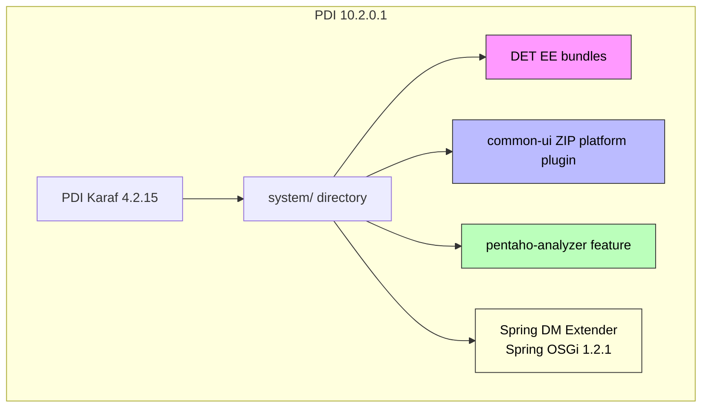

Key components pre-installed in 10.2.0.1:

| Component | Role |
|-----------|------|
| DET EE bundles | Data exploration UI, REST endpoints, JDBC connectivity |
| common-ui platform plugin | Provides Dojo toolkit, Pentaho visualization framework, RequireJS modules |
| pentaho-analyzer feature | OLAP analysis engine, content generators for MODEL view |
| Spring DM (Spring OSGi 1.2.1) | Auto-detects Spring XML in bundles, creates ApplicationContext |
| Spring Framework 3.2.18 | Dependency injection framework (ServiceMix OSGi bundles) |
| pentaho-spring-dm-extender | Custom Pentaho bundle providing `PentahoOsgiBundleXmlApplicationContext` (resolves `plugin:` protocol) |

### 1.2 Component Interaction: MODEL View

When a user opens the DET MODEL view (drag-and-drop data modeling), the following interaction occurs:

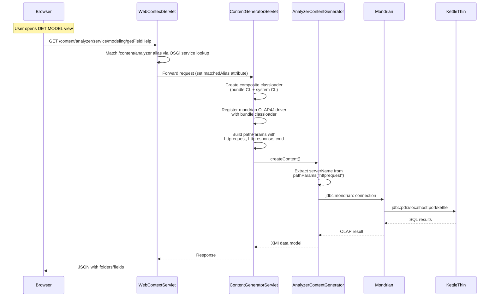

The MODEL view relies on:
1. **AnalyzerContentGenerator** — a Spring bean that processes OLAP requests
2. **Mondrian** — the OLAP engine connecting to PDI transformations via KettleThin JDBC
3. **WebContextServlet** — routes `/content/analyzer/*` requests to the correct servlet
4. **ContentGeneratorServlet** — bridges OSGi classloaders, registers JDBC drivers, provides `pathParams`

### 1.3 Spring DM and Content Generator Beans

In 10.2.0.1, the `paz-plugin-ce` ZIP contained a `plugin.spring.xml` with 4 content generator beans:

```xml
<bean id="xanalyzer.service" class="com.pentaho.analyzer.content.AnalyzerContentGenerator" scope="prototype" />
<bean id="xanalyzer.generatedContent" class="com.pentaho.analyzer.content.AnalyzerContentGenerator" scope="prototype" />
<bean id="xanalyzer.editor" class="com.pentaho.analyzer.content.EditorContentGenerator" scope="prototype"/>
<bean id="xanalyzer.backgroundExecution" class="com.pentaho.analyzer.content.controller.AnalyzerAction" scope="prototype"/>
```

The `paz-plugin-ce` ZIP structure was:
```
analyzer/
├── plugin.xml                           # Plugin metadata (content-types, static-paths)
├── plugin.spring.xml                    # 4 content generator Spring beans
├── OSGI-INF/blueprint/analyzer_beans.xml  # Blueprint: references Spring DM ApplicationContext
├── lib/pentaho-analyzer-agile-bi.jar    # Core analyzer code + internal beans.xml (11 infra beans)
└── ... (JS, CSS, images, etc.)
```

The processing chain was:

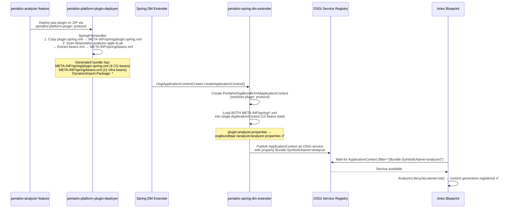

**Key role of `pentaho-spring-dm-extender`**: This custom Pentaho bundle provided `PentahoOsgiBundleXmlApplicationContext` which resolved the `plugin:` resource protocol used in `beans.xml` (e.g., `plugin:analyzer.properties` → `osgibundlejar:/analyzer/analyzer.properties`). It was registered via `META-INF/spring/extender/spring-extender.xml` — a Spring DM extension point that the `spring-osgi-extender` scanned. Without it, Spring DM uses the standard `OsgiBundleXmlApplicationContext` which cannot resolve `plugin:` protocol.

### 1.4 The pentaho-analyzer Feature

The enterprise feature definition required multiple prerequisites:

```xml
<feature name="pentaho-analyzer" version="1.0.0">
    <feature prerequisite="true">pentaho-analyzer-prerequisites</feature>
    <feature prerequisite="true">spring-dm</feature>
    <feature prerequisite="true">pdi-platform</feature>
    <feature prerequisite="true">pentaho-requirejs-osgi-manager</feature>
    <bundle>wrap:mvn:pentaho/pentaho-connections/...</bundle>
    <bundle>mvn:pentaho/pentaho-analyzer-xsd/...</bundle>
    <bundle>pentaho-platform-plugin:mvn:pentaho/paz-plugin-ce/.../zip</bundle>
</feature>
```

Spring DM was provided by a **custom Hitachi Vantara Karaf features repository** (`org.hitachivantara.karaf.features/spring32`), not from Apache Karaf's built-in features. This repository defined:

```xml
<!-- spring32 features.xml (from HV custom Karaf features distribution) -->
<feature name="spring" version="3.2.18.RELEASE_1">
    <bundle start-level="30" dependency="true">mvn:org.apache.servicemix.bundles/org.apache.servicemix.bundles.aopalliance/1.0_6</bundle>
    <bundle start-level="30">mvn:org.apache.servicemix.bundles/org.apache.servicemix.bundles.spring-core/3.2.18.RELEASE_1</bundle>
    <bundle start-level="30">mvn:org.apache.servicemix.bundles/org.apache.servicemix.bundles.spring-expression/3.2.18.RELEASE_1</bundle>
    <bundle start-level="30">mvn:org.apache.servicemix.bundles/org.apache.servicemix.bundles.spring-beans/3.2.18.RELEASE_1</bundle>
    <bundle start-level="30">mvn:org.apache.servicemix.bundles/org.apache.servicemix.bundles.spring-aop/3.2.18.RELEASE_1</bundle>
    <bundle start-level="30">mvn:org.apache.servicemix.bundles/org.apache.servicemix.bundles.spring-context/3.2.18.RELEASE_1</bundle>
    <bundle start-level="30">mvn:org.apache.servicemix.bundles/org.apache.servicemix.bundles.spring-context-support/3.2.18.RELEASE_1</bundle>
</feature>

<feature name="spring-dm" version="1.2.1">
    <feature version="[2.5.6,4)">spring</feature>
    <bundle start-level="30" dependency="true">mvn:org.apache.servicemix.bundles/org.apache.servicemix.bundles.cglib/3.2.4_1</bundle>
    <bundle start-level="30">mvn:org.springframework.osgi/spring-osgi-io/1.2.1</bundle>
    <bundle start-level="30">mvn:org.springframework.osgi/spring-osgi-core/1.2.1</bundle>
    <bundle start-level="30">mvn:org.springframework.osgi/spring-osgi-extender/1.2.1</bundle>
    <bundle start-level="30">mvn:org.springframework.osgi/spring-osgi-annotation/1.2.1</bundle>
</feature>
```

> **Note:** The `pdi-platform` feature has always been minimal — it contains only a single bundle (`mvn:pentaho/pentaho-pdi-platform`). It never included a `spring` sub-feature dependency in any version. Spring DM's presence was entirely determined by the Karaf features distribution layer.

### 1.5 RequireJS Module Resolution

In 10.2.0.1, the `common-ui` platform plugin (deployed as a ZIP) provided:
- Full Pentaho visualization framework JS (`pentaho/type/*`, `pentaho/visual/*`, etc.)
- Dojo toolkit (`dojo/`, `dijit/`, `dojox/`)
- Common-UI utilities (`common-ui/prompting/**`, `common-ui/util/**`, etc.)
- jQuery, Underscore, and other dependencies

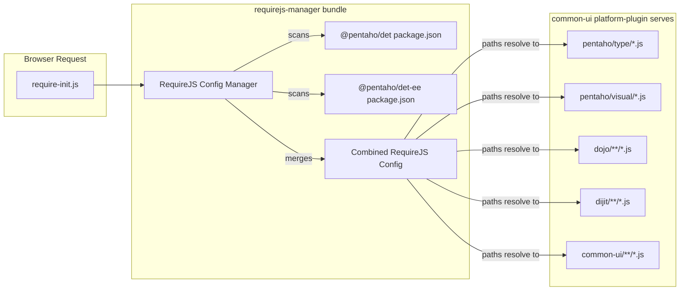

### 1.6 Why plugin: Protocol and IPluginManager Worked

Two mechanisms that worked in 10.2.0.1 fail in 10.2.0.X:

#### The `plugin:` Resource Protocol

The original `beans.xml` inside `pentaho-analyzer-agile-bi.jar` uses:
```xml
<property name="location" value="plugin:analyzer.properties"/>
```

In 10.2.0.1, `pentaho-spring-dm-extender` provided `PentahoOsgiBundleXmlApplicationContext` which overrode `getResource()`:
```java
// PentahoOsgiBundleXmlApplicationContext.java
@Override public Resource getResource(String location) {
    int index = location.indexOf("plugin:");
    if (index != 0) { return super.getResource(location); }
    location = location.substring("plugin:".length());
    String pluginPath = getBundle().getSymbolicName() + "/";
    return super.getResource("osgibundlejar:/" + pluginPath + location);
}
```

#### `IPluginManager.getClassLoader("common-ui")`

The `LocalizationServlet.getBundle()` method calls:
```java
IPluginManager pm = PentahoSystem.get(IPluginManager.class);
ClassLoader pluginClassLoader = pm.getClassLoader(pluginId); // returns null in PDI!
```

In PDI 10.2.0.X, `PdiPlatformActivator` registers a **stub** `PentahoSystemPluginManager` that never scans plugin directories or registers classloaders. On Pentaho Server, the full `PentahoSystemPluginManager` scans `system/` and registers each plugin's classloader. In PDI, platform-plugin ZIPs are deployed as OSGi bundles via `pentaho-platform-plugin-deployer` — this deployer does NOT call `pluginManager.registerClassLoader()`, so the manager's internal map stays empty.

```mermaid
graph TD
    subgraph "PDI 10.2.0.1 (Karaf 4.2.15)"
        LLINIT1["AnalyzerLifecycleListener.init()"]
        LLINIT1 -->|"creates"| AAC1["AnalyzerApplicationContext<br/>(overrides getResourceByPath)"]
        AAC1 -->|"resolves plugin:X as"| FS1["new File(pluginPath, X)"]
        FS1 -->|"reads"| PROPS1["system/analyzer/analyzer.properties ✅"]
    end

    subgraph "PDI 10.2.0.X (Karaf 4.4.6)"
        DEPLOYER2["pentaho-platform-plugin-deployer"]
        DEPLOYER2 -->|"extracts beans.xml to"| META2["META-INF/spring/beans.xml"]
        META2 -->|"BundleApplicationContextFactory creates context<br/>(standard ClassPathXmlApplicationContext)"| CTX2["Spring Context"]
        CTX2 -->|"resolves plugin:X"| FAIL2["Unknown protocol ❌<br/>FileNotFoundException"]
    end

    style PROPS1 fill:#bfb,stroke:#333,color:#000
    style FAIL2 fill:#fbb,stroke:#333,color:#000
```

**Solution in 10.2.0.X**: Strip the original `beans.xml` from the agile-bi JAR and inject a replacement that uses standard `classpath:` protocol:
```xml
<bean id="properties" class="org.springframework.beans.factory.config.PropertiesFactoryBean">
    <property name="location" value="classpath:analyzer/analyzer.properties"/>
</bean>
```

---

## 2. PDI 10.2.0.X Architecture (Current)

### 2.1 What Changed

PDI 10.2.0.X (based on 10.2 branch, Karaf 4.4.6) introduced major platform changes:

| Component | 10.2.0.1 | 10.2.0.X | Reason |
|-----------|----------|----------|--------|
| Apache Karaf | 4.2.15 | 4.4.6 | Platform upgrade |
| Pax Web | 7.x | 8.x (OSGi R7 HTTP Whiteboard) | Karaf dependency |
| Spring DM (Spring OSGi 1.2.1) | ✅ Pre-installed | ❌ **Completely removed** | Security (CVEs) + abandoned |
| Spring Framework 3.2.18 | ✅ Pre-installed | ❌ **Removed** | 13 CVEs including Spring4Shell |
| `pentaho-spring-dm-extender` | ✅ In deployers feature | ❌ **Removed** | Depends on Spring DM |
| `common-ui` platform plugin | ✅ Deployed as ZIP | ❌ **Not deployed** | Architecture change |
| DET EE | Pre-installed in `system/` | Hot-deployed KAR in `deploy/` | Modularity |
| `pentaho-analyzer` feature | ✅ Enterprise features | ❌ Removed from PDI | Prerequisites block boot |

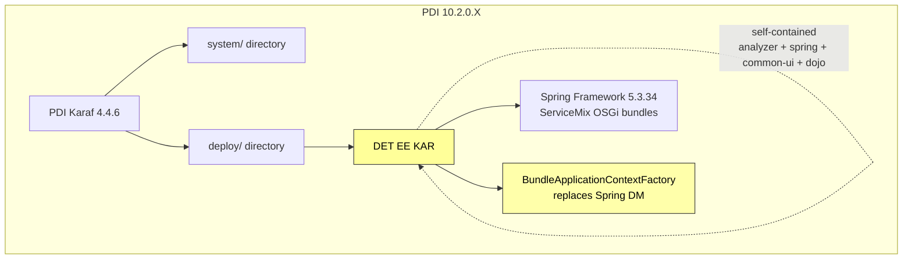

### 2.2 Why DET MODEL View Stopped Working

Multiple cascading failures prevented DET from functioning:

1. **No Spring DM** → The `plugin.spring.xml` content generator beans are never instantiated → No servlet responds to `/content/analyzer/*` → MODEL view gets empty responses

2. **Content generator beans removed from paz-plugin-ce** → In commit `4c774947e` (SP-6671, "Karaf 4.4.6 upgrade and security fixes"), the 4 content generator beans were removed from `plugin.spring.xml` because Pentaho Server handles them differently. PDI was not considered.

3. **No common-ui plugin** → All client-side JavaScript (Pentaho visualization framework, Dojo toolkit, prompting modules) returns 404 → DET UI cannot render

4. **Pax Web 8 whiteboard interference** → Even if servlets were registered, Pax Web 8 (in Karaf 4.4.6) intercepts services with the `alias` property (legacy HttpService compatibility), preventing WebContextServlet from finding them

5. **Mondrian JDBC classloader mismatch** → `java.sql.DriverManager` rejects the mondrian OLAP4J driver due to Class identity differences between the system classloader and OSGi's DynamicImport resolution

6. **Boot-order race conditions** → KAR prerequisites block the Karaf feature installer thread pool, causing timeout on cold starts

7. **`plugin:` protocol unresolvable** → `pentaho-spring-dm-extender` removed, so `PentahoOsgiBundleXmlApplicationContext` is unavailable; `beans.xml` references `plugin:analyzer.properties` → `FileNotFoundException`

8. **`IPluginManager.getClassLoader()` returns null** → `LocalizationServlet` can't load i18n resources for common-ui → 500 errors

### 2.3 Security Reasons for Removing Spring DM

Spring DM was removed from PDI 10.2.0.X primarily for **security reasons**. The `spring32` repository required Spring Framework 3.2.18.RELEASE, which has **13 known CVEs**:

| CVE | Severity | Description |
|-----|----------|-------------|
| [CVE-2022-22965](https://github.com/advisories/GHSA-36p3-wjmg-h94x) | **CRITICAL** | Remote Code Execution ("Spring4Shell") — JDK 9+ |
| [CVE-2022-22970](https://github.com/advisories/GHSA-hh26-6xwr-ggv7) | **HIGH** | DoS via file upload data binding |
| [CVE-2018-1272](https://github.com/advisories/GHSA-4487-x383-qpph) | **HIGH** | Privilege escalation via multipart request forwarding |
| [CVE-2022-22968](https://github.com/advisories/GHSA-g5mm-vmx4-3rg7) | **HIGH** | DataBinder disallowedFields case-sensitivity bypass |
| [CVE-2023-20863](https://github.com/advisories/GHSA-wxqc-pxw9-g2p8) | **HIGH** | DoS via crafted SpEL expression |
| [CVE-2016-5007](https://github.com/advisories/GHSA-8crv-49fr-2h6j) | **HIGH** | URL pattern matching bypass |
| [CVE-2018-1271](https://github.com/advisories/GHSA-g8hw-794c-4j9g) | MEDIUM | Path traversal on Windows |
| [CVE-2018-1257](https://github.com/advisories/GHSA-rcpf-vj53-7h2m) | MEDIUM | DoS via STOMP WebSocket broker |
| [CVE-2022-22950](https://github.com/advisories/GHSA-558x-2xjg-6232) | MEDIUM | DoS via crafted SpEL expression |
| [CVE-2023-20861](https://github.com/advisories/GHSA-564r-hj7v-mcr5) | MEDIUM | DoS via crafted SpEL expression |
| [CVE-2024-38808](https://github.com/advisories/GHSA-9cmq-m9j5-mvww) | MEDIUM | DoS via crafted SpEL expression |
| [CVE-2024-38820](https://github.com/advisories/GHSA-4gc7-5j7h-4qph) | MEDIUM | DataBinder locale-dependent case bypass |
| [CVE-2025-22233](https://github.com/advisories/GHSA-4wp7-92pw-q264) | LOW | DataBinder disallowedFields bypass |

Additionally, Spring OSGi 1.2.1 (the Spring DM framework) was **last released in 2009** — the project was abandoned and never maintained.

The removal was tracked in:
- **pentaho-karaf-assembly**: [PR #818](https://github.com/pentaho/pentaho-karaf-assembly/pull/818) (10.2 branch) — commit [`3bc0b5a438e7`](https://github.com/pentaho/pentaho-karaf-assembly/commit/3bc0b5a438e7) — `[SP-6858] - Backport of PPP-5517 - Vulnerable Component: org.apache.servicemix.bundles for spring 3.2.18`
- **pentaho-osgi-bundles**: [PR #534](https://github.com/pentaho/pentaho-osgi-bundles/pull/534) (10.2 branch) — commit [`e5898ab918`](https://github.com/pentaho/pentaho-osgi-bundles/commit/e5898ab918) — `[SP-6858] - Backport of PPP-5517`

### 2.4 KAR File Structure

The DET EE KAR file is a self-contained deployment unit:

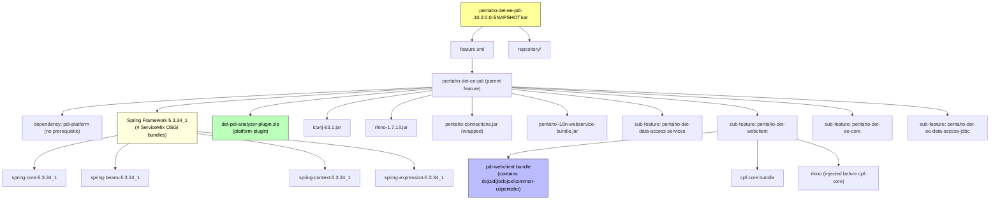

The KAR is fully self-contained — it ships:
- **Spring Framework 5.3.34** (4 ServiceMix OSGi bundles: core, beans, context, expression — `spring-aop` NOT included since all `org.springframework.aop` imports in spring-context are `resolution:=optional`; `aopalliance` NOT included; `spring-context-support` NOT included)
- **Analyzer plugin** (repackaged paz-plugin-ce with fixed beans and Blueprint)
- **Client-side JS** (full Dojo toolkit, Pentaho visualization framework, common-ui resources)
- **All runtime dependencies** (ICU4J, Rhino, pentaho-connections, etc.)

### 2.5 BundleApplicationContextFactory: Replacing Spring DM

Since Spring DM is gone, a new factory class creates the analyzer's Spring ApplicationContext deterministically during Blueprint initialization:

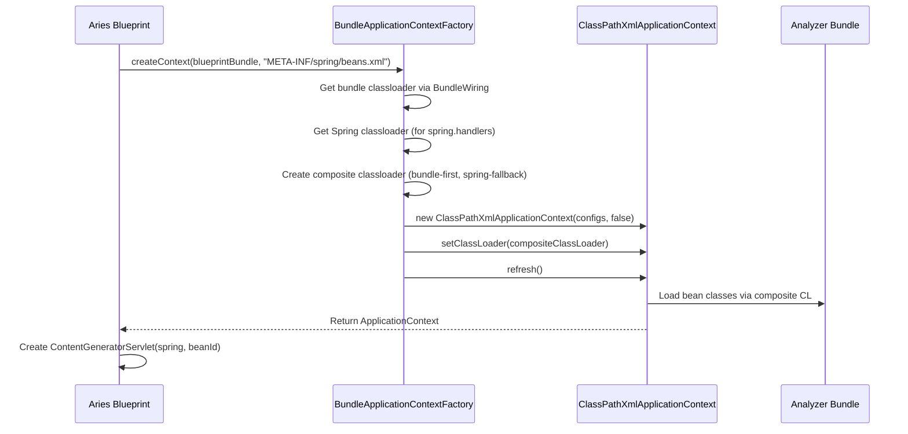

The composite classloader is essential because in OSGi:
- **Bean classes** (e.g., `com.pentaho.analyzer.content.AnalyzerContentGenerator`) are in the analyzer bundle's classloader
- **Spring infrastructure** (e.g., `META-INF/spring.handlers` for namespace resolution) is in the Spring framework bundle's classloader
- **Classpath resources** (e.g., `analyzer/analyzer.properties`) are in the analyzer bundle's classloader

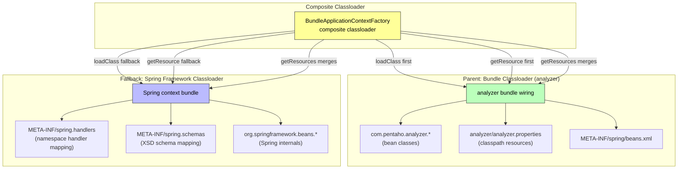

#### Comparison: Spring DM (old) vs BundleApplicationContextFactory (new)

| Aspect | 10.2.0.1 (Spring DM) | 10.2.0.X (BundleApplicationContextFactory) |
|--------|----------------------|---------------------------------------------|
| **Context creation** | Spring DM extender auto-detects XML | `BundleApplicationContextFactory.createContext()` |
| **ApplicationContext access** | OSGi service registry (published by Spring DM) | Inline Blueprint bean (passed directly to servlets) |
| **Spring Framework version** | 3.2.18.RELEASE_1 (pre-installed, 13 CVEs) | 5.3.34 (shipped in KAR, 4 bundles) |
| **Pre-installed platform bundles** | 13+ (Spring + Spring DM + cglib + pentaho-spring-dm-extender) | 0 (all self-contained in KAR) |
| **`plugin:` protocol** | ✅ Works (via `PentahoOsgiBundleXmlApplicationContext`) | N/A — uses `classpath:` instead |
| **Namespace handlers (`util:`)** | ✅ Works (Spring DM's `OsgiBundleXmlApplicationContext`) | ❌ Uses `PropertiesFactoryBean` instead |
| **Race conditions** | ⚠️ 5000ms timeout (could fail on slow starts) | ✅ None (synchronous creation) |
| **Hot-deployable** | ❌ Prerequisites block thread pool | ✅ No prerequisites, non-blocking |
| **Dependency health** | ❌ Spring 3.2 EOL, Spring OSGi abandoned | ✅ Spring 5.3.34 (maintained) |

### 2.6 Classloader Architecture for Mondrian JDBC

The MODEL view uses Mondrian's OLAP engine which connects via JDBC. A Class identity mismatch between the system classloader (which loads `mondrian.jar` from `lib/`) and OSGi's DynamicImport resolution causes `DriverManager` to reject the driver:

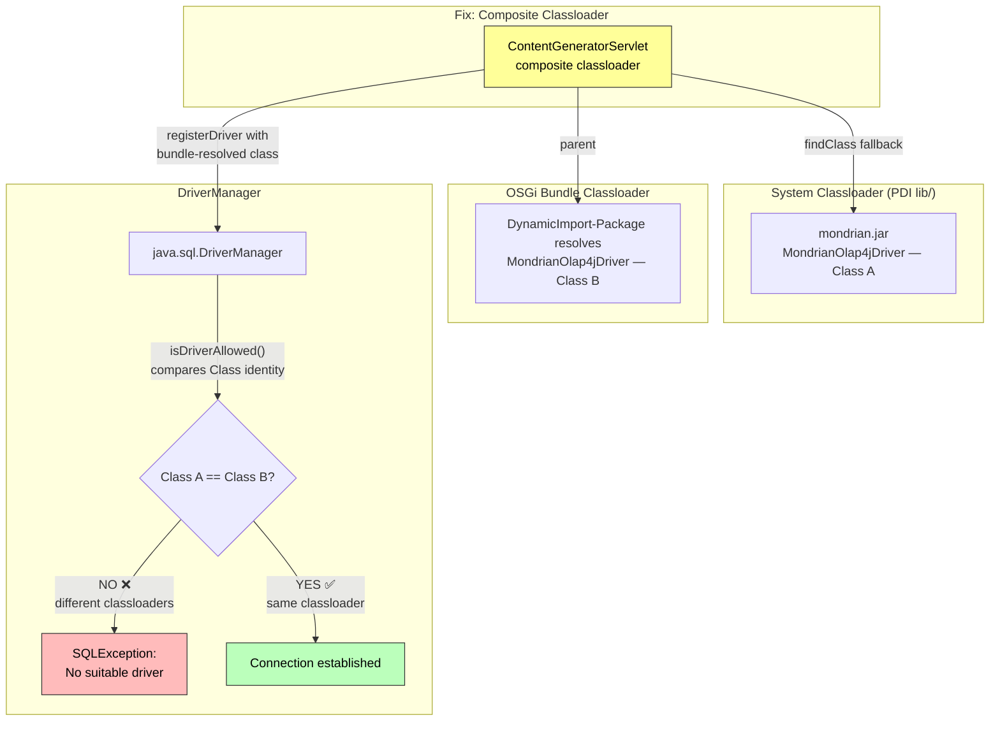

The fix: `ContentGeneratorServlet` creates a composite classloader and explicitly calls `DriverManager.registerDriver()` with the bundle-resolved mondrian class, ensuring Class identity matches.

### 2.7 RequireJS and Webclient Module Resolution

Since `common-ui` is no longer deployed, the `pdi-webclient` bundle self-contains all JavaScript resources and registers full module metadata in its `package.json`:

**RequireJS paths mappings:**
```json
"pentaho/type": "/@pentaho/det-ee@VERSION/pentaho/type",
"pentaho/visual": "/@pentaho/det-ee@VERSION/pentaho/visual",
"pentaho/data": "/@pentaho/det-ee@VERSION/pentaho/data",
"pentaho/action": "/@pentaho/det-ee@VERSION/pentaho/action",
"pentaho/ccc": "/@pentaho/det-ee@VERSION/pentaho/ccc",
"pentaho/theme": "/@pentaho/det-ee@VERSION/pentaho/theme",
"pentaho/csrf": "/@pentaho/det-ee@VERSION/pentaho/csrf",
"pentaho/platformBundle": "/@pentaho/det-ee@VERSION/pentaho/platformBundle",
"pentaho/platformCore": "/@pentaho/det-ee@VERSION/pentaho/platformCore",
"pentaho/common": "/@pentaho/det-ee@VERSION/pentaho/common",
"dojo": "/@pentaho/det-ee@VERSION/dojo",
"dijit": "/@pentaho/det-ee@VERSION/dijit",
"dojox": "/@pentaho/det-ee@VERSION/dojox",
"common-ui": "/@pentaho/det-ee@VERSION/common-ui",
"common-ui/echarts": "/@pentaho/det-ee@VERSION/common-ui/echarts/echarts",
"common-repo": "/@pentaho/det-ee@VERSION/common-ui/repo",
"common-data": "/@pentaho/det-ee@VERSION/common-ui/dataapi"
```

**Pentaho module metadata** (`pentaho/modules` config in `package.json`):
- **Type system**: `pentaho/type/*` hierarchy (Instance → Value → Element → Complex/Simple/List, Property, String, Number, Boolean, Date, Object, Function, TypeDescriptor, Enum)
- **Data filters**: `pentaho/data/filter/*` hierarchy (Abstract, Tree, And, Or, Not, Property, IsEqual, IsIn, IsLike, IsLess, IsGreater, etc.)
- **Visualization models**: `pentaho/visual/*` (Model, Abstract, Bar, Line, Pie, Scatter, Bubble, HeatGrid, Treemap, Sunburst, Donut, Boxplot, Waterfall, BarLine, Radar, Gauge, Funnel, etc.)
- **CCC views**: `pentaho/ccc/visual/*` (all CCC view implementations)
- **ECharts views**: `pentaho/visual/views/echarts/*` (Gauge, Radar, Funnel)
- **Role adaptation strategies**: Identity, Combine, Tuple, EntityWithTimeIntervalKey, EntityWithNumberKey
- **Color palettes**: nominalPrimary, nominalNeutral, nominalLight, nominalDark, divergentRyb3/5, divergentRyg3/5, quantitativeBlue3/5, quantitativeGray3/5
- **DET virtual modules**: `IPenDetExtensionPlugin`, `IPenDetPersistenceService`, `IPenDetLifecycleService`, `IPenDetDialog`, `IPenDetExplorerHeader`, `store`, `titleOnTruncate`

**Patched `Messages.js`**: Embeds `pentaho/common/nls/messages` and `prompting/messages/messages` bundles inline and pre-registers them in the internal bundle cache, so `addUrlBundle()` short-circuits without calling `/i18n?plugin=common-ui` (which returns 500 because common-ui isn't a registered platform plugin).

---

## 3. Deployment Scenarios

### 3.1 Cold Start (KAR Pre-Installed in deploy/)

A **cold start** occurs when PDI boots with a clean Karaf cache (`system/karaf/caches/` deleted) and the DET EE KAR file already present in `system/karaf/deploy/`. This is the most challenging scenario because all bundles must resolve from scratch.

#### Cold-Start Boot Sequence

```
┌─────────────────────────────────────────────────────────────────────────┐
│ 1. Karaf boot → featuresBootAsynchronous=true                           │
│    featuresBoot: ssh, config, pentaho-base, pentaho-client-minimal,     │
│                  pentaho-big-data-plugin-osgi, pentaho-fasterxml         │
├─────────────────────────────────────────────────────────────────────────┤
│ 2. Deploy folder deployer detects DET EE KAR (CONCURRENT with step 1)  │
│    → Extracts to caches/kar/, registers feature repository               │
├─────────────────────────────────────────────────────────────────────────┤
│ 3. DET EE feature installs (NO prerequisites - non-blocking):           │
│    • <feature>pdi-platform</feature> → hard dependency, resolved         │
│      alongside in single batch                                            │
│    • Spring 5.3.34 ServiceMix bundles installed                          │
│    • All DET bundles installed in parallel:                               │
│      - data-access-impl-rest Blueprint WAITS for CXF Bus reference       │
│      - det-impl-pdi, det-impl-core register CXF endpoints               │
│      - det-pdi-analyzer-plugin deployed via pentaho-platform-plugin:     │
│        URL handler (from pentaho-deployers in featuresBoot)               │
│      - Analyzer Blueprint calls BundleApplicationContextFactory          │
│      - pdi-webclient, cpf-core, rhino bundles start                     │
├─────────────────────────────────────────────────────────────────────────┤
│ 4. featuresBoot completes (ssh, pentaho-base, big-data, etc.)           │
│    • CXF Bus service registered → data-access-impl-rest initializes     │
│    • KarafFeatureWatcher satisfied (all boot features installed) ✅      │
├─────────────────────────────────────────────────────────────────────────┤
│ 5. Runtime features install (profile.cfg):                               │
│    pentaho-spoon, pentaho-metaverse, pentaho-dataservice,               │
│    pdi-data-refinery, pdi-marketplace, etc.                             │
├─────────────────────────────────────────────────────────────────────────┤
│ 6. Spoon UI launches                                                    │
│    "Logging is at level: Debug"                                         │
│    "Carte - Installing timer to purge stale objects"                    │
└─────────────────────────────────────────────────────────────────────────┘
```

#### Cold-Start Timeline

```
T+0s   : KarafBoot starts, clean cache
T+2s   : features-3-thread-1 begins installing featuresBoot + DET EE KAR
T+5s   : DET EE bundles resolve (resolution:=optional allows immediate resolve)
T+6s   : Spring Framework bundles active (ServiceMix OSGi bundles start quickly)
T+7s   : Analyzer Blueprint → BundleApplicationContextFactory.createContext()
T+8s   : ApplicationContext created successfully (composite CL resolves all)
T+8s   : Content generator services registered (/content/analyzer/*)
T+9s   : CXF endpoints register (/det/core/data, /det/pdi/navigation, etc.)
T+30s  : pentaho-big-data-plugin-osgi completes
T+35s  : Spoon UI ready, Carte timer installed
```

#### Cold-Start Specific Mechanisms

Three mechanisms work together to ensure cold-start success:

**1. `resolution:=optional` in ManifestUpdaterImpl** — All `Import-Package` entries generated by the platform-plugin-deployer include `resolution:=optional`. Since `DynamicImport-Package: *` is always set, packages are wired dynamically at runtime when classes are first loaded. This allows platform-plugin bundles (like the analyzer) to resolve immediately during cold start without waiting for package providers.

**2. Plain `<feature>pdi-platform</feature>` (no prerequisite)** — This ensures Karaf includes `pdi-platform` in the same resolution batch as DET EE. Since `pentaho-spoon` (in `profile.cfg`) already depends on `pdi-platform`, it's already being installed during boot — this declaration coordinates timing without blocking the thread pool.

**3. Mandatory CXF Bus Blueprint reference** — The `data-access-impl-rest` Blueprint has a mandatory `<reference id="cxfBus" interface="org.apache.cxf.Bus"/>`. This makes Blueprint wait for the shared CXF Bus service (registered after `pentaho-base` installs `cxf-core`). Using `bus="cxfBus"` on `<jaxrs:server>` forces the endpoint to use the shared Bus (which has all transport extensions) instead of creating a new per-bundle Bus that may lack the HTTP DestinationFactory.

#### Cold-Start Sequence Diagram

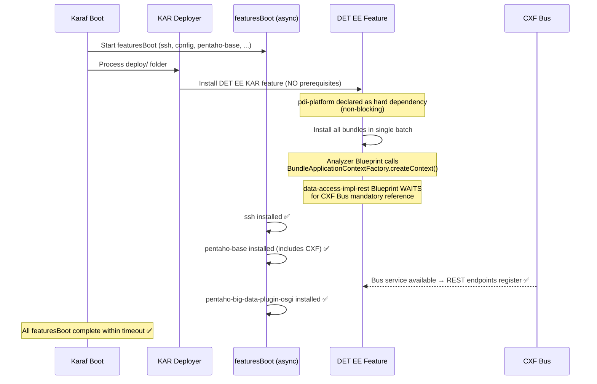

### 3.2 Hot Deploy (KAR Placed After Boot)

A **hot deploy** occurs when the DET EE KAR file is placed into `system/karaf/deploy/` while PDI is already fully running. This is the simpler scenario because all platform services are already available.

#### Hot-Deploy Sequence

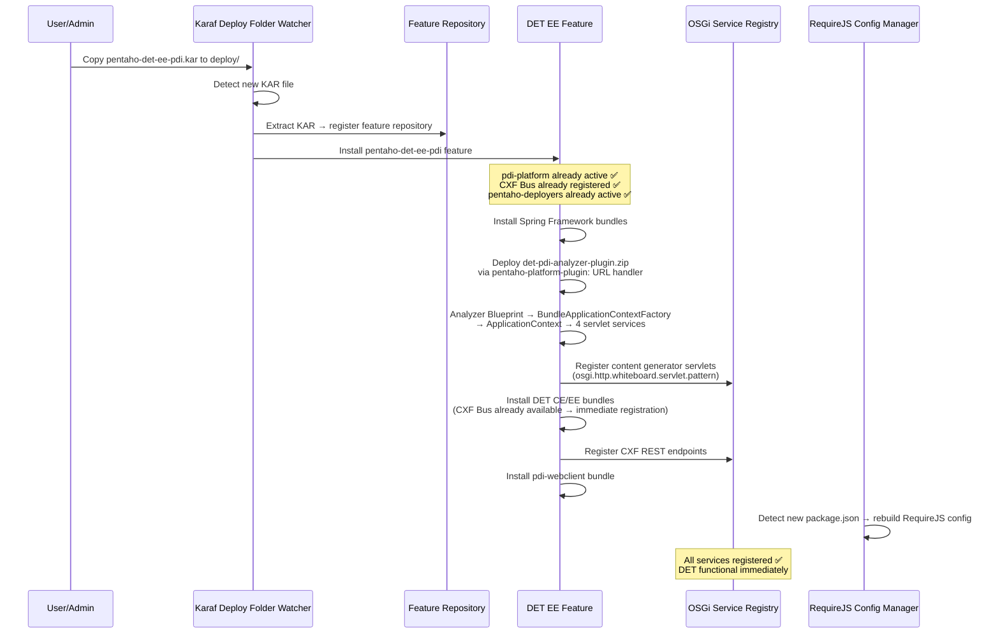

#### Hot-Deploy Timeline

```
T+0s   : KAR file placed in deploy/
T+2s   : Karaf deploy watcher detects KAR
T+3s   : Feature repository registered
T+5s   : All bundles installed and started
T+6s   : BundleApplicationContextFactory creates analyzer context
T+7s   : Content generator servlets registered
T+7s   : CXF endpoints registered (Bus already available)
T+8s   : RequireJS config manager rebuilds config
T+8s   : DET fully functional ✅
```

#### Hot-Deploy Advantages Over Cold Start

| Aspect | Cold Start | Hot Deploy |
|--------|-----------|------------|
| CXF Bus | Must wait for `pentaho-base` to install | Already available |
| `pentaho-platform-plugin:` URL handler | Must wait for `pentaho-deployers` | Already available |
| `pdi-platform` bundle | Installed in same batch | Already active |
| Spring Framework bundles | Must start from scratch | Start quickly (no dependency waits) |
| RequireJS config rebuild | Done during initial scan | Incremental update |
| Package refresh cascades | None (resolution:=optional) | None (new bundles only) |
| Total time to functional | ~35s (includes entire PDI boot) | ~8s |

#### Hot-Deploy Specific Considerations

- **No bundle refresh cascades** — Since the KAR uses a self-contained `det-pdi-analyzer-plugin` ZIP (not the `pentaho-analyzer` feature), installing it does NOT trigger refresh cascades or bundle rewiring that would break the RequireJS config manager.
- **RequireJS config manager update** — The `pentaho-requirejs-osgi-manager` detects the new `pdi-webclient` bundle's `package.json` and rebuilds the combined config. Any browser refresh after this point loads the full DET UI.
- **No prerequisites needed** — All dependencies are already active, so the plain `<feature>pdi-platform</feature>` hard dependency resolves immediately without any waiting.

### 3.3 Why Prerequisites Are Forbidden in Deploy-Folder KARs

Any `prerequisite="true"` in a deploy-folder KAR causes **thread-pool starvation** during clean-cache cold starts:

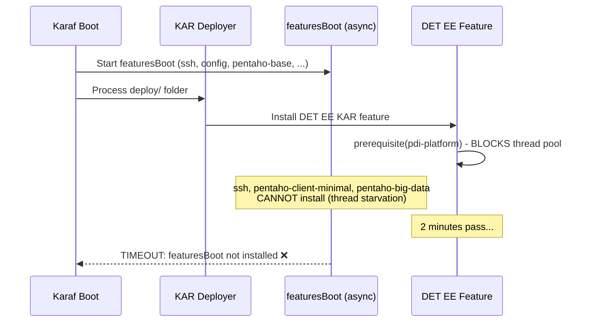

**Root cause**: The Karaf feature installer uses a **shared thread pool** for both `featuresBoot` and deploy-folder KAR installations. When a KAR feature declares a `prerequisite`, the installer thread blocks waiting for that prerequisite to become available. But the prerequisite (`pdi-platform`) is itself being installed by another feature in `featuresBoot` — which can't proceed because all threads are blocked. This circular dependency causes the `KarafFeatureWatcher` 2-minute timeout.

**Solution**: Use plain `<feature>pdi-platform</feature>` (non-blocking hard dependency). Karaf adds it to the same resolution batch without blocking the thread. The CXF Bus `<reference>` in data-access-impl-rest provides the necessary timing guarantee for cold starts.

| Approach | Bundle Resolution | Boot Timeout | Context Creation |
|----------|------------------|--------------|------------------|
| `prerequisite="true"` | ✅ | ❌ Blocks thread pool | ✅ |
| No dependency | ❌ Missing packages | ✅ | N/A |
| `dependency="true"` | ❌ Not in resolver scope | ✅ | N/A |
| Plain `<feature>` + `resolution:=optional` | ✅ | ✅ | ✅ Synchronous |

---

## 4. Changes Made to Fix DET in 10.2.0.X

### 4.1 pentaho-det-ee Repository

#### Feature Definition (`det/assemblies/pdi/src/main/feature/feature.xml`)

- **NO prerequisites** — prevents thread-pool starvation on cold starts
- Plain `<feature>pdi-platform</feature>` as a non-blocking hard dependency
- Added Spring Framework 5.3.34_1 ServiceMix OSGi bundles (4 bundles: core, beans, context, expression)
- Removed old `pentaho-analyzer` feature dependency (causes Spring-DM refresh cascades)
- Added explicit bundles:
  - `mvn:com.ibm.icu/icu4j/63.1` — analyzer dependency (`com.ibm.icu.text.DateFormat`)
  - `mvn:org.mozilla/rhino/1.7.13` — cpf-core dependency (`org.mozilla.javascript`)
  - `wrap:mvn:pentaho/pentaho-connections` — analyzer OLAP connection support
  - `mvn:pentaho/pentaho-i18n-webservice-bundle` — i18n servlet registration

#### KAR Build Configuration (`det/assemblies/pdi/pom.xml`)

- Added ServiceMix Spring 5.3.34_1 as Maven dependencies for KAR repository inclusion
- Added rhino, ICU4J, pentaho-connections dependencies
- Added `maven-antrun-plugin` to inject rhino into webclient sub-feature XML (cpf-core needs `org.mozilla.javascript` in the same feature scope in Karaf 4.4.6)

#### Analyzer Plugin (`det/assemblies/pdi-analyzer-plugin/`) — New Module

A new module that repackages `paz-plugin-ce` for PDI's OSGi environment:

| File | Purpose |
|------|---------|
| `pom.xml` | Unpacks paz-plugin-ce, strips beans.xml from agile-bi JAR, injects fixed versions |
| `analyzer_beans.xml` | Blueprint: creates Spring context via `BundleApplicationContextFactory`, registers 4 servlet services as HTTP Whiteboard servlets with `osgi.http.whiteboard.servlet.pattern` |
| `beans.xml` | Standard Spring beans namespace (no `util:` namespace); uses `PropertiesFactoryBean`; content generators + infrastructure beans with `default-lazy-init="true"` |
| `plugin.spring.xml` | **Intentionally empty** — prevents SpringFileHandler from generating duplicate Blueprint services that interfere with Pax Web 8 |
| `assembly.xml` | Assembly descriptor for ZIP structure expected by `pentaho-platform-plugin-deployer` |

**Build pipeline (JAR surgery):**

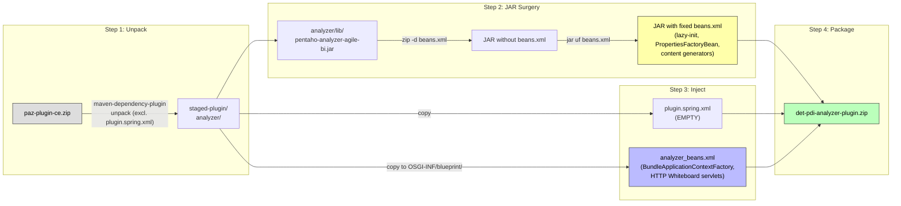

The JAR surgery is necessary because `beans.xml` inside `pentaho-analyzer-agile-bi.jar` uses the `plugin:analyzer.properties` resource protocol (see [Section 1.6](#16-why-plugin-protocol-and-ipluginmanager-worked)) which cannot be resolved in OSGi without Spring DM. The replacement uses standard `classpath:` resolution.

#### Webclient Bundle (`det/impls/pdi-webclient/`)

Since `common-ui` is no longer deployed, the webclient bundle includes everything (see [Section 2.7](#27-requirejs-and-webclient-module-resolution) for full details):
- Full Pentaho platform JS, Dojo toolkit, Common-UI resources
- Patched `Messages.js` with inline i18n bundles
- AMD shims for jQuery and Underscore
- Full pentaho module system metadata in `package.json`
- ECharts and Dojo override paths

#### Data Access JDBC (`data-access/impls/jdbc/pom.xml`) — Import-Package resolution

Added `resolution:=optional` on `org.pentaho.metadata.model` and `org.pentaho.metadata.model.concept.types` imports so the bundle resolves immediately on cold start without waiting for the metadata model provider.

#### DET Bundle Import-Package Fixes

Several DET EE bundles had mandatory `Import-Package` entries for packages that may not be available at bundle resolution time during cold start. These were changed to `resolution:=optional` with corresponding `DynamicImport-Package` entries for runtime wiring:

- **`det/apis/core/pom.xml`** — Added `resolution:=optional` on `org.pentaho.metadata.model` and `org.pentaho.di.trans.dataservice`
- **`det/impls/core/pom.xml`** — Added `resolution:=optional` + `DynamicImport-Package` for: `org.pentaho.agilebi.modeler.*`, `org.pentaho.di.core.refinery.model`, `org.pentaho.di.trans.dataservice.*`, `org.pentaho.metadata.model`, `org.pentaho.metadata.automodel`
- **`det/impls/pdi/pom.xml`** — Added `resolution:=optional` + `DynamicImport-Package` for: `org.pentaho.di.core.refinery.publish.agilebi`, `org.pentaho.di.job.entries.publish.*`, `org.pentaho.di.trans.dataservice.*`, `org.pentaho.platform.settings`, `com.pentaho.commons.dsc.*`, `org.pentaho.metadata.*`, `com.fasterxml.jackson.jaxrs.json`

These changes ensure DET EE bundles resolve immediately during cold start without waiting for runtime features (like `pdi-data-refinery`, `pentaho-dataservice`, `pentaho-metaverse`) that are only installed later via `profile.cfg`.

### 4.2 pentaho-det Repository (CE)

#### CXF Bus Reference (`data-access/impls/rest/` Blueprint)

- Added `<reference id="cxfBus" interface="org.apache.cxf.Bus"/>` mandatory Blueprint reference
- Added `bus="cxfBus"` attribute to the `<jaxrs:server>` element

**Why this matters for cold start vs hot deploy:**
- **Cold start**: The `<reference>` makes Blueprint wait for the CXF Bus (which arrives when `pentaho-base` finishes installing). Without it, the bundle would create a per-bundle Bus without HTTP transport → "No DestinationFactory" error.
- **Hot deploy**: The CXF Bus is already registered, so the `<reference>` resolves immediately → no waiting.

### 4.3 pentaho-osgi-bundles Repository

#### `BundleApplicationContextFactory.java` — **NEW**

Factory class replacing Spring DM. Creates the analyzer's Spring ApplicationContext using a composite classloader (bundle CL for bean classes + Spring CL for namespace handlers). See [Section 2.5](#25-bundleapplicationcontextfactory-replacing-spring-dm) for detailed flow.

#### `ContentGeneratorServlet.java` — Complete Rewrite

- Composite classloader (bundle CL as parent, system CL as fallback for `findClass`)
- Explicit mondrian OLAP4J driver registration using bundle-loaded class
- Uses `req.getPathInfo()` directly (provided by Pax Web 8 HTTP Whiteboard pattern matching)
- `pathParams` with `httprequest`, `httpresponse`, `cmd` (prevents NPE in AnalyzerContentGenerator at line 330)

#### `WebContextServlet.java` — No Changes

- No functional changes in 10.2.0.X — content routing via `service()` override is not needed since content generators register directly as HTTP Whiteboard servlets with more specific patterns

#### `PdiPlatformActivator.java` — Refresh Safety

- Added `removeProvider("mtm")` before `addProvider()` for bundle refresh/restart handling (old provider holds invalidated classloader reference)
- Fallback log changed to `info` level (expected if `removeProvider()` fails on older VFS versions)

#### `pentaho-pdi-platform/pom.xml` — Bundle Metadata

- Added `Export-Package: org.pentaho.platform.pdi,org.pentaho.platform.pdi.vfs` so that DET EE's analyzer bundle can resolve `org.pentaho.platform.pdi` package via DynamicImport


#### `ManifestUpdaterImpl.java` — Bundle Resolution

- All `Import-Package` entries generated by platform-plugin-deployer now include `resolution:=optional`
- Combined with `DynamicImport-Package: *`, allows bundles to resolve immediately during cold start without waiting for package providers

#### `SpringFileHandler.java` — Pax Web 8 Compatibility

- Added OSGi R7 HTTP Whiteboard properties to generated Blueprint servlet services:
  - `osgi.http.whiteboard.servlet.pattern = /content/<bundleName>/*`
  - `osgi.http.whiteboard.servlet.name = <beanId>`
  - `servlet-name = <beanId>`

#### `PluginXmlExternalResourcesHandler.java` — Import Resolution

- Added `org.pentaho.platform.pdi` to generated `Import-Package` entries so the deployer-created bundle can reference `ContentGeneratorServlet` and related classes

#### `WebjarsURLConnection.java` — Version Fallback

- Added fallback version extraction from `META-INF/resources/webjars/{name}/{version}/` path when bower.json lacks a version field
- Fixes 404 on 8 datatables.net webjars: `datatables.net@1.10.12`, `datatables.net-bs@1.10.12`, `datatables.net-fixedheader@3.1.1`, `datatables.net-fixedheader-bs@3.1.1`, `datatables.net-scroller@1.4.2`, `datatables.net-scroller-bs@1.4.2`, `datatables.net-colreorder@1.3.2`, `datatables.net-colreorder-bs@1.3.2`

---

## 5. Why Restoring Content Generator Beans in paz-plugin-ce Is Not Viable

### 5.1 What Would Be Needed

To restore the 10.2.0.1 approach (Spring DM processing `paz-plugin-ce`'s `plugin.spring.xml`) in PDI 10.2.0.X, **all** of the following would be required:

| # | Requirement | Impact | Feasibility |
|---|------------|--------|-------------|
| 1 | Restore `spring32` feature repository (Spring 3.2.18 + Spring OSGi 1.2.1) | +12 bundles pre-installed | ⚠️ Unmaintained, 13 CVEs |
| 2 | Restore `pentaho-spring-dm-extender` bundle (for `plugin:` protocol + `OsgiApplicationContextCreator`) | +1 bundle pre-installed | ⚠️ Source exists but removed from build |
| 3 | Re-introduce `pentaho-analyzer` feature with prerequisites | Must be PRE-INSTALLED (not hot-deployed) | ❌ Defeats hot-deploy goal |
| 4 | Fix Pax Web 8 whiteboard interference | **Still required even with Spring DM** | Still required |
| 5 | Fix `common-ui` absence (JS resources) | **Still required even with Spring DM** | Still required |
| 6 | Fix Mondrian JDBC classloader issue | **Still required even with Spring DM** | Still required |

> **Key insight**: Restoring Spring DM only addresses the Spring context creation (items 1-3). Items 4-6 — which represent the majority of the engineering effort — remain unsolved regardless.

### 5.2 Security Vulnerabilities (CVEs)

Restoring the `spring32` repository would reintroduce **13 known security vulnerabilities**, including the **CRITICAL** Spring4Shell RCE vulnerability (CVE-2022-22965). The full list is in [Section 2.3](#23-security-reasons-for-removing-spring-dm).

Additionally, Spring OSGi 1.2.1 was last released in **2009** — the project was abandoned and replaced by Eclipse Gemini Blueprint (also since abandoned). No security patches will ever be available.

### 5.3 Technical Impossibilities

Even if security concerns were ignored:

1. **Prerequisites block hot-deploy**: The `pentaho-analyzer` feature requires `prerequisite="true"` on `spring-dm` and `pdi-platform`. Any prerequisite in a deploy-folder KAR blocks the Karaf feature installer thread pool, causing a 2-minute timeout (see [Section 3.3](#33-why-prerequisites-are-forbidden-in-deploy-folder-kars)). DET EE cannot be hot-deployed — it would need to be pre-installed, defeating the modularity goal.

2. **`plugin:` protocol requires `pentaho-spring-dm-extender`**: Without this bundle, even if Spring DM were restored, it would use the standard `OsgiBundleXmlApplicationContext` which cannot resolve `plugin:analyzer.properties` — context creation fails with `FileNotFoundException`.

3. **Pax Web 8 is architectural**: Karaf 4.4.6 ships Pax Web 8 which implements OSGi R7 HTTP Whiteboard. Its interference with legacy `alias` properties is fundamental — not something that can be patched by adding Spring DM.

4. **No Spring DM retry in cold-start scenario**: Even with Spring DM, if DET were hot-deployed as a KAR, the Spring DM extender's 5-second reference timeout would fail because `pdi-platform` may not be active yet during cold start.

### 5.4 Feasibility of paz-plugin-ce-pdi Module

An alternative approach was analyzed: creating a `paz-plugin-ce-pdi` module in the `pentaho-analyzer` repository that produces a PDI-ready ZIP.

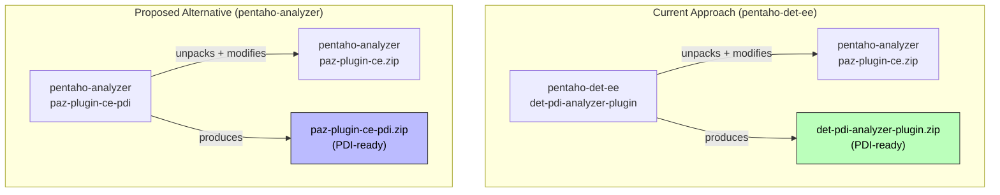

This is **technically feasible** but provides **minimal practical benefit** for 10.2.0.X:

1. **Same complexity** — the same JAR surgery, empty `plugin.spring.xml`, and custom Blueprint must exist somewhere
2. **Cross-team coordination** — the Analyzer team would need to own PDI deployment constraints (Pax Web 8, HTTP Whiteboard, singleton scope)
3. **No reduction in other changes** — `pentaho-osgi-bundles` and `pentaho-det-ee` changes (webclient, feature.xml, JDBC) remain regardless
4. **Net code is just relocated** — ~320 lines move between repos with no overall reduction

#### Effort Distribution

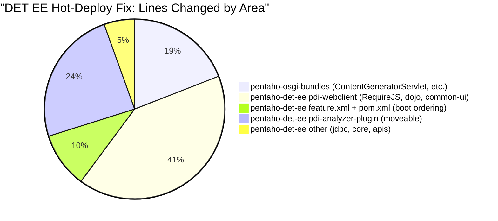

> The `pdi-analyzer-plugin` module represents only ~25% of the total changes. Moving it to `pentaho-analyzer` does NOT reduce the scope of changes in other repos.

**Recommendation**: Keep the current approach (`det-pdi-analyzer-plugin` in `pentaho-det-ee`) for 10.2.0.X. Consider migrating for 10.3+ if the Analyzer team takes ownership.

---

## 6. Issues Resolved

| # | Issue | Root Cause | Fix |
|---|-------|-----------|-----|
| 1 | Analyzer context never starts (TimeoutException) | Spring DM removed; `<reference>` to ApplicationContext never satisfied | `BundleApplicationContextFactory.createContext()` + Spring 5.3.34 bundles in KAR |
| 2 | `Unable to locate Spring NamespaceHandler for .../util` | Bundle CL can't see Spring's `META-INF/spring.handlers` | Composite classloader + `PropertiesFactoryBean` (avoids `util` namespace) |
| 3 | 404 on 8 `datatables.net*` webjars | Webjars deployer extracted null version from bower.json | Fallback version extraction from resource path in `WebjarsURLConnection` |
| 4 | `No suitable driver found for jdbc:mondrian:...` | `DriverManager` Class identity mismatch (system CL vs OSGi) | Explicit `DriverManager.registerDriver()` with bundle-resolved class |
| 5 | MODEL view returns `{"folders":[],"fields":[]}` | Mondrian OLAP connection failed (cascade from #4) | Fix #4 |
| 6 | NPE at `AnalyzerContentGenerator:330` on drag-drop | `ContentGeneratorServlet` didn't set `httprequest` in pathParams | Added `pathParams.setParameter("httprequest", req)` |
| 7 | `pentaho/config/spec/IRuleSet not defined` | Missing pentaho module metadata (was in common-ui ZIP) | Full module definitions in pdi-webclient `package.json` |
| 8 | `pentaho/visual/Model is not defined` | Missing type hierarchy + JS implementation files | Added pentaho/type, pentaho/visual paths + extracted common-ui JS |
| 9 | 404 on `common-ui/prompting/**`, `dojo/**`, `dijit/**` | common-ui platform plugin not deployed | Extracted complete dojo/dijit/dojox/common-ui into webclient bundle |
| 10 | 500 on `/i18n?plugin=common-ui&name=...messages` | `LocalizationServlet` can't find common-ui plugin classloader (stub `PentahoSystemPluginManager`) | Patched `Messages.js` with inline message bundles |
| 11 | `Failed loading explorer.module` — `undefined.extend` | jQuery 3.5.1 uses named AMD `define("jquery",...)`, shim used file path | Shim depends on `"jquery"` (named module) |
| 12 | KarafFeatureWatcher timeout (`Timed out waiting for Karaf features`) | `prerequisite="true"` blocks feature installer thread pool on clean-cache | Removed all prerequisites; plain `<feature>` dependency |
| 13 | `No DestinationFactory` for CXF HTTP on cold start | DET bundles start before CXF extension BundleListener finishes registering HTTP transport | Mandatory `<reference>` to shared CXF Bus + `bus="cxfBus"` |
| 14 | cpf-core can't resolve `org.mozilla.javascript` | Rhino bundle not in same feature scope in Karaf 4.4.6 | Injected rhino into webclient sub-feature via antrun |
| 15 | 404 on `common-ui/echarts.js` | ECharts library at `common-ui/echarts/echarts.js` (subdirectory) | Path override `"common-ui/echarts": "common-ui/echarts/echarts"` |
| 16 | Pax Web 8 whiteboard hijacks servlet services | `alias` property tracked by Pax Web 8 whiteboard (legacy HttpService) | Registered as standard HTTP Whiteboard servlets (`osgi.http.whiteboard.servlet.pattern`) |
| 17 | `PdiPlatformActivator: Multiple providers for scheme "mtm"` | Bundle refresh causes re-activation, "mtm" already registered with stale classloader | `removeProvider("mtm")` before `addProvider()`; fallback log → INFO |
| 18 | `require-init.js` returns empty config | RequireJS config manager bundle refresh during pentaho-analyzer feature install | Avoided pentaho-analyzer feature entirely (prevents cascading refreshes) |
| 19 | `No bean named 'properties' is defined` | Original `beans.xml` used `plugin:analyzer.properties` (unavailable in OSGi) | `PropertiesFactoryBean` with `classpath:analyzer/analyzer.properties` |
| 20 | 404 on `/content/analyzer/scripts/visual/config.js` | Cascade from #1: analyzer content generators never registered | Fix #1 resolved this |

---

## 7. Key Architectural Decisions

| Decision | Rationale |
|----------|-----------|
| `BundleApplicationContextFactory` replacing Spring DM | Spring DM removed; factory creates context directly in Blueprint with composite classloader. No external extender dependency. Synchronous — no retries needed. |
| `PropertiesFactoryBean` instead of `<util:properties>` | `util` namespace requires `META-INF/spring.handlers` resolution which fails in OSGi without Spring DM's `OsgiBundleXmlApplicationContext`. Standard beans namespace avoids namespace handler resolution entirely. |
| Spring Framework 5.3.34 in KAR (4 bundles only) | Spring JARs are not OSGi bundles; ServiceMix wraps them. Only 4 needed — `spring-aop`, `aopalliance`, `spring-context-support` unnecessary since their imports are all `resolution:=optional`. |
| Self-contained analyzer platform-plugin ZIP | Avoids pulling `pentaho-analyzer` feature which would cause prerequisites, Spring-DM refresh cascades, and require 13+ pre-installed bundles. |
| Empty `plugin.spring.xml` + custom `analyzer_beans.xml` Blueprint | `SpringFileHandler` generates servlet services with whiteboard properties from `plugin.spring.xml`; keeping it empty prevents Pax Web 8 interference. Custom Blueprint in `OSGI-INF/blueprint/` controls registration fully. |
| HTTP Whiteboard servlet registration (`osgi.http.whiteboard.servlet.pattern`) | Content generators register directly with Pax Web 8 using standard patterns. More specific patterns take priority over WebContextServlet's `/*`. Eliminates legacy `alias` property interference entirely. |
| Top-level `<bean>` + `<service ref>` in Blueprint (not inline) | Inline `<bean>` inside `<service>` creates `scope=bundle` ServiceFactory, which Pax Web 8 can't register properly. Top-level beans produce singleton services. |
| NO feature prerequisites in deploy-folder KARs | ANY `prerequisite="true"` blocks the Karaf feature installer thread pool on cold starts. Non-negotiable for hot-deployable KARs. |
| Full common-ui/dojo/pentaho in webclient bundle | `common-ui` platform plugin not deployed in 10.2.0.X. Self-contained — no external dependency. |
| Inline i18n in `Messages.js` | `LocalizationServlet` calls `IPluginManager.getClassLoader("common-ui")` which returns null (stub `PentahoSystemPluginManager`). Inlining avoids the HTTP roundtrip entirely. |
| Explicit mondrian JDBC driver registration | `java.sql.DriverManager` uses caller's classloader for Class identity comparison. |
| `resolution:=optional` on all platform-plugin imports | Combined with `DynamicImport-Package: *`, allows immediate bundle resolution on cold start. Runtime wiring still works. |
| jQuery shim depends on `"jquery"` not `"common-ui/jquery/jquery"` | jQuery 3.5.1 uses named AMD `define("jquery", ...)` — RequireJS registers it under the name `"jquery"`, not the file path. |
| Webjars version fallback from resource path | bower.json without `version` field causes null version → Blueprint pattern `/{name}@null/*` → 404. |

---

## 8. Data Flow: MODEL View Request

```mermaid
graph LR
    subgraph "Browser (DET UI)"
        UI[Explorer MODEL View]
    end

    subgraph "CXF REST Endpoint"
        EP["/cxf/det/core/data/datasources/{id}/MODEL/"]
        EP --> JMDSV[JdbcModelDataSourceView]
    end

    subgraph "Analyzer HTTP Connection"
        JMDSV --> AHC[AnalyzerHttpConnection]
        AHC -->|"HTTP GET"| CGS["/content/analyzer/service/modeling/..."]
    end

    subgraph "Content Generator (OSGi)"
        CGS --> ACG[AnalyzerContentGenerator]
        ACG --> OAM[OlapMetaDataManager]
        OAM --> OCM[AgileBIOlapConnectionManager]
    end

    subgraph "OLAP/Mondrian"
        OCM -->|"jdbc:mondrian:<br/>DataSource=jdbc:pdi://..."| MON[Mondrian Engine]
        MON -->|"SQL"| KT[KettleThin JDBC]
        KT -->|"PDI Transformation"| DATA[(Step Data)]
    end

    UI -->|"fetch()"| EP
    DATA -->|"XMI Model"| UI

    style UI fill:#bbf,stroke:#333,color:#000
    style MON fill:#ffa,stroke:#333,color:#000
    style DATA fill:#bfb,stroke:#333,color:#000
```

---

## 9. Verification and Testing

### Cold-Start Verification

- [ ] PDI cold start with KAR pre-installed: boots within 61 seconds
- [ ] ZERO errors/warnings in Karaf log (no transient retry errors)
- [ ] All featuresBoot features install within KarafFeatureWatcher timeout
- [ ] `BundleApplicationContextFactory` creates context on first attempt
- [ ] PDI starts without errors when KAR is NOT deployed (no side effects)

### Hot-Deploy Verification

- [ ] KAR placed after boot: all endpoints register within 10 seconds
- [ ] No bundle refresh cascades
- [ ] No "Alias was never registered" errors
- [ ] RequireJS config updated (browser refresh loads DET UI)

### Functional Verification (Both Scenarios)

- [ ] All DET CXF endpoints respond: `/det/core/data`, `/det/core/persistence`, `/det/pdi/navigation`, `/det/pdi/repository`, `/det/pdi/publish`
- [ ] `/content/analyzer/service/modeling/getFieldHelp` → 200
- [ ] `/content/analyzer/scripts/visual/config.js` → 200
- [ ] All datatables.net webjars respond (8 bundles)
- [ ] `require-init.js` contains DET paths (not empty)
- [ ] DET STREAM view renders data table
- [ ] DET MODEL view returns XMI data model (not empty `{"folders":[],"fields":[]}`)
- [ ] MODEL view drag-and-drop (measures/dimensions into axes — no NPE)
- [ ] ECharts visualizations (Gauge, Radar, Funnel) render correctly
- [ ] No `console.error` for missing JS modules in browser DevTools
- [ ] No regression on Pentaho Server builds

---

## 10. Build and Deploy

```bash
# Build pentaho-osgi-bundles (BundleApplicationContextFactory + ContentGeneratorServlet + 
#   ManifestUpdaterImpl + WebjarsURLConnection fixes)
cd ~/github/pentaho-osgi-bundles
mvn clean install -DskipTests -pl pentaho-pdi-platform,pentaho-platform-plugin-deployer,pentaho-webjars-deployer -am

# Build DET CE (CXF Bus reference fix)
cd ~/github/pentaho-det
mvn clean install -DskipTests -pl data-access/impls/rest -am

# Build DET EE KAR
cd ~/github/pentaho-det-ee
mvn clean install -Dagilebi -Drelease -DskipTests -pl det/assemblies/pdi -am

# Deploy KAR to PDI 10.2.0.X
cp det/assemblies/pdi/target/pentaho-det-ee-pdi-10.2.0.0-SNAPSHOT.kar \
   ~/pentaho/pdi/10.2.0.0-SNAPSHOT/pdi-ee-client-10.2.0.0-*-osgi/data-integration/system/karaf/deploy/

# Update pentaho-pdi-platform in PDI
cp ~/github/pentaho-osgi-bundles/pentaho-pdi-platform/target/pentaho-pdi-platform.jar \
   ~/pentaho/pdi/10.2.0.0-SNAPSHOT/.../system/karaf/system/pentaho/pentaho-pdi-platform/10.2.0.0-SNAPSHOT/pentaho-pdi-platform-10.2.0.0-SNAPSHOT.jar

# Update pentaho-platform-plugin-deployer in PDI
cp ~/github/pentaho-osgi-bundles/pentaho-platform-plugin-deployer/target/pentaho-platform-plugin-deployer.jar \
   ~/pentaho/pdi/10.2.0.0-SNAPSHOT/.../system/karaf/system/pentaho/pentaho-platform-plugin-deployer/10.2.0.0-SNAPSHOT/pentaho-platform-plugin-deployer-10.2.0.0-SNAPSHOT.jar

# Update pentaho-webjars-deployer in PDI
cp ~/github/pentaho-osgi-bundles/pentaho-webjars-deployer/target/pentaho-webjars-deployer.jar \
   ~/pentaho/pdi/10.2.0.0-SNAPSHOT/.../system/karaf/system/pentaho/pentaho-webjars-deployer/10.2.0.0-SNAPSHOT/pentaho-webjars-deployer-10.2.0.0-SNAPSHOT.jar
```

---

## 11. Pentaho Server Compatibility

> **DET is exclusively a PDI feature** — it is never deployed on Pentaho Server. However, some changes are in `pentaho-osgi-bundles` which is shared infrastructure used by both PDI and Server. This section assesses the Server impact of those shared changes.

All changes in `pentaho-osgi-bundles` are shared between PDI and Pentaho Server. Impact:

| Change | Server Impact | Risk |
|--------|--------------|------|
| `BundleApplicationContextFactory` in pentaho-pdi-platform | Only invoked by DET EE KAR's analyzer_beans.xml. Never used on Server. | None |
| `ManifestUpdaterImpl`: `resolution:=optional` | Platform-plugin bundles resolve faster. `DynamicImport-Package` handles runtime wiring unchanged. | Low — improves startup resilience |
| `ContentGeneratorServlet`: composite CL + pathParams | Only instantiated by DET EE Blueprint (PDI-specific; DET is never on Server). | None |
| `PdiPlatformActivator`: removeProvider("mtm") | PDI-specific activator, not present on Server. | None |
| `SpringFileHandler`: HTTP Whiteboard properties | Adds `osgi.http.whiteboard.servlet.pattern` to all platform-plugin Blueprint services. On Server (Karaf 4.4.6), may improve plugin servlet routing. | Low — additive |
| `PluginXmlExternalResourcesHandler`: import org.pentaho.platform.pdi | With `resolution:=optional`, harmless if package not available on Server. | None |
| `pentaho-pdi-platform/pom.xml`: Export-Package | Only affects PDI-specific bundle. Not present on Server. | None |
| `WebjarsURLConnection`: version fallback | Fixes webjars without bower.json version. Benefits all platforms. | Low — improves correctness |
| Spring Framework bundles in KAR | Only installed when KAR is deployed on PDI. DET EE KAR is never deployed on Server. | None |

---

## 12. Migration Notes for Developers

For developers porting the DET EE hot-deploy solution or maintaining it:

1. **Spring DM is gone** — You cannot use `<reference interface="org.springframework.context.ApplicationContext" ...>` in Blueprint. Use `BundleApplicationContextFactory` instead. There is no retry mechanism — context creation is synchronous and deterministic.

2. **Spring Framework is gone from base PDI** — Include ServiceMix Spring OSGi bundles directly in the KAR feature.xml. Only 4 bundles are needed (core, beans, context, expression).

3. **Avoid `<util:properties>`** — The util namespace handler resolution fails in OSGi without Spring DM's `OsgiBundleXmlApplicationContext`. Use standard `PropertiesFactoryBean` from the beans namespace.

4. **`pdi-platform` feature is minimal** — In all versions (10.2.0.1, 10.2.0.2, 10.2.0.X) the `pdi-platform` feature only contains the `pentaho-pdi-platform` bundle. It never had a Spring sub-feature dependency. Spring was provided by the Karaf distribution layer (custom features), not by `pdi-platform`.

5. **No Spring DM retry** — In the old approach, Spring DM had a built-in retry mechanism (5-minute timeout) that handled transient class-loading failures during cold start. In 10.2.0.X, the analyzer context is created synchronously by `BundleApplicationContextFactory`. Either it works immediately or it fails hard. Ensure all packages are available at resolve time (use `resolution:=optional` + `DynamicImport-Package: *`).

6. **No `alias` property on servlet services** — Pax Web 8 intercepts services with `alias`. Use `osgi.http.whiteboard.servlet.pattern` for content generator registration.

7. **Never use `prerequisite="true"` in deploy-folder KARs** — This blocks the Karaf feature installer thread pool and causes boot timeout. Use plain `<feature>` hard dependency + Blueprint `<reference>` for timing guarantees.

8. **Webjars with bower.json** — If a webjar's bower.json doesn't have a `"version"` field, the webjars deployer now falls back to extracting the version from the `META-INF/resources/webjars/{name}/{version}/` path.

9. **Cold start vs hot deploy testing** — Always test BOTH scenarios. Cold start (clean cache + KAR in deploy/) is much more fragile than hot deploy (KAR placed after boot). Thread-pool starvation and CXF race conditions only manifest on cold starts.

---

## Appendix: Platform-Plugin Deployer Pipeline

The `pentaho-platform-plugin-deployer` transforms a platform-plugin ZIP into an OSGi bundle. The `SpringFileHandler` performs **two key operations**:

1. **Copies `plugin.spring.xml` → `META-INF/spring/plugin.spring.xml`** in the generated bundle
2. **Scans all JARs in `lib/`** — opens each JAR, looks for `.xml` files containing `http://www.springframework.org/schema/beans`, and copies them to `META-INF/spring/<filename>` in the generated bundle

In 10.2.0.1, this meant the generated analyzer bundle had:
- `META-INF/spring/plugin.spring.xml` — 4 content generator beans (from the top-level file)
- `META-INF/spring/beans.xml` — 11 infrastructure beans (extracted from `lib/pentaho-analyzer-agile-bi.jar`)

Spring DM's extender would process ALL `META-INF/spring/*.xml` into a single ApplicationContext.

In 10.2.0.X with the empty `plugin.spring.xml` and stripped `beans.xml`:
- `META-INF/spring/plugin.spring.xml` — empty `<beans>` element (no servlet generation by SpringFileHandler)
- `META-INF/spring/beans.xml` — the **replacement** beans.xml injected during JAR surgery (content generators + `PropertiesFactoryBean`)
- Context creation is handled by `BundleApplicationContextFactory` (not Spring DM)

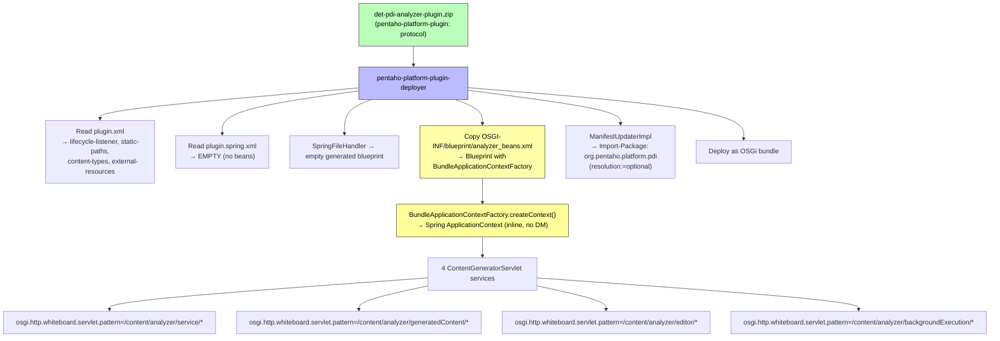

---

## Appendix: Full System Context Diagram

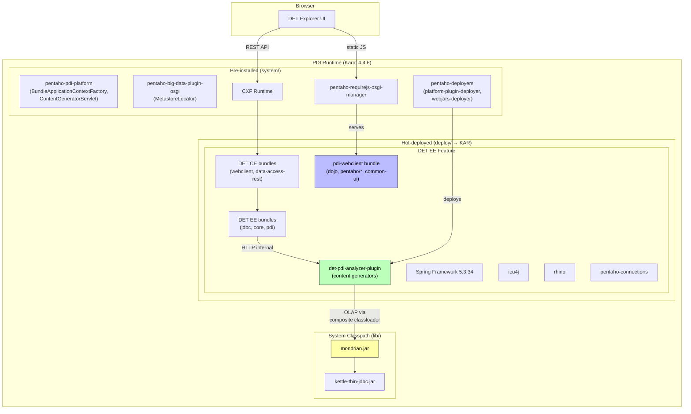

---

## Appendix: Repository Changes Summary

### `pentaho-det-ee` (18 files, +1103/-49 lines)

| File | Change Type | Purpose |
|------|-------------|---------|
| `det/assemblies/pdi-analyzer-plugin/pom.xml` | NEW | Repackages paz-plugin-ce with content generators |
| `det/assemblies/pdi-analyzer-plugin/src/assembly/assembly.xml` | NEW | ZIP assembly for staged plugin |
| `det/assemblies/pdi-analyzer-plugin/src/main/resources/analyzer_beans.xml` | NEW | Blueprint: BundleApplicationContextFactory + HTTP Whiteboard servlets |
| `det/assemblies/pdi-analyzer-plugin/src/main/resources/beans.xml` | NEW | PDI-compatible Spring beans (lazy-init, PropertiesFactoryBean, content generators) |
| `det/assemblies/pdi-analyzer-plugin/src/main/resources/plugin.spring.xml` | NEW | Intentionally empty |
| `det/assemblies/pdi/pom.xml` | MODIFIED | Add Spring/rhino/ICU4J deps, antrun for feature XML |
| `det/assemblies/pdi/src/main/feature/feature.xml` | MODIFIED | Non-blocking deps, Spring bundles, no prerequisites |
| `det/assemblies/pom.xml` | MODIFIED | Add pdi-analyzer-plugin module |
| `det/assemblies/core/src/main/feature/feature.xml` | MODIFIED | Feature structure adjustments |
| `det/impls/pdi-webclient/pom.xml` | MODIFIED | Extract common-ui/dojo/pentaho from ZIP deps |
| `det/impls/pdi-webclient/src/main/resources-filtered/app/package.json` | MODIFIED | Full pentaho module metadata + RequireJS paths |
| `det/impls/pdi-webclient/src/main/resources/app/common-ui/jquery-clean.js` | NEW | AMD shim (depends on "jquery" named define) |
| `det/impls/pdi-webclient/src/main/resources/app/common-ui/underscore.js` | NEW | AMD shim (noConflict) |
| `det/impls/pdi-webclient/src/main/resources/app/pentaho/common/Messages.js` | NEW | Patched localization (inline bundles) |
| `det/apis/core/pom.xml` | MODIFIED | Import-Package resolution:=optional |
| `det/impls/core/pom.xml` | MODIFIED | Import-Package resolution:=optional + DynamicImport-Package |
| `det/impls/pdi/pom.xml` | MODIFIED | Import-Package resolution:=optional + DynamicImport-Package |
| `data-access/impls/jdbc/pom.xml` | MODIFIED | Import-Package resolution:=optional |

### `pentaho-det` (1 file changed)

| File | Change Type | Purpose |
|------|-------------|---------|
| `data-access/impls/rest/src/main/resources-filtered/OSGI-INF/blueprint/blueprint.xml` | MODIFIED | Mandatory CXF Bus reference + `bus="cxfBus"` |

### `pentaho-osgi-bundles` (8 files, +305/-35 lines)

| File | Change Type | Purpose |
|------|-------------|---------|
| `pentaho-pdi-platform/src/main/java/.../BundleApplicationContextFactory.java` | **NEW** | Replaces Spring DM — creates ApplicationContext with composite CL |
| `pentaho-pdi-platform/src/main/java/.../ContentGeneratorServlet.java` | MODIFIED | Complete rewrite: composite CL, mondrian driver, pathParams |
| `pentaho-pdi-platform/src/main/java/.../PdiPlatformActivator.java` | MODIFIED | VFS "mtm": removeProvider() + info log |
| `pentaho-pdi-platform/pom.xml` | MODIFIED | Export-Package: org.pentaho.platform.pdi,org.pentaho.platform.pdi.vfs |
| `pentaho-platform-plugin-deployer/.../ManifestUpdaterImpl.java` | MODIFIED | All Import-Package: `resolution:=optional` |
| `pentaho-platform-plugin-deployer/.../SpringFileHandler.java` | MODIFIED | OSGi R7 HTTP Whiteboard properties |
| `pentaho-platform-plugin-deployer/.../PluginXmlExternalResourcesHandler.java` | MODIFIED | Import-Package for org.pentaho.platform.pdi |
| `pentaho-webjars-deployer/.../WebjarsURLConnection.java` | MODIFIED | Version fallback for bower webjars |

---

## Appendix: Reference Installations

| Version | Installation Path | Notes |
|---------|-------------------|-------|
| PDI 10.2.0.1 (baseline) | `/Users/andjorge/pentaho/pdi/10.2.0.1/pdi-ee-client-10.2.0.1-255-osgi/data-integration` | DET EE pre-installed, everything works |
| PDI 10.2.0.X (clean) | `/Users/andjorge/pentaho/pdi/10.2.0.0-SNAPSHOT/pdi-ee-client-10.2.0.0-20260529.003302-1598-osgi/data-integration` | No DET EE |
| PDI 10.2.0.X (DET EE patched) | `/Users/andjorge/pentaho/pdi/10.2.0.0-SNAPSHOT/pdi-ee-client-10.2.0.0-20260529.003302-1598-osgi_v6/data-integration` | Working DET EE with all fixes |

**Git repositories** (branch `10.2`, uncommitted changes):
- `~/github/pentaho-det` — CXF Bus reference fix
- `~/github/pentaho-det-ee` — KAR feature, analyzer plugin, webclient bundle
- `~/github/pentaho-osgi-bundles` — BundleApplicationContextFactory, ContentGeneratorServlet, ManifestUpdater, Webjars fixes

---

## Appendix: Cross-Repository Regression Analysis

This appendix documents the potential impact of the DET-in-PDI changes on other repositories and products, complementing [Section 11 (Pentaho Server Compatibility)](#11-pentaho-server-compatibility).

### Shared Infrastructure: How Changes Propagate

The three modified repositories are consumed at runtime by two products via `pentaho-karaf-assembly`:

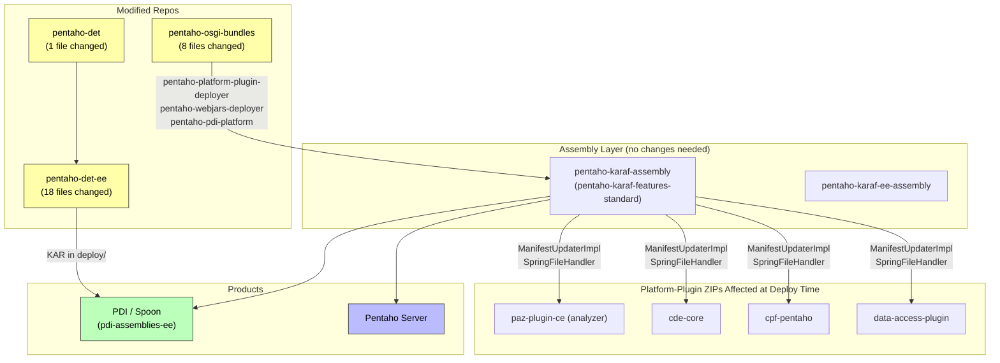

### Per-Change Regression Matrix

Only changes that affect Pentaho Server or other shared repos are listed (PDI-only changes with zero regression risk are omitted):

| Change | Affected Products | Other Repos Impacted | Regression Risk | Rationale |
|--------|-------------------|---------------------|-----------------|-----------|
| `ManifestUpdaterImpl`: `resolution:=optional` | PDI + Server | `cde`, `cpf`, `data-access`, `pentaho-analyzer` (all platform-plugin ZIPs) | **Low** | All platform-plugin bundles already have `DynamicImport-Package: *`. Adding `resolution:=optional` to imports only accelerates resolution. Runtime wiring is identical. |
| `SpringFileHandler`: HTTP Whiteboard properties | PDI + Server | Same as above | **Low** | Additive properties (`osgi.http.whiteboard.servlet.pattern`, `servlet-name`). Existing `alias` property preserved. On Server, servlets are routed by `PentahoWebContextFilter` → `IPluginManager`, not by the OSGi whiteboard. |
| `PluginXmlExternalResourcesHandler`: import `org.pentaho.platform.pdi` | PDI + Server | Same as above | **None** | Import is `resolution:=optional` (from ManifestUpdaterImpl change). Package doesn't exist on Server → import unsatisfied but harmless. |
| `WebjarsURLConnection`: version fallback | PDI + Server | `pentaho-karaf-assembly` (all webjars on both platforms) | **None** | Only activates when bower.json lacks `version` field (currently 8 datatables.net webjars). Other webjars have version → fallback code path not triggered. |

> **PDI-only changes (zero Server regression risk):** `BundleApplicationContextFactory`, `ContentGeneratorServlet` rewrite, `PdiPlatformActivator` VFS fix, `pentaho-pdi-platform` Export-Package, all `pentaho-det` / `pentaho-det-ee` changes. These are either in PDI-specific bundles not deployed on Server, or only invoked by the DET EE KAR which is never deployed on Server (DET is a PDI-only feature).

### Repos in ~/github NOT Requiring Changes

| Repository | Why Unaffected |
|------------|----------------|
| `pentaho-karaf-assembly` | Consumes binaries from Maven; no source changes needed. Builds the Karaf distribution that includes the 3 modified deployer/platform JARs. |
| `pentaho-analyzer` | `paz-plugin-ce` is consumed AS-IS by DET EE (repackaged into `det-pdi-analyzer-plugin`). No source changes to analyzer needed. |
| `cde` / `cpf` / `data-access` | Their platform-plugin ZIPs get `resolution:=optional` imports and HTTP Whiteboard properties at deploy time via the deployer — this is safe and additive. No source changes. |

### Pentaho Server: Detailed Whiteboard Impact Analysis

> **Note:** DET (Data Exploration Tool) is exclusively a PDI feature. It is never deployed on Pentaho Server and never has been. The DET EE KAR is only placed in PDI's `system/karaf/deploy/` folder. This section analyzes the impact of the *shared infrastructure changes* (`pentaho-osgi-bundles`) on Pentaho Server's existing plugins.

The primary concern is `SpringFileHandler` adding `osgi.http.whiteboard.servlet.pattern` to ALL platform-plugin servlet services on Pentaho Server. Affected Server plugins:

| Plugin | Servlets Generated | Whiteboard Pattern Added | Server Routing |
|--------|-------------------|------------------------|----------------|
| `paz-plugin-ce` (analyzer) | `xanalyzer.service`, `xanalyzer.editor`, etc. | `/content/analyzer/service/*`, `/content/analyzer/editor/*` | `PentahoWebContextFilter` → `IPluginManager` |
| `cde-core` | `cde.main`, `cde.api` | `/content/pentaho-cdf-dd/main/*`, `/content/pentaho-cdf-dd/api/*` | `PentahoWebContextFilter` → `IPluginManager` |
| `data-access-plugin` | `data-access-wizard`, etc. | `/content/data-access/wizard/*` | `PentahoWebContextFilter` → `IPluginManager` |

**Why no conflict on Server:**
1. On Pentaho Server, Pax Web 8's HTTP Whiteboard tracks services with `osgi.http.whiteboard.servlet.pattern` — but the Server's main HTTP connector is Tomcat (not Pax Web's Jetty). Pax Web only handles the Karaf-internal HTTP service.
2. The Server's `PentahoWebContextFilter` intercepts all `/content/*` requests at the Tomcat level, before they reach any OSGi HTTP service. Content generators are dispatched via `IPluginManager.getContentGenerator(pluginId, contentGeneratorId)` — completely bypassing OSGi service lookups.
3. The whiteboard properties are **additive** — the existing `alias` property is preserved, and services continue to be registered exactly as before.

**Conclusion: Zero regression risk on Pentaho Server.**

### Build Order for CI/CD

If all three repos are merged simultaneously, the build order must be:

```
1. pentaho-osgi-bundles  (provides pentaho-pdi-platform, pentaho-platform-plugin-deployer, pentaho-webjars-deployer)
2. pentaho-det           (provides data-access-impl-rest with CXF Bus fix)
3. pentaho-det-ee        (consumes pentaho-osgi-bundles + pentaho-det artifacts → produces KAR)
```

No changes are needed in `pentaho-karaf-assembly` or any other repo — they will pick up the new JAR versions from Maven on their next build.

---

## Appendix: PPUC-752 Spike Answers

This appendix directly addresses the questions from [PPUC-752](https://hv-eng.atlassian.net/browse/PPUC-752).

---

### Q1: Which Pentaho 10.2 version/service pack is the last known working baseline for DET?

**Answer: PDI 10.2.0.1 (build 255)**

PDI 10.2.0.1 is the last version where DET EE worked out of the box. In this version, DET EE was pre-installed in the Karaf `system/` directory alongside all required dependencies (Spring DM, common-ui platform plugin, pentaho-analyzer feature). Both STREAM and MODEL views were fully functional.

Starting with PDI 10.2.0.2, DET EE was removed from the base installation and required hot-deployment as a KAR file — but the platform changes (Karaf 4.4.6 upgrade, Spring DM removal) broke the hot-deploy path without additional fixes.

---

### Q2: What changed between the working and broken versions?

The following changes were made between 10.2.0.1 and 10.2.0.X (current 10.2 branch):

| Change | Version Introduced | Impact on DET |
|--------|-------------------|---------------|
| Karaf upgrade 4.2.15 → 4.4.6 | 10.2.0.2 | Pax Web 8 whiteboard interferes with servlet registration; thread-pool starvation from KAR prerequisites |
| Spring DM (Spring OSGi 1.2.1) removed | 10.2.0.X | Content generator Spring context never created; analyzer beans never instantiated |
| Spring Framework 3.2.18 removed | 10.2.0.X | No Spring available for beans.xml processing |
| `pentaho-spring-dm-extender` removed | 10.2.0.X | `plugin:` resource protocol unresolvable; `PentahoOsgiBundleXmlApplicationContext` unavailable |
| Content generator beans removed from paz-plugin-ce | 10.2.0.2 | Even with Spring DM, no beans are declared for SpringFileHandler to process |
| DET EE removed from base installation | 10.2.0.2 | Must be hot-deployed as KAR; prerequisites cause boot timeout |
| `common-ui` platform plugin no longer deployed | 10.2.0.X | All client-side JS (Dojo, Pentaho visualization, prompting) returns 404 |
| `pentaho-analyzer` feature removed from PDI | 10.2.0.X | OLAP content generators not available |

See [Section 2.1](#21-what-changed) for full details.

---

### Q3: Is the failure caused by...

**All of the above factors contribute.** The failure is **not** caused by a single issue but by a combination of platform changes that compound:

#### ✅ Removed Analyzer bean declarations — YES, contributing factor

In commit `4c774947e` (SP-6671), the 4 content generator beans were removed from `paz-plugin-ce/plugin.spring.xml`. These beans (`xanalyzer.service`, `xanalyzer.generatedContent`, `xanalyzer.editor`, `xanalyzer.backgroundExecution`) are what the `pentaho-platform-plugin-deployer` used to generate Blueprint servlet services. Without them, no content generator servlets are registered for `/content/analyzer/*` endpoints.

**However**, even if the beans were restored to `plugin.spring.xml`, DET would still not work due to issues below.

#### ✅ Karaf 4.4.6 upgrade impact — YES, major contributing factor

The Karaf 4.4.6 upgrade introduced:
1. **Pax Web 8 whiteboard interference** — Services registered with legacy `alias` property are "claimed" by the whiteboard extender, making them invisible to WebContextServlet
2. **Thread-pool starvation** — Any `prerequisite="true"` in a deploy-folder KAR blocks the shared feature installer thread pool, causing 2-minute boot timeout
3. **Different Bundle-Start behavior** — Bundles start in different order during clean-cache cold starts

#### ✅ PDI OSGi "fake server/platform" behavior — YES, contributing factor

PDI uses a stub `PentahoSystemPluginManager` that never scans plugins or registers classloaders. This causes:
- `IPluginManager.getClassLoader("common-ui")` returns `null` → `LocalizationServlet` returns 500
- `plugin:` resource protocol resolution fails (no `AnalyzerApplicationContext`)
- No full Pentaho Server infrastructure for content generator lifecycle

#### ⚠️ Hadoop add-on / KAR packaging changes — INDIRECTLY

The KAR packaging itself is not broken. The issue is that the KAR feature.xml cannot use `prerequisite="true"` (causes thread-pool starvation) AND the contained bundles must handle race conditions with CXF and other boot features. The big-data plugin (`pentaho-big-data-plugin-osgi`) is affected by thread-pool starvation but is not the root cause.

#### ✅ Another dependency/configuration issue — YES, multiple

- **Mondrian JDBC classloader mismatch** — `java.sql.DriverManager` Class identity check fails between system CL and OSGi DynamicImport
- **Missing common-ui** — Full Dojo toolkit, Pentaho visualization framework, and prompting modules not available (404 on all JS)
- **Missing i18n** — Inline message bundles needed because `LocalizationServlet` can't find plugin classloaders
- **Webjars version bug** — 8 datatables.net webjars return 404 due to null version extraction from bower.json

---

### Q4: Can DET be restored in the latest 10.2 service pack?

**YES.** DET EE has been successfully restored and tested in PDI 10.2.0.X (10.2 branch snapshot).

The working installation is at:
```
/Users/andjorge/pentaho/pdi/10.2.0.0-SNAPSHOT/pdi-ee-client-10.2.0.0-20260529.003302-1598-osgi_v6/data-integration
```

Both STREAM view and MODEL view (including drag-and-drop) are fully functional with the patched code.

---

### Q5: What is the recommended technical approach and estimated effort?

#### Recommended Approach

A self-contained KAR file that hot-deploys into `system/karaf/deploy/` with all dependencies included. This approach:

1. **Ships its own Spring Framework 5.3.34** (4 ServiceMix OSGi bundles) — no dependency on removed Spring DM
2. **Uses `BundleApplicationContextFactory`** — a new class in `pentaho-pdi-platform` that creates the analyzer's Spring context with a composite classloader, replacing Spring DM entirely
3. **Includes a repackaged analyzer platform-plugin ZIP** — with content generator beans restored, `PropertiesFactoryBean` replacing `plugin:` protocol, and HTTP Whiteboard servlet registration
4. **Self-contains all client JS** — full Dojo/Dijit/Dojox, Pentaho visualization framework, common-ui resources in the `pdi-webclient` bundle
5. **Uses NO feature prerequisites** — plain `<feature>` hard dependency + Blueprint `<reference>` for boot timing

#### Repositories Changed

| Repository | Files | Lines Changed | Key Changes |
|------------|-------|---------------|-------------|
| `pentaho-osgi-bundles` | 8 | +305/-35 | `BundleApplicationContextFactory` (new), `ContentGeneratorServlet` rewrite, `ManifestUpdaterImpl`, `WebjarsURLConnection` |
| `pentaho-det-ee` | 18 | +1103/-49 | KAR feature.xml, `pdi-analyzer-plugin` module (new), `pdi-webclient` JS extraction, Import-Package fixes |
| `pentaho-det` | 1 | ~10 | CXF Bus Blueprint reference |
| **Total** | **27** | **~1,408** | |

#### Estimated Effort

| Phase | Effort | Notes |
|-------|--------|-------|
| Implementation | ✅ **Done** | All changes implemented and tested (uncommitted on branch 10.2) |
| Code review | 2-3 days | 27 files across 3 repos; requires OSGi/Karaf expertise |
| Integration testing | 2-3 days | Cold start, hot deploy, MODEL view, STREAM view, Server regression |
| CI/CD pipeline | 1 day | Build order: pentaho-osgi-bundles → pentaho-det → pentaho-det-ee |
| **Total remaining** | **5-7 days** | Implementation complete; review + testing + merge |

#### Risk Assessment

| Risk | Severity | Mitigation |
|------|----------|------------|
| Pentaho Server regression from pentaho-osgi-bundles changes | Low | All PDI-specific code paths; Server uses different routing (`IPluginManager`) |
| Boot timing issues on slower hardware | Low | No prerequisites + CXF Bus `<reference>` provides deterministic timing |
| Future analyzer version incompatibility | Medium | `det-pdi-analyzer-plugin` module does JAR surgery on paz-plugin-ce; bean structure changes would require update |

---

### Q6: If no or high-risk, what viable workaround can be proposed?

**Not applicable** — DET can be restored (answer to Q4 is YES). However, for context:

**If the full fix were not feasible**, the only viable workaround would be:
- **Pin PDI at 10.2.0.1** for customers requiring DET EE MODEL view functionality
- **Partial workaround**: DET STREAM view could potentially work with fewer changes (only needs CXF endpoints + webclient JS, no analyzer/Mondrian), but MODEL view requires the full content generator + Mondrian JDBC stack

**Why restoring the old Spring DM approach is NOT a workaround:**
- Reintroduces 13 CVEs including CRITICAL Spring4Shell (CVE-2022-22965)
- Depends on abandoned projects (Spring OSGi 1.2.1, last updated 2009)
- Prerequisites still cause boot timeout in Karaf 4.4.6
- Pax Web 8 whiteboard interference remains regardless

See [Section 5](#5-why-restoring-content-generator-beans-in-paz-plugin-ce-is-not-viable) for the full analysis.

