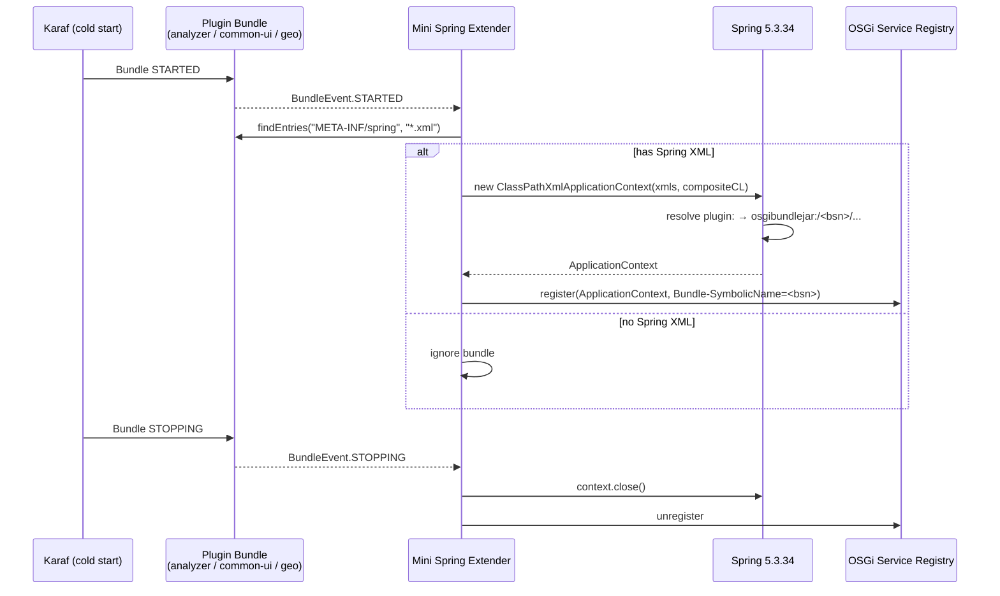
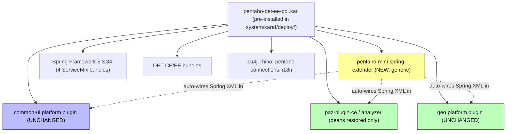
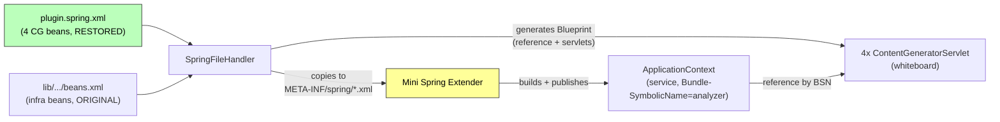

# DET in PDI 10.2.0.X — Proposed Approach: Mini Spring DM + Upgraded Spring

> **Status:** ✅ **IMPLEMENTED AND VERIFIED (cold start)** on the `PPUC-752_proposed` branches. The
> original design (§1–§11) is preserved for context; the as-built deltas are recorded in
> **[§12 Errata](#12-errata--what-changed-from-proposal-to-working-solution)** and the edited install
> files in **[§13](#13-pdi-install-files-edited--corresponding-repo-files)**. This document describes an
> alternative architecture to the one in `DET_IN_PDI_10.2.0.X.md`. The goal is the **smallest possible
> change footprint** while restoring the "it just works" deployment model of PDI 10.2.0.1 — with the
> platform's modern, CVE-free Spring and a tiny custom OSGi extender that takes over Spring DM's job.

## TL;DR

The currently-implemented fix makes DET EE work by giving the **analyzer plugin** a bespoke Blueprint
file (`analyzer_beans.xml`) that explicitly calls a new `BundleApplicationContextFactory`, plus a
pile of per-plugin packaging surgery. That works, but it is **plugin-specific**: every BA-style
platform plugin (analyzer, common-ui, geo, …) would need its own custom Blueprint to be revived.

This proposal replaces the per-plugin Blueprint wiring with **one shared, pre-installed OSGi bundle**
— a *Mini Spring DM Extender* — that reproduces the only part of Spring DM that Pentaho plugins
actually relied on: *scan a bundle for `META-INF/spring/*.xml`, build a Spring `ApplicationContext`
with the right classloader, publish it as an OSGi service, tear it down on stop.*

With this extender in place:

- **Spring is upgraded to 5.3.34** → all 13 Spring 3.2.18 CVEs gone, no abandoned dependencies.
- **A custom Spring DM layer** (one small bundle) does the context creation Spring DM used to do.
- **Only cold start is supported** — the KAR is pre-installed and PDI is restarted. No hot-deploy
  machinery, no thread-pool-starvation workarounds, no race-condition retry logic.
- **BA plugins need zero changes** — common-ui, analyzer CE, and geo are consumed *as-is*. The only
  exception is **restoring the 4 analyzer content-generator beans** that were deleted from
  `paz-plugin-ce/plugin.spring.xml` (a one-line-per-bean revert), exactly as it used to work.
- **All other identified issues are still fixed**, but most of them collapse into the extender or
  disappear once hot-deploy is off the table.

---

## Table of Contents

- [1. Why This Approach](#1-why-this-approach)
- [2. The Four Pillars](#2-the-four-pillars)
  - [2.1 Upgraded Spring (5.3.34, no CVEs)](#21-upgraded-spring-5334-no-cves)
  - [2.2 Custom Spring DM Layer (Mini Extender)](#22-custom-spring-dm-layer-mini-extender)
  - [2.3 Cold Start Only](#23-cold-start-only)
  - [2.4 Generic, Zero-Change BA Plugin Support](#24-generic-zero-change-ba-plugin-support)
- [3. Mini Spring DM Extender — Design](#3-mini-spring-dm-extender--design)
  - [3.1 Responsibilities](#31-responsibilities)
  - [3.2 Lifecycle Flow](#32-lifecycle-flow)
  - [3.3 The `plugin:` Protocol Handler](#33-the-plugin-protocol-handler)
  - [3.4 Composite Classloader](#34-composite-classloader)
  - [3.5 Reference Implementation Sketch](#35-reference-implementation-sketch)
- [4. How Each Previously-Identified Issue Is Resolved](#4-how-each-previously-identified-issue-is-resolved)
- [5. Change Footprint (Least Changes Possible)](#5-change-footprint-least-changes-possible)
- [6. Packaging: Everything in One KAR](#6-packaging-everything-in-one-kar)
- [7. Cold-Start Boot Sequence](#7-cold-start-boot-sequence)
- [8. Comparison vs Current Implementation](#8-comparison-vs-current-implementation)
- [9. Risks and Mitigations](#9-risks-and-mitigations)
- [10. Effort Estimate](#10-effort-estimate)
- [11. Implementation Reference](#11-implementation-reference)
  - [11.1 The Deployer ↔ Extender Contract (critical)](#111-the-deployer--extender-contract-critical)
  - [11.2 Single Context From All `META-INF/spring/*.xml`](#112-single-context-from-all-meta-infspringxml)
  - [11.3 Extender Bundle: Module, POM, Manifest](#113-extender-bundle-module-pom-manifest)
  - [11.4 Composite Classloader (full)](#114-composite-classloader-full)
  - [11.5 `BundleApplicationContextFactory` Changes](#115-bundleapplicationcontextfactory-changes)
  - [11.6 The `osgibundlejar:` / `plugin:` Protocol Prerequisite](#116-the-osgibundlejar--plugin-protocol-prerequisite)
  - [11.7 Spring 5.3.34 Maven Coordinates](#117-spring-5334-maven-coordinates)
  - [11.8 Feature.xml (KAR) Example](#118-featurexml-kar-example)
  - [11.9 Analyzer Bean Restoration (exact content)](#119-analyzer-bean-restoration-exact-content)
  - [11.10 Files to Add / Change / Revert / Delete](#1110-files-to-add--change--revert--delete)
  - [11.11 Pentaho Server Exclusion](#1111-pentaho-server-exclusion)
  - [11.12 Verification Checklist](#1112-verification-checklist)
  - [11.13 Open Items to Confirm in Code](#1113-open-items-to-confirm-in-code)
- [12. Errata — What Changed From Proposal to Working Solution](#12-errata--what-changed-from-proposal-to-working-solution)
  - [12.1 TL;DR of the deltas](#121-tldr-of-the-deltas)
  - [12.2 Detailed explanation](#122-detailed-explanation)
  - [12.3 Known follow-ups](#123-known-follow-ups-non-blocking)
- [13. PDI Install Files Edited & Corresponding Repo Files](#13-pdi-install-files-edited--corresponding-repo-files)
  - [13.1 Repo files changed (summary)](#131-repo-files-changed-summary-branch-ppuc-752_proposed)

---

## 1. Why This Approach

The current implementation solves DET EE, but it bakes PDI/OSGi knowledge into the **analyzer
plugin packaging**. Consequences:

- Each future BA plugin (geo, common-ui extensions, data-access, cde/cpf) that wants to live in PDI
  needs its **own** custom Blueprint + JAR surgery.
- The analyzer's `plugin.spring.xml` had to be **emptied** and a replacement `beans.xml` injected via
  `zip -d` / `jar uf` surgery — fragile against future analyzer releases.
- A lot of the complexity (no prerequisites, thread-pool starvation, CXF race conditions, 5s retry
  removal) exists *only because hot deployment was a goal*.

The user's clarifications change the calculus:

> **Hot deployment is not needed.** Users install by hand and restart PDI.

Once hot-deploy is dropped, a **pre-installed shared extender** becomes the natural design — it is
exactly what Spring DM was (a pre-installed extender bundle), minus the abandoned code and minus the
Spring 3.x lock-in.

---

## 2. The Four Pillars

### 2.1 Upgraded Spring (5.3.34, no CVEs)

Spring DM 1.2.1 forced Spring to stay in the `[2.5.6, 4)` range — that is the *real* reason PDI was
stuck on Spring 3.2.18 with its 13 CVEs. By replacing Spring DM with our own tiny extender, we are no
longer bound to that range and can ship **Spring Framework 5.3.34** (ServiceMix OSGi bundles: core,
beans, context, expression).

| Concern | Spring 3.2.18 + Spring DM | Spring 5.3.34 + Mini Extender |
|---------|---------------------------|-------------------------------|
| CVEs | 13 (incl. CRITICAL Spring4Shell) | 0 known |
| Maintenance | Spring DM abandoned 2009 | In-house, ~150 LOC |
| Spring version lock | `[2.5.6, 4)` | none |

> The CVEs were never an independent reason to avoid Spring DM — they were a *symptom* of the version
> lock. Fixing the lock fixes the CVEs.

### 2.2 Custom Spring DM Layer (Mini Extender)

A single new bundle, `pentaho-mini-spring-extender`, pre-installed in `system/`. It reproduces only
the behaviour Pentaho plugins relied on. It is **generic** — it does not know anything about analyzer,
common-ui, or geo. It just processes any bundle that ships `META-INF/spring/*.xml`.

### 2.3 Cold Start Only

Because the KAR is pre-installed and PDI is restarted, we can **delete** every mechanism that existed
to survive hot-deploy:

- No "forbidden prerequisites" rule — features can use normal `prerequisite="true"` ordering.
- No thread-pool-starvation workaround.
- No mandatory CXF Bus `<reference>` race-condition guard (normal feature ordering handles it).
- No "fail fast, no retry" constraint — but we also don't *need* Spring DM's 5s retry, because boot
  ordering is deterministic on cold start.

This removes a large chunk of the fragile parts of the current design.

### 2.4 Generic, Zero-Change BA Plugin Support

The extender restores the 10.2.0.1 contract: **a platform plugin that contains Spring XML is wired up
automatically, with no plugin-specific glue.** This means:

| Plugin | Change required under this proposal |
|--------|-------------------------------------|
| common-ui | **None** — consumed as-is, dropped into the KAR |
| analyzer CE (`paz-plugin-ce`) | **Restore the 4 content-generator beans** in `plugin.spring.xml` (revert of SP-6671 deletion). Nothing else. |
| geo | **None** — consumed as-is |
| data-access / cde / cpf | **None** — would work the same way if added |

The analyzer bean restoration is the *only* plugin-side change, and it is a revert to how it always
worked — not new code.

---

## 3. Mini Spring DM Extender — Design

### 3.1 Responsibilities

| # | Responsibility | How |
|---|----------------|-----|
| 1 | Detect Spring-XML bundles | `BundleTracker` / `BundleListener` watching for `ACTIVE` bundles with `META-INF/spring/*.xml` |
| 2 | Build `ApplicationContext` | `ClassPathXmlApplicationContext` (Spring 5.3.34) with a composite classloader |
| 3 | Resolve `plugin:` protocol | A `Resource` override (re-implements the ~10 lines from the old `PentahoOsgiBundleXmlApplicationContext`) so legacy XML needs no edits |
| 4 | Publish context as OSGi service | `registerService(ApplicationContext, {Bundle-SymbolicName=<bsn>})` — same contract downstream code already expects |
| 5 | Tear down on stop/update | On `STOPPING`, `context.close()` and unregister |

### 3.2 Lifecycle Flow



### 3.3 The `plugin:` Protocol Handler

The reason the old `beans.xml` could write `value="plugin:analyzer.properties"` was the custom
`PentahoOsgiBundleXmlApplicationContext.getResource()`. We re-implement *only* that method, so analyzer
(and any other plugin) keeps working **with zero XML edits**:

```java
@Override
public Resource getResource(String location) {
  if (location != null && location.startsWith("plugin:")) {
    String rel = location.substring("plugin:".length());
    return super.getResource("osgibundlejar:/" + bundle.getSymbolicName() + "/" + rel);
  }
  return super.getResource(location);
}
```

This is what lets us avoid the current approach's JAR surgery (stripping `beans.xml`, rewriting it to
use `classpath:`). The plugin's original artifacts are used untouched.

### 3.4 Composite Classloader

Same principle as the existing `BundleApplicationContextFactory` (reuse it directly): bean classes and
classpath resources come from the **plugin bundle** classloader; Spring's `META-INF/spring.handlers`
and `spring.schemas` come from the **Spring framework** bundle classloader.

```
loadClass / getResource:  plugin bundle CL  →  (fallback)  Spring CL
getResources:             merge(plugin bundle CL, Spring CL)
```

Because Spring's namespace handlers are now reachable via the composite CL, **`<util:properties>` and
other namespaces work again** — so we don't even need the `PropertiesFactoryBean` workaround from the
current design. The plugin's original `beans.xml` works verbatim.

### 3.5 Reference Implementation Sketch

```java
@Component(immediate = true)
public class MiniSpringExtender {

  private BundleTracker<ServiceRegistration<ApplicationContext>> tracker;

  @Activate
  void activate(BundleContext ctx) {
    tracker = new BundleTracker<>(ctx, Bundle.ACTIVE, null) {
      @Override
      public ServiceRegistration<ApplicationContext> addingBundle(Bundle b, BundleEvent e) {
        List<URL> xmls = list(b.findEntries("META-INF/spring", "*.xml", false));
        if (xmls.isEmpty()) return null;

        // Reuse existing composite-CL + plugin: protocol logic
        ConfigurableApplicationContext appCtx =
            BundleApplicationContextFactory.createContext(b, xmls);

        Dictionary<String, Object> props = new Hashtable<>();
        props.put("Bundle-SymbolicName", b.getSymbolicName());
        return ctx.registerService(ApplicationContext.class, appCtx, props);
      }

      @Override
      public void removedBundle(Bundle b, BundleEvent e,
                                ServiceRegistration<ApplicationContext> reg) {
        ApplicationContext c = ctx.getService(reg.getReference());
        reg.unregister();
        if (c instanceof ConfigurableApplicationContext cac) cac.close();
      }
    };
    tracker.open();
  }

  @Deactivate
  void deactivate() { if (tracker != null) tracker.close(); }
}
```

> Note: `BundleApplicationContextFactory` already exists in `pentaho-pdi-platform` from the current
> work. We **extend** it with the `plugin:` protocol override (§3.3) and call it from the extender —
> rather than from per-plugin Blueprints. Net new code is the tracker + the protocol method.

---

## 4. How Each Previously-Identified Issue Is Resolved

The original doc listed 20 issues. Under this proposal:

| # | Issue (from current doc) | Resolution under this proposal |
|---|--------------------------|-------------------------------|
| 1 | Analyzer context never starts | Mini extender auto-creates it from `META-INF/spring/*.xml` (same as Spring DM did) |
| 2 | `NamespaceHandler for .../util` not found | Composite CL exposes Spring's `spring.handlers` → `<util:*>` works; **no `PropertiesFactoryBean` workaround needed** |
| 3 | 404 on 8 `datatables.net*` webjars | Keep the `WebjarsURLConnection` version-fallback fix (small, shared, harmless) |
| 4 | `No suitable driver for jdbc:mondrian` | Keep explicit `DriverManager.registerDriver()` in `ContentGeneratorServlet` (orthogonal to Spring) |
| 5 | MODEL view empty | Cascade of #4 — resolved by #4 |
| 6 | NPE at `AnalyzerContentGenerator:330` | Keep `pathParams` (`httprequest/httpresponse/cmd`) fix in `ContentGeneratorServlet` |
| 7–11, 15 | Missing common-ui JS / modules / i18n / jQuery shim / echarts | **Deploy common-ui as-is in the KAR.** With common-ui present and registered, the original RequireJS + i18n paths resolve. No `Messages.js` patch, no `package.json` module re-declaration, no JS extraction. |
| 12 | KarafFeatureWatcher timeout (prerequisite starvation) | **Gone** — cold-start-only means normal `prerequisite="true"` ordering is fine; no deploy-folder thread-pool conflict |
| 13 | `No DestinationFactory` (CXF cold-start race) | **Gone / simplified** — normal feature ordering installs CXF before DET; optional to keep the `<reference>` guard |
| 14 | cpf-core can't resolve `org.mozilla.javascript` | Keep rhino in the feature (packaging detail) |
| 16 | Pax Web 8 whiteboard hijacks `alias` servlets | Restore analyzer beans → `SpringFileHandler` registers them; keep the HTTP Whiteboard property addition (small, additive) |
| 17 | `mtm` VFS provider conflict on refresh | **Largely moot** — no hot-deploy/refresh; keep the cheap `removeProvider("mtm")` guard anyway |
| 18 | `require-init.js` empty (refresh cascade) | **Gone** — no hot-deploy refresh cascades |
| 19 | `No bean named 'properties'` (`plugin:` protocol) | `plugin:` protocol handler (§3.3) resolves it — **original `beans.xml` used unchanged** |
| 20 | 404 on analyzer `config.js` | Cascade of #1 — resolved by #1 |

**Net effect:** Issues 2, 7–11, 15, 18, 19 are eliminated by *restoring the real components*
(common-ui as-is + `plugin:` protocol) instead of working around their absence. Issues 12, 13, 17, 18
shrink or vanish because hot-deploy is gone. The genuinely orthogonal fixes (3, 4, 6, 14, 16) are
small and retained.

---

## 5. Change Footprint (Least Changes Possible)

### New code

| Item | Where | Size |
|------|-------|------|
| `MiniSpringExtender` (BundleTracker) | `pentaho-osgi-bundles` (new bundle or in `pentaho-pdi-platform`) | ~80 LOC |
| `plugin:` protocol `getResource()` override | extend `BundleApplicationContextFactory` | ~10 LOC |

### Reverted / restored (not new code)

| Item | Action |
|------|--------|
| Analyzer 4 content-generator beans | Restore in `paz-plugin-ce/plugin.spring.xml` (revert SP-6671 deletion) |
| common-ui | Ship as-is in KAR (no edits) |
| analyzer `beans.xml` | Use **original** (no JAR surgery, no `classpath:` rewrite) |

### Dropped from the current implementation (less code than today)

| Removed | Reason |
|---------|--------|
| `analyzer_beans.xml` custom Blueprint | Extender does the wiring generically |
| Empty `plugin.spring.xml` + JAR surgery | Original artifacts used as-is |
| `pdi-webclient` JS extraction + `package.json` module re-declaration | common-ui present → not needed |
| Patched `Messages.js`, jQuery/Underscore shims | common-ui present → not needed |
| "No prerequisites" feature gymnastics | Cold-start-only |
| `PropertiesFactoryBean` workaround | `<util:*>` works via composite CL |

> The proposal is a **net reduction** vs the current branch: ~90 LOC of new generic code replaces
> several hundred lines of plugin-specific packaging and JS surgery.

### Retained orthogonal fixes (keep as-is)

- `ContentGeneratorServlet`: composite CL + mondrian driver registration + `pathParams`.
- `WebjarsURLConnection`: version fallback.
- `ManifestUpdaterImpl`: `resolution:=optional` (still helpful, harmless).
- rhino in feature; `removeProvider("mtm")` guard.

---

## 6. Packaging: Everything in One KAR

Even though common-ui, analyzer CE, and geo are unmodified, they can all live inside the **single
pre-installed KAR** (or the base `system/`), exactly like 10.2.0.1 shipped them in `system/`:



The extender + Spring bundles are pre-installed once; **any** plugin dropped into the KAR that carries
`META-INF/spring/*.xml` is wired automatically — the generic, zero-change contract.

---

## 7. Cold-Start Boot Sequence

```
┌──────────────────────────────────────────────────────────────────────┐
│ 1. Karaf boots, clean cache, KAR already in deploy/                   │
│ 2. Base features install (CXF, pentaho-base, deployers, requirejs)    │
│ 3. Spring 5.3.34 bundles start                                        │
│ 4. Mini Spring Extender starts (BundleTracker opens)                  │
│ 5. common-ui / analyzer / geo bundles start                           │
│    → extender sees META-INF/spring/*.xml                              │
│    → builds ApplicationContext (composite CL + plugin: protocol)      │
│    → publishes ApplicationContext service per plugin                  │
│ 6. SpringFileHandler-generated servlets + content generators register │
│ 7. PDI/Spoon UI launches → DET STREAM + MODEL views work              │
└──────────────────────────────────────────────────────────────────────┘
```

Normal feature `prerequisite` ordering is allowed here because there is no deploy-folder hot-install
competing for the feature-installer thread pool.

---

## 8. Comparison vs Current Implementation

| Aspect | Current (implemented) | Proposed (this doc) |
|--------|-----------------------|---------------------|
| Spring version | 5.3.34 | 5.3.34 |
| Context creation | Per-plugin Blueprint → `BundleApplicationContextFactory` | Shared extender → `BundleApplicationContextFactory` |
| Analyzer packaging | JAR surgery, empty `plugin.spring.xml`, custom Blueprint | Original artifacts + restore 4 beans |
| common-ui | Re-implemented inside `pdi-webclient` (JS extraction, shims, `package.json`) | Shipped as-is |
| geo / future plugins | Each needs its own Blueprint | Works automatically |
| `plugin:` protocol | Removed (rewritten to `classpath:`) | Supported (10 LOC handler) |
| `<util:*>` namespaces | Avoided (`PropertiesFactoryBean`) | Supported |
| Hot deploy | Supported (adds complexity) | Not supported (by design) |
| Boot ordering hacks | Many (no prerequisites, CXF `<reference>`, retry removal) | Standard ordering |
| New code | ~1,400 lines across 3 repos | ~90 lines + reverts |

---

## 9. Risks and Mitigations

| Risk | Severity | Mitigation |
|------|----------|------------|
| Extender wires a bundle whose Spring XML isn't meant to be a context | Low | Only scan `META-INF/spring/*.xml` (the established Spring DM convention); plugins not using it are ignored |
| Two extenders (ours + leftover Spring DM) both process a bundle | Low | Spring DM is fully removed; ours is the only one |
| Spring 5 behavioural differences vs Spring 3 in plugin beans | Medium | Analyzer/common-ui/geo beans are simple DI + `PropertiesFactoryBean`/`util:` — well within Spring 5 compatibility; test each plugin context on boot |
| Pentaho Server regression (shared `pentaho-osgi-bundles`) | Low | Extender is pre-installed only in PDI's KAR/system; Server keeps its own `IPluginManager` routing. Don't add the extender to Server assembly. |
| `plugin:` protocol relies on `osgibundlejar:` URL handler | Low | That handler already exists in the platform (used by the original design) |

---

## 10. Effort Estimate

| Task | Estimate |
|------|----------|
| `MiniSpringExtender` bundle (BundleTracker, service publish) | 1 day |
| `plugin:` protocol `getResource()` override in factory | 0.5 day |
| Move Spring 5.3.34 bundles to a shared feature in the KAR | 0.5 day |
| Restore 4 analyzer content-generator beans | 0.25 day |
| Add common-ui + geo as-is to the KAR feature | 0.5 day |
| Remove now-unneeded current-branch code (Blueprint, JS extraction, surgery) | 1 day |
| Cold-start integration testing (DET STREAM + MODEL, geo, common-ui) | 2 days |
| Pentaho Server regression check | 0.5 day |
| **Total** | **~6 days** |

**Bottom line:** comparable effort to the current fix, but the result is **generic, smaller, and
matches the original "drop a Spring-XML plugin in and it works" contract** — with a modern, CVE-free
Spring and no hot-deploy complexity.

---

## 11. Implementation Reference

This section contains the concrete details required to build the proposal. Items marked
**⚠️ confirm** are based on the analysis in `DET_IN_PDI_10.2.0.X.md` and must be verified against the
actual source in `pentaho-osgi-bundles`, `pentaho-analyzer`, and `pentaho-det-ee` before coding.

### 11.1 The Deployer ↔ Extender Contract (critical)

This is the single most important detail and the one most likely to be missed. There are **two
cooperating pieces**, exactly as in PDI 10.2.0.1:

1. **`pentaho-platform-plugin-deployer` → `SpringFileHandler`** turns a platform-plugin ZIP into an
   OSGi bundle. It (a) copies `plugin.spring.xml` to `META-INF/spring/plugin.spring.xml`, (b) scans
   `lib/*.jar` for any XML containing the Spring beans namespace and copies them to
   `META-INF/spring/<name>.xml`, and (c) **generates a Blueprint** that registers one
   `ContentGeneratorServlet` per content-generator bean.
2. **The Mini Spring Extender** builds the `ApplicationContext` from those `META-INF/spring/*.xml`
   files and **publishes it as an OSGi service**.

The generated servlets must obtain their bean **from the extender-published context**. So the
Blueprint generated by `SpringFileHandler` must consume the context via an OSGi reference:

```xml
<!-- Generated by SpringFileHandler into OSGI-INF/blueprint/generated-spring.xml -->
<blueprint xmlns="http://www.osgi.org/xmlns/blueprint/v1.0.0">

  <!-- Wait for the ApplicationContext the extender publishes for THIS bundle -->
  <reference id="appCtx"
             interface="org.springframework.context.ApplicationContext"
             filter="(Bundle-SymbolicName=${bundle.symbolicName})"/>

  <!-- One servlet per content-generator bean from plugin.spring.xml -->
  <bean id="xanalyzer.service.servlet"
        class="org.pentaho.platform.pdi.ContentGeneratorServlet">
    <argument ref="appCtx"/>
    <argument value="xanalyzer.service"/>   <!-- bean id to look up -->
  </bean>
  <service ref="xanalyzer.service.servlet" interface="javax.servlet.Servlet">
    <service-properties>
      <entry key="osgi.http.whiteboard.servlet.pattern" value="/content/analyzer/service/*"/>
      <entry key="osgi.http.whiteboard.servlet.name"   value="xanalyzer.service"/>
    </service-properties>
  </service>
  <!-- repeat for generatedContent, editor, backgroundExecution -->
</blueprint>
```

**Implication for `SpringFileHandler` (`pentaho-osgi-bundles`):** This is the *only* deployer change.
Instead of the current 10.2.0.X behaviour (emit whiteboard servlet services that reference an
inline/factory-created context), it must emit servlet services that reference the
**extender-published `ApplicationContext`** filtered by `Bundle-SymbolicName`. This is effectively a
restoration of the 10.2.0.1 servlet-generation behaviour, plus the OSGi R7 whiteboard properties.



> **Why a `<reference>` and not a Blueprint `<bean>` factory call:** the `<reference>` makes the
> servlet registration **wait** for the extender to finish building the context. On cold start this is
> the natural ordering guarantee — no retry/timeout logic needed.

### 11.2 Single Context From All `META-INF/spring/*.xml`

Spring DM created **one** `ApplicationContext` per bundle from **all** `META-INF/spring/*.xml` files
combined (so beans in `plugin.spring.xml` could reference beans in `beans.xml`). The extender must do
the same: pass the full array of XML URLs to a single `ClassPathXmlApplicationContext`.

- **Ordering:** sort the URLs deterministically (e.g. alphabetical) so cross-file bean references and
  overrides are stable. `beans.xml` (infrastructure) before `plugin.spring.xml` (consumers) is safe.
- **Lazy init:** the analyzer infra beans use `default-lazy-init="true"`. Preserve this — do **not**
  force eager init. The context `refresh()` will still register bean definitions; content generators
  are `scope="prototype"` and created on demand by the servlets.
- **Bundle without Spring XML:** `findEntries` returns `null` → extender ignores the bundle. Plugins
  that do not use Spring are untouched.

### 11.3 Extender Bundle: Module, POM, Manifest

Create a new module, e.g. `pentaho-osgi-bundles/pentaho-mini-spring-extender` (or fold the class into
the existing `pentaho-pdi-platform` bundle to save a module — either works; a dedicated bundle keeps
concerns separate and is reusable by Server-less assemblies).

Key manifest requirements (via `maven-bundle-plugin` / bnd):

```
Bundle-SymbolicName: pentaho-mini-spring-extender
Bundle-Activator: (none — use Declarative Services @Component)
Import-Package: \
  org.osgi.framework, \
  org.osgi.util.tracker, \
  org.springframework.context, \
  org.springframework.context.support, \
  org.springframework.core.io, \
  org.springframework.beans.factory.xml, \
  org.pentaho.platform.pdi          # for BundleApplicationContextFactory
Service-Component: OSGI-INF/*.xml   # generated by bnd from @Component
```

- **Start level:** the extender and the Spring 5.3.34 bundles must reach `ACTIVE` **before** the
  plugin bundles. Put them at a lower start level than the platform plugins in the feature (see
  §11.8). The `BundleTracker` also retro-processes already-`ACTIVE` bundles, so a late start still
  works, but earlier is cleaner.
- The extender **imports** `org.springframework.*`, so its own classloader is the "Spring CL" used in
  the composite classloader (it can see `META-INF/spring.handlers` / `spring.schemas` from the Spring
  bundles it wires to). **⚠️ confirm** the Spring ServiceMix bundles export `META-INF` resources or
  that the handlers are reachable; if not, the factory must take the Spring context bundle's
  classloader explicitly (see §11.4).

### 11.4 Composite Classloader (full)

Reuse the existing `BundleApplicationContextFactory` composite classloader. Required semantics:

```java
final class CompositeClassLoader extends ClassLoader {
  private final ClassLoader bundleCl;   // plugin bundle wiring
  private final ClassLoader springCl;   // Spring framework bundle(s)

  CompositeClassLoader( ClassLoader bundleCl, ClassLoader springCl ) {
    super( null );
    this.bundleCl = bundleCl;
    this.springCl = springCl;
  }

  @Override protected Class<?> loadClass( String name, boolean resolve )
      throws ClassNotFoundException {
    try { return bundleCl.loadClass( name ); }
    catch ( ClassNotFoundException e ) { return springCl.loadClass( name ); }
  }

  @Override public URL getResource( String name ) {
    URL u = bundleCl.getResource( name );
    return ( u != null ) ? u : springCl.getResource( name );
  }

  @Override public Enumeration<URL> getResources( String name ) throws IOException {
    // MUST merge: spring.handlers / spring.schemas may exist in BOTH
    List<URL> all = new ArrayList<>();
    all.addAll( Collections.list( bundleCl.getResources( name ) ) );
    all.addAll( Collections.list( springCl.getResources( name ) ) );
    return Collections.enumeration( all );
  }
}
```

The merged `getResources` is what makes `<util:*>` and other namespace handlers resolve — eliminating
the need for the current design's `PropertiesFactoryBean` workaround.

`bundleCl` = `bundle.adapt(BundleWiring.class).getClassLoader()`.
`springCl` = the extender bundle's own classloader (it imports `org.springframework.*`), **or** the
`spring-context` bundle's classloader if handlers aren't visible transitively (**⚠️ confirm**).

### 11.5 `BundleApplicationContextFactory` Changes

The class already exists. Two additions:

1. **`plugin:` protocol** — subclass `ClassPathXmlApplicationContext` (or set a custom
   `ResourceLoader`) overriding `getResource()` as in §3.3. This restores legacy `plugin:` references
   so the analyzer's **original** `beans.xml` is used unchanged.
2. **Accept a list of config URLs** (multiple `META-INF/spring/*.xml`) and the bundle, returning a
   refreshed `ConfigurableApplicationContext`. Signature:

```java
public static ConfigurableApplicationContext createContext( Bundle bundle, List<URL> springXmls );
```

Internally: build composite CL (§11.4), `ctx.setClassLoader(compositeCl)`,
`ctx.setConfigLocations(urlsAsStrings)`, `ctx.refresh()`. Do **not** publish the service here — the
extender (§3.5) does that so the factory stays reusable.

### 11.6 The `osgibundlejar:` / `plugin:` Protocol Prerequisite

The `plugin:` override rewrites to `osgibundlejar:/<bsn>/<path>`. **⚠️ confirm** the `osgibundlejar`
URL stream handler is registered in the target assembly (it existed in the 10.2.0.1 stack via
`pentaho-spring-dm-extender`). If it is **not** present after Spring DM removal, add a tiny
`URLStreamHandlerService` that resolves `osgibundlejar:/<bsn>/<path>` to `bundle.getEntry(path)` for
the bundle whose symbolic name matches `<bsn>`. ~30 LOC. This is the only other potentially-missing
platform primitive.

### 11.7 Spring 5.3.34 Maven Coordinates

ServiceMix-wrapped OSGi bundles (4 only — `aop`, `aopalliance`, `context-support` not needed because
analyzer/common-ui imports of `org.springframework.aop.*` are `resolution:=optional`):

```
mvn:org.apache.servicemix.bundles/org.apache.servicemix.bundles.spring-core/5.3.34_1
mvn:org.apache.servicemix.bundles/org.apache.servicemix.bundles.spring-beans/5.3.34_1
mvn:org.apache.servicemix.bundles/org.apache.servicemix.bundles.spring-context/5.3.34_1
mvn:org.apache.servicemix.bundles/org.apache.servicemix.bundles.spring-expression/5.3.34_1
```

**⚠️ confirm** the exact ServiceMix wrap suffix (`_1`, `_2`, …) available in the Pentaho/public Maven
repo for 5.3.34. If a plugin actually uses `<aop:*>` or `spring-context-support` features, add the
corresponding wrapped bundles.

### 11.8 Feature.xml (KAR) Example

```xml
<features name="pentaho-det-ee-pdi" xmlns="http://karaf.apache.org/xmlns/features/v1.4.0">

  <!-- Shared, generic Spring + extender. Lower start-level so it's ACTIVE first. -->
  <feature name="pentaho-mini-spring" version="${project.version}">
    <bundle start-level="30">mvn:org.apache.servicemix.bundles/org.apache.servicemix.bundles.spring-core/5.3.34_1</bundle>
    <bundle start-level="30">mvn:org.apache.servicemix.bundles/org.apache.servicemix.bundles.spring-beans/5.3.34_1</bundle>
    <bundle start-level="30">mvn:org.apache.servicemix.bundles/org.apache.servicemix.bundles.spring-expression/5.3.34_1</bundle>
    <bundle start-level="30">mvn:org.apache.servicemix.bundles/org.apache.servicemix.bundles.spring-context/5.3.34_1</bundle>
    <bundle start-level="35">mvn:pentaho/pentaho-mini-spring-extender/${project.version}</bundle>
  </feature>

  <feature name="pentaho-det-ee-pdi" version="${project.version}">
    <!-- cold-start only: normal hard dependency ordering is fine -->
    <feature>pdi-platform</feature>
    <feature>pentaho-mini-spring</feature>

    <!-- BA plugins, UNCHANGED, deployed via the platform-plugin handler -->
    <bundle start-level="80">pentaho-platform-plugin:mvn:pentaho/common-ui/${common-ui.version}/zip</bundle>
    <bundle start-level="80">pentaho-platform-plugin:mvn:pentaho/paz-plugin-ce/${analyzer.version}/zip</bundle>
    <bundle start-level="80">pentaho-platform-plugin:mvn:pentaho/pentaho-geo/${geo.version}/zip</bundle>

    <!-- analyzer runtime deps -->
    <bundle dependency="true">mvn:com.ibm.icu/icu4j/63.1</bundle>
    <bundle dependency="true">mvn:org.mozilla/rhino/1.7.13</bundle>
    <bundle>wrap:mvn:pentaho/pentaho-connections/${connections.version}</bundle>
    <bundle>mvn:pentaho/pentaho-i18n-webservice-bundle/${i18n.version}</bundle>

    <!-- DET CE/EE bundles -->
    <feature>pentaho-det-webclient</feature>
    <feature>pentaho-det-ee-core</feature>
    <feature>pentaho-det-data-access-services</feature>
    <feature>pentaho-det-ee-data-access-jdbc</feature>
  </feature>
</features>
```

Notes:
- Start-levels: Spring (30) → extender (35) → platform plugins (80). Guarantees the extender is up
  before plugins are processed.
- `prerequisite="true"` is **allowed** now (cold-start only). Use it only if a strict ordering is
  genuinely required; plain `<feature>` is preferred.

### 11.9 Analyzer Bean Restoration (exact content)

Revert the SP-6671 deletion: put the 4 content-generator beans back into
`paz-plugin-ce`'s `plugin.spring.xml` (CE source repo `pentaho-analyzer`):

```xml
<bean id="xanalyzer.service"
      class="com.pentaho.analyzer.content.AnalyzerContentGenerator" scope="prototype"/>
<bean id="xanalyzer.generatedContent"
      class="com.pentaho.analyzer.content.AnalyzerContentGenerator" scope="prototype"/>
<bean id="xanalyzer.editor"
      class="com.pentaho.analyzer.content.EditorContentGenerator" scope="prototype"/>
<bean id="xanalyzer.backgroundExecution"
      class="com.pentaho.analyzer.content.controller.AnalyzerAction" scope="prototype"/>
```

This is the **only** plugin-source change. No JAR surgery, no emptied `plugin.spring.xml`, no rewritten
`beans.xml`. The original `lib/pentaho-analyzer-agile-bi.jar` `beans.xml` (with `plugin:` references)
is used as-is, resolved by §3.3.

> **⚠️ confirm** whether the restoration belongs upstream in `pentaho-analyzer` (preferred — fixes it
> for everyone) or can be applied at KAR-assembly time. Upstream revert is cleanest and is still
> "zero new code".

### 11.10 Files to Add / Change / Revert / Delete

| Repo | File | Action | Notes |
|------|------|--------|-------|
| pentaho-osgi-bundles | `pentaho-mini-spring-extender/**` (new module) | **ADD** | BundleTracker `@Component` (§3.5) |
| pentaho-osgi-bundles | `BundleApplicationContextFactory.java` | **CHANGE** | `plugin:` protocol + list-of-URLs signature (§11.5) |
| pentaho-osgi-bundles | `SpringFileHandler.java` | **CHANGE** | Generate servlets that `<reference>` the extender context (§11.1) |
| pentaho-osgi-bundles | `osgibundlejar` URL handler | **ADD (if missing)** | §11.6, ~30 LOC |
| pentaho-osgi-bundles | `ContentGeneratorServlet.java` | **KEEP** | composite CL + mondrian driver + pathParams (orthogonal) |
| pentaho-osgi-bundles | `WebjarsURLConnection.java` | **KEEP** | version fallback (orthogonal) |
| pentaho-analyzer | `paz-plugin-ce/.../plugin.spring.xml` | **REVERT** | restore 4 beans (§11.9) |
| pentaho-det-ee | `det/assemblies/pdi/src/main/feature/feature.xml` | **CHANGE** | §11.8; add common-ui/geo as-is |
| pentaho-det-ee | `det/assemblies/pdi/pom.xml` | **CHANGE** | add Spring 5.3.34 + extender + common-ui/geo deps |
| pentaho-det-ee | `det/assemblies/pdi-analyzer-plugin/**` | **DELETE** | no longer needed (no JAR surgery) |
| pentaho-det-ee | `pdi-webclient` JS extraction, `Messages.js`, shims, `package.json` modules | **REVERT/DELETE** | common-ui present → not needed |
| pentaho-det | `data-access/impls/rest/.../blueprint.xml` | **OPTIONAL KEEP** | CXF Bus `<reference>` harmless; less critical without hot-deploy |

### 11.11 Pentaho Server Exclusion

DET and this extender are **PDI-only**. Do **not** add `pentaho-mini-spring-extender` or the DET KAR to
the Pentaho Server assembly. Server keeps its own `IPluginManager`/`PentahoWebContextFilter` routing.
The shared `pentaho-osgi-bundles` changes (`SpringFileHandler`, factory) are additive and only take
effect when the extender is present — **⚠️ confirm** that on Server (no extender) `SpringFileHandler`'s
new `<reference>`-based output does not break existing Server plugin deployment. If it might, gate the
new generation behaviour behind a property/flag set only in the PDI KAR.

### 11.12 Verification Checklist

Cold start (clean Karaf cache, KAR pre-installed, restart PDI):

- [ ] Spring 5.3.34 bundles reach `ACTIVE`; no Spring 3.x bundles present.
- [ ] Extender bundle `ACTIVE`; `BundleTracker` open.
- [ ] For each of common-ui, analyzer, geo: an `ApplicationContext` service is published with the
      correct `Bundle-SymbolicName` (`inspect`/`services` in Karaf console).
- [ ] No `Unable to locate Spring NamespaceHandler` errors (proves composite-CL `getResources` merge).
- [ ] No `FileNotFoundException` for `plugin:analyzer.properties` (proves §3.3 + §11.6).
- [ ] `/content/analyzer/service/modeling/getFieldHelp` → 200.
- [ ] `/content/analyzer/scripts/visual/config.js` → 200.
- [ ] common-ui JS (`dojo/**`, `common-ui/prompting/**`, `pentaho/visual/Model`) load (no 404/500).
- [ ] `/i18n?plugin=common-ui&...` resolves (common-ui registered, no `Messages.js` patch needed).
- [ ] DET STREAM view renders; MODEL view returns XMI (not empty); drag-drop has no NPE.
- [ ] geo plugin functions (proves genericity with zero geo changes).
- [ ] PDI boots cleanly when the KAR is absent (no side effects).
- [ ] Pentaho Server build unaffected.

### 11.13 Open Items to Confirm in Code

These cannot be verified from the design docs alone (source repos are outside this workspace):

1. **`osgibundlejar:` handler presence** after Spring DM removal (§11.6).
2. **ServiceMix 5.3.34 wrap availability** and exact suffix (§11.7).
3. **Spring `spring.handlers`/`spring.schemas` visibility** from the extender classloader vs needing
   the `spring-context` bundle CL explicitly (§11.4).
4. **`SpringFileHandler` current output shape** — how much of the 10.2.0.1 servlet-generation logic
   still exists vs the 10.2.0.X whiteboard-only rewrite (§11.1).
5. **Whether common-ui/geo ship `META-INF/spring/*.xml`** or `plugin.spring.xml` that the extender
   should process, and whether any use Spring 5-incompatible constructs.
6. **Upstream vs assembly-time** analyzer bean restoration (§11.9).
7. **Server-side `SpringFileHandler` behaviour** with the new `<reference>` output (§11.11).

---

## 12. Errata — What Changed From Proposal to Working Solution

> **Status: IMPLEMENTED AND VERIFIED (cold start).** This proposal was built on the
> `PPUC-752_proposed` branches and validated against the install
> `pdi-ee-client-10.2.0.0-20260529.003302-1598-osgi_mini_spring_ext`. Both acceptance criteria pass on
> a clean cold start:
>
> - `http://127.0.0.1:9051/requirejs-manager/js/require-init.js` → **180 KB**, full `requireCfg`
>   (common-ui, pentaho, dojo, dijit present) — common-ui consumed as-is.
> - `http://127.0.0.1:9051/cxf/det/core/data/datasources/<id>/MODEL/` → **HTTP 200** with fully
>   populated `folders`/`fields` (Measures + Geography + all SteelWheels columns), **not** the empty
>   `{"folders":[],"fields":[]}`. The restored analyzer beans + mini extender fixed the content
>   generators behind the DET Model view.
> - **DET Geo Map renders** end-to-end: dragging *Country* into the Geography Layout draws the map.
>   This required restoring the geo server chain (`content/geojson` → 200) and fixing two geo-specific
>   defects (a Pax Web 8 servlet-name collision and a client-side AMD off-by-one). See §12.4.
>
> The sections below record where the *as-built* solution diverged from the original §1–§11 proposal.
> The proposal's overall architecture (one generic mini Spring DM extender + analyzer beans restored +
> BA plugins as-is + cold-start only) held; the divergences are in the mechanics.

### 12.1 TL;DR of the deltas

| # | Proposal said | Reality / fix |
|---|---------------|---------------|
| 1 | Bundle **Spring 5.3.34** (4 ServiceMix wraps) in the KAR (§2.1, §11.7, §11.8). | **Dropped entirely.** PDI 10.2.0.0 already exports Spring **5.3.39** to OSGi via `etc/custom.properties` system packages. A second Spring split the extender's package wiring across two copies → `java.lang.LinkageError` (loader constraint violation). The extender uses the **platform's own Spring**. The CVE argument is moot — platform Spring is already 5.3.39. |
| 2 | `plugin:` protocol via **subclassing** `ClassPathXmlApplicationContext.getResource()` (§3.3, §11.5). | Subclassing reintroduced the split-classloader `LinkageError`. Replaced with `ctx.addProtocolResolver(...)` — **no subclass**. |
| 3 | `SpringFileHandler` must **generate** `<reference id="spring">` (§11.1). | **Removed that generation.** The analyzer plugin already ships `OSGI-INF/blueprint/analyzer_beans.xml` with `<reference id="spring" filter="(Bundle-SymbolicName=analyzer)"/>` (the original 10.2.0.1 contract). Emitting a second one is a **duplicate Blueprint component id** that breaks the container. The deployer now emits **only** the servlet whiteboard services. |
| 4 | Generated servlets carry `alias` + R7 whiteboard props (§11.1 sample). | The legacy **`alias` property must NOT be emitted.** Pax Web 8 treats `alias` + `servlet.pattern` as ambiguous and silently drops the registration → 404. Only `osgi.http.whiteboard.servlet.pattern` + `…servlet.name` are emitted. |
| 5 | (Not foreseen.) | **New missing dependency surfaced:** CDE (`pentaho-cde-plugin-pdi`) → `commons-jxpath/1.3.0` needs package `javax.servlet.jsp`. Provider `pax-web-jsp 8.0.32` exists but isn't active early enough on cold start. **Fix:** add `<feature>pax-web-jsp</feature>` to the DET feature **and** make `cpf`/`cde` **non-prerequisite** (emptied `karaf-maven-plugin.prerequisiteFeatures`) so the whole KAR — including pax-web-jsp — resolves in a single Karaf batch. (This was the "Option 2" decision the user approved.) |
| 6 | May need a standalone `osgibundlejar:` URL handler (§11.6). | **Not needed.** The `ProtocolResolver` resolves `plugin:<rel>` by scanning the bundle's own entries directly, so no separate URL stream handler. |
| 7 | Analyzer beans restored "upstream or assembly-time" (§11.9). | Done **upstream** in `pentaho-analyzer` `plugin.spring.xml` (preferred path). No JAR surgery. |
| 8 | (Not foreseen as a deploy gotcha.) | **Datatables webjar 404s froze DET on its starting screen.** The `WebjarsURLConnection` fix was in source but the **stock** `pentaho-webjars-deployer` was still deployed in `system/`. Deploy the patched jar **and clear `system/karaf/caches`** so webjars re-process → all 8 `datatables.net*` URLs return 200 and DET opens. (§12.2 #8.) |
| 9 | Geo "as-is" was assumed to just work once deployed (§2.4/§6). | **Geo server chain was blocked by a missing `ILineageClient`.** `pdi-dataservice-server-plugin`'s blueprint has a *mandatory* `ILineageClient` reference (published only by the metaverse-core OSGi bundle, absent in the thin cold-start). That blocked `IDataServiceMetaFactory` → `IGeoService`/`IGeoStorage` → `content/geojson`. **Fix:** a KAR-scoped Blueprint bundle **`det-impl-lineage-stub`** publishes a **no-op `ILineageClient`** (lowest ranking, no mandatory refs → registers immediately; imports `org.pentaho.metaverse.api;version="0.0.0"`, the OSGi system-package export). Caching *is* genuinely needed (already present); metaverse is **not** functionally needed by the geo path, so a stub suffices. See §12.4. |
| 10 | (Not foreseen.) | **Geo whiteboard servlets collided on a default name.** `pentaho-geo-agile-bi`'s blueprint registers 4 `GeoContentGeneratorServlet` instances with no `osgi.http.whiteboard.servlet.name` → all default to the class name → Pax Web 8 keeps one and drops the rest (`/content/geojson` 404/405, caught by `webContext`'s `/*`). **Fix:** add unique `servlet.name`s (`geo-geojson`, `geo-geoprint`, `geo-geomapexport`, `geo-geomapexport.service`) in the geo `blueprint.xml`. |
| 11 | (Not foreseen.) | **Geo `Map.js` AMD off-by-one left `xssUtil` undefined** → `Cannot read properties of undefined (reading 'setHtml')` at `__setupControlPanel`, blocking the map render. The `css!` plugin dependency was listed **before** `common-ui/util/xss`; `css!` resolves to no value, so the 6th factory param `xssUtil` bound to it. **Fix:** reorder so `common-ui/util/xss` precedes the trailing `css!` (factory params then align). Must be baked into the geo bundle/KAR, not only the runtime cache. |

### 12.2 Detailed explanation

**(1) Spring is the platform's, not the KAR's.** The single biggest divergence. `etc/custom.properties`
exports `org.springframework.beans.*`, `…context.*`, `…core.io`, `…util`, `…dao` at `version="5.3.39"`
(and Spring Security 5.8.16) as framework system packages. Adding the ServiceMix Spring 5.3.34 wraps
meant the extender imported some Spring packages from the wraps and some from the system bundle,
producing a classic two-copies-of-Spring `LinkageError`/loader-constraint-violation when building the
`ApplicationContext`. Removing the wraps and letting the extender wire to the system-exported Spring
fixed it. Net result: §2.1's CVE table no longer applies (platform already ships a CVE-clean Spring),
and §11.7/§11.8's Spring bundle list is deleted from the feature.

**(2) `ProtocolResolver`, not a subclass.** For the same two-copies reason, subclassing
`ClassPathXmlApplicationContext` is unsafe (the subclass's superclass view and the context's own view
can resolve from different classloaders). `BundleApplicationContextFactory` now creates a plain
`ClassPathXmlApplicationContext(configLocations, /*refresh*/false)`, sets the composite classloader,
then `addProtocolResolver(...)` to map `plugin:<rel>` → a bundle entry, then `refresh()`. The composite
classloader still merges the plugin bundle CL with the Spring CL so `util:`/`context:` namespace
handlers resolve and the original analyzer `beans.xml` works verbatim — exactly as §3.4 intended.

**(3) Who provides `<reference id="spring">`.** The proposal assumed the deployer had to synthesize the
context reference. In practice the analyzer plugin's shipped `analyzer_beans.xml` *is* the SpringDM-era
blueprint that already declares `<reference id="spring" filter="(Bundle-SymbolicName=analyzer)"/>` — the
very contract the mini extender is designed to satisfy. The deployer merges that shipped blueprint with
its generated one, so the deployer must contribute **only** the per-bean `ContentGeneratorServlet`
whiteboard services. Generating another `id="spring"` reference produced a duplicate-id Blueprint
failure. This makes the extender↔plugin contract *more* faithful to 10.2.0.1 than the proposal drew it.

**(4) Pax Web 8 whiteboard `alias` trap.** Confirmed empirically against the working hand-patched
analyzer blueprint: registrations that carry both the legacy `alias` property and the R7
`servlet.pattern` are dropped by the Pax Web 8 whiteboard extender, yielding a 404 on the
content-generator endpoint. The deployer now emits pattern + name only.

**(5) `javax.servlet.jsp` / jxpath / prerequisite ordering.** The only genuine missing-dependency the
user asked to surface. `commons-jxpath 1.3.0` (pulled by CDE) has a *mandatory* `Import-Package:
javax.servlet.jsp`. The provider (`pax-web-jsp 8.0.32`) is present but not a boot feature, so on cold
start the DET KAR resolves before it. Because `cpf`/`cde` were `prerequisite="true"`, Karaf resolved
them in an **earlier, separate batch**, before `pax-web-jsp` (a normal dependency) was installed.
Emptying `prerequisiteFeatures` (cold-start makes prerequisites unnecessary — §2.3) plus adding
`<feature>pax-web-jsp</feature>` lets everything resolve in one batch: 0 resolution errors, extender
runs, analyzer context publishes, MODEL works.

**(6) No `osgibundlejar:` handler.** Open item §11.6 resolved by avoiding the indirection: the
`ProtocolResolver` reads `bundle.findEntries(...)`/`getEntry(...)` directly.

**(7) Upstream analyzer revert.** The 4 beans were restored in `pentaho-analyzer`'s
`paz-plugin-ce/src/main/resources/plugin.spring.xml` (the clean, upstream-revert path of §11.9). The
analyzer's `lib/.../beans.xml` and its shipped `analyzer_beans.xml` blueprint are used **unchanged**.

**(8) Datatables webjar 404s / DET stuck on starting screen (deploy gotcha).** Symptom: DET hangs on
its loading screen and the browser shows 404 for the 8 `datatables.net*` webjar resources
(`/datatables.net@1.10.12/js/jquery.dataTables.js`, etc.). Root cause was **not** a code regression:
the `WebjarsURLConnection` version-fallback fix (§4 issue #3 / §5 "retained orthogonal fixes") was in
the source but the **stock** `pentaho-webjars-deployer` jar was still the one deployed in the install's
`system/`. The bower datatables webjars have no `version` in `bower.json`, so without the fallback the
generated RequireJS config / resource registration uses a `null` version and the resource alias never
matches the requested `/<pkg>@<version>/...` URL → 404 → the DET webclient never finishes loading.
Fixes: (a) deploy the rebuilt `pentaho-webjars-deployer-<version>.jar` into
`…/system/karaf/system/pentaho/pentaho-webjars-deployer/<version>/`, and (b) **clear the Karaf cache**
(`…/system/karaf/caches`) before the next cold start so the already-cached webjar bundles are
re-processed by the patched deployer. After this, all 8 datatables URLs return HTTP 200 and DET opens
past the starting screen. (This is why §13 row #6 must actually be applied — it is easy to miss because
the source change alone does not update a previously-booted install's `system/` bundle.)

### 12.3 Known follow-ups (non-blocking)

- **Diagnostic instrumentation removed.** While chasing the silent Karaf console (PDI's console
  appender threshold defaults to `OFF`, so the extender's `INFO`/`ERROR` lines do not reach
  `SpoonDebug.txt`), `MiniSpringExtender` temporarily wrote a `/tmp/miniext.log` trace and
  `System.out` "[MINIEXT]" markers. These have been **removed**; the extender now logs via SLF4J only.
  A confirming cold start after the cleanup reproduced the full result (8/8 datatables `200`,
  `require-init.js` 180 KB, 0 errors). Note: to see the extender's own log lines, raise the console
  threshold (`etc/org.ops4j.pax.logging.cfg`, `log4j2.rootLogger.appenderRef.Console.filter.threshold.level`)
  or read the Karaf log appender — they are suppressed by default, not absent.
 - The analyzer **editor static resources** (`/analyzer/scripts/…`, `/analyzer/resources/…`) were not
   part of the acceptance criteria (the DET Model **data** endpoint is). The embedded Analyzer editor
   surface, if needed later, is a separate task.

### 12.4 DET Geo Map — server chain + two geo-specific defects

The DET **Geo Map** (drag *Country* into the Geography Layout) was the last surface to come up. None of
the geo bundles were missing — `pentaho-geo-visual-map`, `openlayers`, `dataservice-geo-impl`,
`pentaho-geo-agile-bi`, and the caching stack are all `ACTIVE` (the geo viz JS is in `require-init.js`,
escaped as `pentaho\/geo\/visual\/…`). Three independent defects had to be fixed; all are verified on a
clean cold start (re-extracted from the patched KAR), with `content/geojson` → 200 and 0 errors in
`SpoonDebug.txt`.

**(9) `ILineageClient` blocked the whole geo server chain.** The map resolves country→centroid
coordinates by POSTing to `content/geojson`, served by `pentaho-geo-agile-bi`'s blueprint. That blueprint
needs `IGeoService`/`IGeoStorage` (from `dataservice-geo-impl`), which in turn need
`IDataServiceMetaFactory` (from `pdi-dataservice-server-plugin`). The server-plugin blueprint declares two
**mandatory** references — `PentahoCacheManager` and `ILineageClient`. Caching is genuinely required
(`ServiceCacheFactory` is a constructor arg of `DataServiceMetaFactory`, and `createDataService(...)`
dereferences `getCacheFactory()` — a null cache NPEs on the geo path) and is already satisfied
(`org.pentaho.caching-default.cfg` + cache-manager/guava/ehcache bundles present). `ILineageClient`,
however, is published only by the **metaverse-core OSGi bundle**, which is **not** loaded in the thin
DET-in-PDI cold-start (only the stub `pentaho-metaverse-core` feature is referenced) — and the geo path's
`createDataService(...)` never uses lineage. Because Aries Blueprint refuses to start a container with any
unsatisfied mandatory reference, the entire chain stalled and `content/geojson` was never registered.
**Fix:** a small **KAR-scoped bundle `det-impl-lineage-stub`** publishes a **no-op `ILineageClient`**
(`com.pentaho.det.impl.lineage.NoOpLineageClient` returns empty maps) via a one-line Blueprint
`<service interface="org.pentaho.metaverse.api.ILineageClient" ranking="-2147483648">`. The bundle has
**no mandatory references**, so Aries Blueprint registers the service immediately, and the lowest
possible ranking means a real metaverse client always wins if one is ever present. `org.pentaho.metaverse.api`
is exported as an OSGi *system package* (no version) via `etc/custom.properties`, so the bundle imports it
with `version="0.0.0"` and resolves on cold start. This unblocks `IDataServiceMetaFactory` →
`IGeoService`/`IGeoStorage` → `content/geojson` (and DET's own `det-core`/`det-pdi` blueprints, which also
hold a mandatory `IDataServiceMetaFactory` reference) without dragging in the metaverse tree. The shim ships
inside the DET EE KAR, so it lives and dies with the KAR. *(Errata vs. the first implementation: the stub
was initially hosted in `MiniSpringExtender` as a reflective `java.lang.reflect.Proxy` registered on a retry
thread; per PPUC-752 review it was moved into this dedicated DET EE bundle so the generic extender stays
purely a Spring-context publisher and the lineage shim is scoped to the KAR.)

**(10) Pax Web 8 servlet-name collision (geo 404).** `pentaho-geo-agile-bi`'s blueprint registers four
`GeoContentGeneratorServlet` instances (`/content/geojson`, `/content/geoprint`, `/content/geomapexport`,
`/content/geomapexport.service`) but originally set **no** `osgi.http.whiteboard.servlet.name`. Per the
Whiteboard spec a nameless servlet defaults to its class name, so all four shared one name → Pax Web 8
registered one and rejected the rest; requests then fell through to `pentaho-pdi-platform`'s
`WebContextServlet` (pattern `/*`), giving 404/405. (Analyzer's content servlets did not collide because
`SpringFileHandler` assigns each a unique name.) **Fix:** add unique `osgi.http.whiteboard.servlet.name`
values in the geo `blueprint.xml` (`geo-geojson`, `geo-geoprint`, `geo-geomapexport`,
`geo-geomapexport.service`). After this all four geo content endpoints return 200.

**(11) Geo `Map.js` AMD dependency/parameter off-by-one (client render).** With the server side fixed, the
map still failed in the browser: `TypeError: Cannot read properties of undefined (reading 'setHtml')` at
`OpenLayersMap.__setupControlPanel` (`xssUtil.setHtml(...)`). The `define([...])` array listed
`"css!openlayers/theme/default/style"` **before** `"common-ui/util/xss"`, while the factory has six
params ending in `xssUtil`. The `css!` loader plugin resolves to **no value**, so any module after it is
misaligned with the factory params — `xssUtil` bound to the `css!` (undefined) slot and the real xss
module value was dropped. **Fix:** reorder so `"common-ui/util/xss"` precedes the trailing `"css!…"`
(the css plugin, which yields nothing, must be last); the factory params then align and `xssUtil` is the
real `common-ui/util/xss` (which loads fine — `xss.js` and its `common-ui/dompurify`→`dompurify/purify`
both serve 200). **Durability note:** this fix must be baked into the geo bundle inside the DET EE **KAR**
(and the geo source), not just the running Felix cache — a cache-clear cold start re-extracts `Map.js`
from the KAR, so a KAR that still ships the old order silently reintroduces the bug.

> The two remaining browser-console messages observed during bring-up — the `unload is not allowed`
> Permissions-policy violation and `Possibly unhandled rejection: canceled` — originate in the legacy
> OpenLayers/Angular stack, are non-fatal, and do not block the map render.

---

## 13. PDI Install Files Edited & Corresponding Repo Files

The DET EE KAR remains **deploy-only** (placed in `system/karaf/deploy/`, **not** added to any
`featuresBoot` in `etc/org.apache.karaf.features.cfg`). All other artifacts below were restored into
the base install's `system/` so a cold start wires DET EE on top of restored PDI features.

Install root used:
`~/pentaho/pdi/10.2.0.0-SNAPSHOT/pdi-ee-client-10.2.0.0-20260529.003302-1598-osgi_mini_spring_ext/data-integration`
(Karaf home = `…/system/karaf`).

| # | PDI install file (under `…/data-integration/system/karaf`) | Edit | Corresponding repo source (branch `PPUC-752_proposed`) |
|---|-------------------------------------------------------------|------|--------------------------------------------------------|
| 1 | `deploy/pentaho-det-ee-pdi-10.2.0.0-SNAPSHOT.kar` | **ADDED** (deploy-only, hot/cold deployable; not pre-installed). The embedded geo bundle `repository/com/pentaho/pentaho-geo-visual-map/.../*.jar` carries the fixed `web/Map.js` (xss/css reorder, §12.4 #11) and `pentaho-geo-agile-bi` carries unique servlet names (§12.4 #10). The KAR also embeds `det-impl-lineage-stub` — the KAR-scoped no-op `ILineageClient` (§12.4 #9). | `pentaho-det-ee` → `det/assemblies/pdi/` (feature.xml + pom.xml) builds the KAR; geo content from `pentaho-platform-plugin-geo` |
| 2 | `system/pentaho/pentaho-mini-spring-extender/10.2.0.0-SNAPSHOT/pentaho-mini-spring-extender-10.2.0.0-SNAPSHOT.jar` | **ADDED** (new generic mini Spring DM extender bundle — builds/publishes per-bundle Spring `ApplicationContext`s only; the lineage shim was moved out to `det-impl-lineage-stub`, §12.4 #9) | `pentaho-osgi-bundles` → `pentaho-mini-spring-extender/**` (new module: `MiniSpringExtender.java`, `BundleApplicationContextFactory.java`, `pom.xml`) |
| 3 | `system/pentaho/paz-plugin-ce/10.2.0.0-SNAPSHOT/paz-plugin-ce-10.2.0.0-SNAPSHOT.zip` | **REPLACED** (4 content-generator beans restored) | `pentaho-analyzer` → `assemblies/paz-plugin-ce/src/main/resources/plugin.spring.xml` |
| 4 | `system/.../pentaho-platform-plugin-deployer-*.jar` | **REPLACED** (servlet whiteboard generation; no `<reference>`, no `alias`) | `pentaho-osgi-bundles` → `pentaho-platform-plugin-deployer/.../handlers/SpringFileHandler.java`, `.../impl/ManifestUpdaterImpl.java` |
| 5 | `system/.../pentaho-pdi-platform-*.jar` | **REPLACED** (ContentGeneratorServlet composite-CL + mondrian driver + pathParams; `mtm` provider guard) | `pentaho-osgi-bundles` → `pentaho-pdi-platform/.../ContentGeneratorServlet.java`, `.../PdiPlatformActivator.java` |
| 6 | `system/.../pentaho-webjars-deployer-*.jar` | **REPLACED** (webjar version fallback) | `pentaho-osgi-bundles` → `pentaho-webjars-deployer/.../WebjarsURLConnection.java` |

Notes:

- **No `etc/custom.properties` edit was required** — PDI 10.2.0.0-SNAPSHOT already exports Spring 5.3.39 as
  framework system packages, which is exactly why the bundled Spring 5.3.34 was dropped (§12.1 #1).
- **No `etc/org.apache.karaf.features.cfg` boot edit** — the KAR stays deploy-only by design.
- The DET KAR's internal aggregated feature carries the `pax-web-jsp` dependency and the
  non-prerequisite `cpf`/`cde` wiring; these come from the `pentaho-det-ee` source
  (`det/assemblies/pdi/src/main/feature/feature.xml` and `det/assemblies/pdi/pom.xml`), not a manual
  install edit.
- **Geo fixes are inside the KAR**, not separate `system/` files: the geo bundles ship within the DET EE
  KAR (pulled via `pdi-geo`). For the running install the KAR's geo jar was patched in place with the
  fixed `Map.js`; the **durable** source of truth is the `pentaho-platform-plugin-geo` repo — a rebuild
  of the geo module + KAR bakes both geo fixes in. After patching the KAR, the Karaf
  cache (`system/karaf/caches`) must be cleared so the cold start re-extracts the corrected bundle.

### 13.1 Repo files changed (summary, branch `PPUC-752_proposed`)

| Repo | File | Action |
|------|------|--------|
| `pentaho-osgi-bundles` | `pom.xml` (root reactor) | CHANGE (register `<module>pentaho-mini-spring-extender</module>`) |
| `pentaho-osgi-bundles` | `pentaho-mini-spring-extender/pom.xml` | ADD |
| `pentaho-osgi-bundles` | `pentaho-mini-spring-extender/.../minispring/MiniSpringExtender.java` | ADD (per-bundle Spring context publisher; lineage shim removed — moved to `det-impl-lineage-stub`, §12.4 #9) |
| `pentaho-osgi-bundles` | `pentaho-mini-spring-extender/.../minispring/BundleApplicationContextFactory.java` | ADD |
| `pentaho-osgi-bundles` | `pentaho-platform-plugin-deployer/.../handlers/SpringFileHandler.java` | CHANGE |
| `pentaho-osgi-bundles` | `pentaho-platform-plugin-deployer/.../impl/ManifestUpdaterImpl.java` | CHANGE |
| `pentaho-osgi-bundles` | `pentaho-pdi-platform/.../ContentGeneratorServlet.java` | CHANGE |
| `pentaho-osgi-bundles` | `pentaho-pdi-platform/.../PdiPlatformActivator.java` | CHANGE |
| `pentaho-osgi-bundles` | `pentaho-webjars-deployer/.../WebjarsURLConnection.java` | CHANGE |
| `pentaho-analyzer` | `assemblies/paz-plugin-ce/src/main/resources/plugin.spring.xml` | CHANGE (restore 4 beans) |
| `pentaho-platform-plugin-geo` | `client/pentaho-geo-visual-map/src/main/javascript/web/Map.js` | CHANGE (xss/css `define` reorder, §12.4 #11) |
| `pentaho-platform-plugin-geo` | `server/core/src/main/resources/OSGI-INF/blueprint/blueprint.xml` | CHANGE (unique geo whiteboard `servlet.name`s, §12.4 #10) |
| `pentaho-det-ee` | `det/impls/lineage-stub/**` | ADD (new KAR-scoped no-op `ILineageClient` bundle: `pom.xml`, `NoOpLineageClient.java`, `OSGI-INF/blueprint/blueprint.xml`, §12.4 #9) |
| `pentaho-det-ee` | `det/impls/pom.xml` | CHANGE (register `<module>lineage-stub</module>`) |
| `pentaho-det-ee` | `det/assemblies/pdi/pom.xml` | CHANGE (empty `prerequisiteFeatures`; add `det-impl-lineage-stub` bundle dependency) |
| `pentaho-det-ee` | `det/assemblies/pdi/src/main/feature/feature.xml` | CHANGE (drop Spring wraps; add extender, `det-impl-lineage-stub`, pax-web-jsp, common-ui/paz as-is) |
| `pentaho-det-ee` | `det/assemblies/core/src/main/feature/feature.xml` | CHANGE |
| `pentaho-det` | `data-access/impls/rest/.../OSGI-INF/blueprint/blueprint.xml` | CHANGE (CXF Bus guard, harmless) |

> Incidental (not part of the solution): `pentaho-analyzer/client/pom.xml` has a local `nodejs.version`
> downgrade (`v18.20.4` → `v18.20.2`) made only to get the analyzer front-end to build on the dev
> machine. It does not affect DET EE behaviour and can be dropped/ignored when merging.

