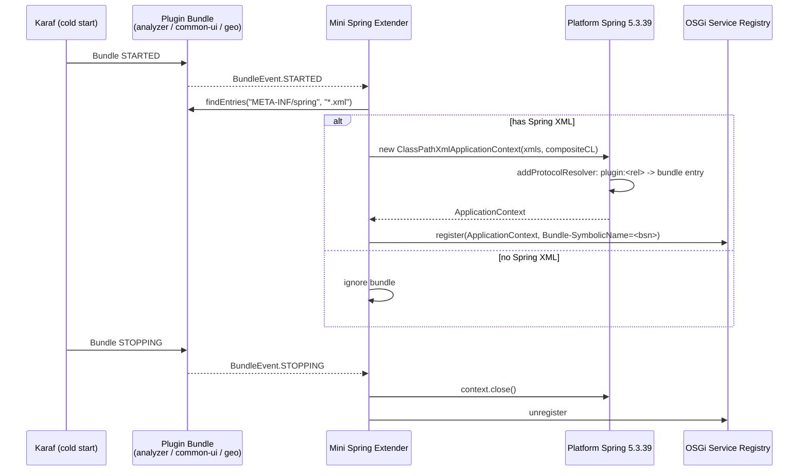

# PPUC-752 — Restoring DET EE in PDI 10.2 (since 10.2.0.2)

> **Jira:** [PPUC-752](https://hv-eng.atlassian.net/browse/PPUC-752)
> **Status:** ✅ **Implemented and verified (cold start)** on the `PPUC-752_proposed` branches.
> **Goal:** make **DET EE** (Data Exploration Tool, Enterprise Edition) work again in **PDI 10.2.0.X**
> (the next 10.2 Service Pack, versioned `10.2.0.X` and built from `10.2.0.0-SNAPSHOT` on the `10.2`
> branch), with the **smallest change footprint** and a deployment model as close as possible to the
> last version where it worked, **PDI 10.2.0.1**.

This document consolidates the analysis and engineering work captured during the spike. It explains, for
**both non‑technical readers and engineers**:

1. **What happened** to DET between PDI 10.2.0.1 and 10.2.0.X (the "what broke and when").
2. **Which security changes (CVEs / PPPs / SPs)** drove the platform changes that made DET stop working.
3. **The final solution** ("Mini Spring DM" extender) and **how it fixes each broken piece**.

---

## TL;DR

### For non‑technical readers

- **DET worked out of the box in PDI 10.2.0.1.** Everything it needed shipped inside PDI.
- Between then and now, PDI had to make **mandatory security upgrades**: it removed an old, abandoned,
  vulnerable library (**Spring DM** / Spring Framework 3.2.18, which carried **13 security
  vulnerabilities** including the critical "Spring4Shell" remote‑code‑execution bug) and upgraded the
  underlying container (**Apache Karaf 4.2 → 4.4.6**, which brought **Pax Web 8**).
- Those upgrades were the right thing to do for security, but they **removed the plumbing DET relied on**.
  As a side effect DET's **Model view** stopped working — it returned empty data — mainly because **four
  Analyzer "Content Generators"** were no longer wired up.
- **The fix** restores that plumbing in a **modern, secure** way: a tiny in‑house replacement for the old
  abandoned library (the **"Mini Spring DM" extender**), plus putting the four Content Generators back.
  No insecure libraries are reintroduced. DET's **Stream view, Model view, and Geo Map** all work again.
- **Deployment matches 10.2.0.1**: the pieces live in PDI's `system/` folders and DET is delivered as a
  single KAR. The target scenario is **cold start** (install, then start PDI).

### For engineers

The currently‑shipping platform (PDI 10.2.0.X) removed **Spring DM** (Spring OSGi 1.2.1) and **Spring
3.2.18** for security, upgraded to **Karaf 4.4.6 / Pax Web 8**, deleted the **4 Analyzer content‑generator
beans** (SP‑6671), and stopped deploying **common‑ui**. The net effect: the Analyzer Spring context is
never created, its content‑generator servlets never register, common‑ui JS 404s, and DET's MODEL endpoint
returns `{"folders":[],"fields":[]}`.

The final solution introduces **one generic, pre‑installed OSGi bundle — the Mini Spring DM extender** —
that reproduces the *only* thing Spring DM actually did for Pentaho plugins: scan a bundle for
`META-INF/spring/*.xml`, build a Spring `ApplicationContext` with the correct (composite) classloader,
publish it as an OSGi service, tear it down on stop. With that in place:

- **Spring is the platform's own 5.3.39** (already exported to OSGi via `etc/custom.properties`) — no
  bundled Spring, no CVEs, no version lock.
- **BA plugins (common‑ui, analyzer, geo) are consumed as‑is** — the *only* plugin‑source change is
  **restoring the 4 Analyzer content‑generator beans** (a revert of the SP‑6671 deletion).
- **Cold‑start only** — the KAR is pre‑installed and PDI is restarted, which deletes a large class of
  hot‑deploy race/ordering workarounds.
- Three small, scoped fixes bring up the **Geo Map** (a no‑op `ILineageClient` stub, unique Pax Web 8
  servlet names, and a geo `Map.js` AMD ordering fix).

**Verified on a clean cold start:** `require-init.js` returns the full RequireJS config (≈180 KB);
the MODEL endpoint returns populated `folders`/`fields`; the **Geo Map renders** end‑to‑end.

---

## Table of Contents

- [1. Background: What DET Is and Why It Broke](#1-background-what-det-is-and-why-it-broke)
- [2. Timeline — What Changed Since 10.2.0.2](#2-timeline--what-changed-since-10202)
- [3. The Root Causes: Security Changes (CVEs / PPPs / SPs) That Broke DET](#3-the-root-causes-security-changes-cves--ppps--sps-that-broke-det)
  - [3.1 The Spring 3.2.18 CVEs (PPP‑5517 / SP‑6858)](#31-the-spring-3218-cves-ppp5517--sp6858)
  - [3.2 The Analyzer Bean Removal (SP‑6671)](#32-the-analyzer-bean-removal-sp6671)
  - [3.3 The Karaf 4.4.6 / Pax Web 8 Upgrade](#33-the-karaf-446--pax-web-8-upgrade)
  - [3.4 Removal of common‑ui and the analyzer feature](#34-removal-of-common-ui-and-the-analyzer-feature)
- [4. The Final Solution: Mini Spring DM Extender](#4-the-final-solution-mini-spring-dm-extender)
  - [4.1 The Four Pillars](#41-the-four-pillars)
  - [4.2 Mini Spring DM Extender — Design](#42-mini-spring-dm-extender--design)
  - [4.3 Restoring the 4 Analyzer Content Generators](#43-restoring-the-4-analyzer-content-generators)
  - [4.4 Bringing Up the DET Geo Map](#44-bringing-up-the-det-geo-map)
- [5. How the Final Solution Fixes Each Root Cause](#5-how-the-final-solution-fixes-each-root-cause)
- [6. How Each Originally‑Identified Issue Is Resolved](#6-how-each-originally-identified-issue-is-resolved)
- [7. Change Footprint — Repositories and Files](#7-change-footprint--repositories-and-files)
- [8. PDI Install Files Edited (Cold‑Start Layout)](#8-pdi-install-files-edited-cold-start-layout)
- [9. Build, Deploy, and Verify](#9-build-deploy-and-verify)
- [10. Two Approaches Compared](#10-two-approaches-compared)
- [11. Pentaho Server Compatibility](#11-pentaho-server-compatibility)
- [12. PPUC-752 Spike Answers](#12-ppuc-752-spike-answers)
- [13. Risks, Dependencies & Unknowns](#13-risks-dependencies--unknowns)
- [14. Effort Estimate for the Actual Fix](#14-effort-estimate-for-the-actual-fix)
- [15. Workaround Analysis (Old PDI Client ↔ Newer Server)](#15-workaround-analysis-old-pdi-client--newer-server)
- [16. Acceptance Criteria & Deliverables Mapping](#16-acceptance-criteria--deliverables-mapping)
- [Appendix A: Reference Installations](#appendix-a-reference-installations)
- [Appendix B: Glossary](#appendix-b-glossary)

---

## 1. Background: What DET Is and Why It Broke

**DET EE (Data Exploration Tool, Enterprise Edition)** is a feature inside Pentaho Data Integration
(PDI / Spoon). It lets a user click a transformation step and explore that step's data in two views:

- **STREAM view** — the raw rows flowing through the step.
- **MODEL view** — an OLAP‑style model (measures, dimensions, geography fields…) used by visualizations
  such as the **Geo Map**.

In **PDI 10.2.0.1** (the last fully‑working version, build 255, on **Karaf 4.2.15**), DET EE was
**pre‑installed** in the Karaf `system/` directory, together with everything it needed:

- **Spring DM** (Spring OSGi 1.2.1) + **Spring Framework 3.2.18** — the engine that turned plugin Spring
  XML files into live services.
- The **common‑ui** platform plugin (Dojo, the Pentaho visualization framework, prompting modules, i18n).
- The **pentaho‑analyzer** feature, including the **4 content‑generator beans** that serve
  `/content/analyzer/*` (the endpoints behind the MODEL view).

Everything worked at boot, with no extra steps.

In **PDI 10.2.0.X**, a series of necessary platform and security changes removed or altered each of those
pieces. DET became, at best, *hot‑deployable but non‑functional*: the **Model view returned empty JSON**
(`{"folders":[],"fields":[]}`) mainly because the **four Analyzer Content Generators were missing**.

### 1.1 Business Context & Affected Customers

DET is expected to **remain supported in Pentaho 10.2**, even though it is planned to be **unavailable
starting with Pentaho 11.0**. The breakage in later 10.2 service packs is therefore a **regression** for
customers currently using DET on 10.2 — including **Vancos** and downstream customers such as **Telcel**.
The immediate priority is the customer's **Windows / PDI‑client** scenario. (The investigation and the
fix were validated on macOS, but the root causes and the solution are in the **OSGi / Karaf** layer and
are therefore **platform‑independent**; the Windows PDI client exercises the same bundles.) Ubuntu‑specific
DET issues are **out of scope** unless proven to share this root cause.

### 1.2 Failing Scenario & How to Reproduce

**Exact failure mode (affected: PDI 10.2.0.2 → current 10.2.0.X / 10.2.0.0‑SNAPSHOT):**

1. Install/start an affected 10.2 service‑pack PDI client and open a transformation.
2. Click a step to open DET. **DET partially loads** (or hangs on its loading screen if the datatables
   webjars 404 — see [§6](#6-how-each-originally-identified-issue-is-resolved) issue #3).
3. **STREAM view may render**, but **MODEL view shows no fields / no model data** — the MODEL endpoint
   `…/cxf/det/core/data/datasources/<id>/MODEL/` returns the empty `{"folders":[],"fields":[]}`.
4. Logs show the cascade: the Analyzer Spring context never starts, `/content/analyzer/*` is unregistered,
   `require-init.js` is missing the common‑ui config, and (for the Geo Map) `content/geojson` 404s.

**Evidence captured** (clean cold start of the affected install): no `ApplicationContext` service published
for analyzer; `Unable to locate Spring NamespaceHandler` / `No bean named 'properties'`; `FileNotFoundException`
for `plugin:analyzer.properties`; `No suitable driver for jdbc:mondrian`; 404 on common‑ui JS and the 8
`datatables.net*` webjars. These are exactly the symptoms the fix removes (see [§9](#9-build-deploy-and-verify) verification).

### 1.3 Where the Fix Belongs (Layer Attribution)

The failure is **not in DET application code**. It is a **combination** spread across the shared platform
and packaging layers, which is why restoring the Analyzer beans alone is insufficient:

| Layer | Implicated? | Evidence |
|-------|-------------|----------|
| **DET (CE/EE)** | ❌ Not the root cause | DET code is unchanged in behaviour; it only consumes services/endpoints that disappeared |
| **Analyzer** | ✅ | 4 content‑generator beans deleted (SP‑6671) → no `/content/analyzer/*` |
| **PDI OSGi platform / "fake server"** | ✅ (primary) | Spring DM removed; `plugin:` protocol gone; deployer/whiteboard changes; stub `PentahoSystemPluginManager` returns null classloaders; `ContentGeneratorServlet`/Mondrian JDBC |
| **Karaf configuration / Pax Web 8** | ✅ | `alias` servlets dropped; servlet‑name collisions; prerequisite thread‑pool starvation |
| **Hadoop add‑on / KAR packaging** | ⚠️ Not a root cause | The big‑data/Hadoop add‑on is only *affected by* (not a cause of) prerequisite thread‑pool starvation; under **cold‑start** that path is irrelevant. A diff of the 10.2.0.1 vs later PDI‑client OSGi deployment (incl. Hadoop add‑on) confirms the deltas are the platform/Spring/Analyzer changes above, not Hadoop packaging |

---

## 2. Timeline — What Changed Since 10.2.0.2

| Change | Version introduced | Commit / reference | Why it was done | Impact on DET |
|--------|--------------------|--------------------|-----------------|---------------|
| **DET EE removed from the base install** (converted to a KAR add‑on) | 10.2.0.2 | **SP‑6688** (backport of **PPP‑5167**) — `pentaho-det-ee` [`185837d36`](https://github.com/pentaho/pentaho-det-ee/commit/185837d36c9a5e012548b1f66efe42003369105c); origin commit [`89449fe23`](https://github.com/pentaho/pentaho-det-ee/commit/89449fe234d4442fbc744cba78b5d2c9af22afd3) *“convert DET into a kar assembly”* | Modularity / AngularJS 1.8.0 EOL — DET ships as a separately deployable KAR | DET must now be deployed as a KAR rather than being present at boot |
| **Apache Karaf 4.2.15 → 4.4.6** | 10.2.0.2 | **SP‑6671** backport — `pentaho-karaf-assembly` [`4591f349e`](https://github.com/pentaho/pentaho-karaf-assembly/commit/4591f349e41f68485508a60f4cea027017ec96e3) ([PR #789](https://github.com/pentaho/pentaho-karaf-assembly/pull/789)); origin **PPP‑4893** et al. [`2c8319670`](https://github.com/pentaho/pentaho-karaf-assembly/commit/2c8319670a10dc1edb68132d163f78cdb4d24c2b) | Platform/security upgrade | Brings **Pax Web 8** (OSGi R7 HTTP Whiteboard); legacy `alias` servlet registration no longer works; KAR `prerequisite="true"` features can starve the feature‑installer thread pool |
| **Analyzer content‑generator beans deleted** from `paz-plugin-ce/plugin.spring.xml` | 10.2.0.2 | **SP‑6671** — `pentaho-analyzer` [`4c774947e`](https://github.com/pentaho/pentaho-analyzer/commit/4c774947eb24262f06f02a8d8312ac14077f5c1f) | Karaf 4.4.6 upgrade + security fixes; Pentaho Server wires them differently and PDI was not considered | No beans for the deployer to turn into servlets → **no `/content/analyzer/*` endpoints** → MODEL view empty |
| **Spring DM (Spring OSGi 1.2.1) completely removed** | 10.2.0.X | **PPP‑5517 / SP‑6858** — `pentaho-karaf-assembly` [`74bc00f85`](https://github.com/pentaho/pentaho-karaf-assembly/commit/74bc00f853bf1bc2d04f8645686db5e1db0687ea) → backport [`3bc0b5a43`](https://github.com/pentaho/pentaho-karaf-assembly/commit/3bc0b5a438e7888158e5258e7821f4c5a02a1912) ([PR #818](https://github.com/pentaho/pentaho-karaf-assembly/pull/818)) | Abandoned since 2009; forced Spring to stay in the vulnerable `[2.5.6, 4)` range | The mechanism that created plugin Spring contexts is gone; `plugin:` resource protocol unresolvable |
| **Spring Framework 3.2.18 (`servicemix.bundles`) removed** | 10.2.0.X | **PPP‑5517 / SP‑6858** — `pentaho-osgi-bundles` [`638c138b5d`](https://github.com/pentaho/pentaho-osgi-bundles/commit/638c138b5d52892b3951c59b4b8feda37fdd68d9) → backport [`e5898ab918`](https://github.com/pentaho/pentaho-osgi-bundles/commit/e5898ab91858e4fb27f07f3eeb13b40cc08557c0) ([PR #534](https://github.com/pentaho/pentaho-osgi-bundles/pull/534)) | **13 CVEs** incl. CRITICAL Spring4Shell | No Spring 3.x to process plugin `beans.xml` (the platform now ships modern Spring 5.3.39 instead) |
| **`pentaho-spring-dm-extender` / spring‑framework‑features no longer assembled** | 10.2.0.X | Part of **PPP‑5517 / SP‑6858** — `pentaho-osgi-bundles` [`638c138b5d`](https://github.com/pentaho/pentaho-osgi-bundles/commit/638c138b5d52892b3951c59b4b8feda37fdd68d9) (drops `spring-framework-features`) | Depends on Spring DM | `PentahoOsgiBundleXmlApplicationContext` and the `plugin:` protocol handler gone |
| **common‑ui platform plugin no longer deployed** | 10.2.0.X | Part of the **SP‑6671** Karaf 4.4.6 backport — `pentaho-karaf-assembly` [`4591f349e`](https://github.com/pentaho/pentaho-karaf-assembly/commit/4591f349e41f68485508a60f4cea027017ec96e3) *(no separate isolated commit)* | Architecture/modularity change | All client JS (Dojo, Pentaho viz, prompting, i18n) 404s → DET UI cannot render |
| **`pentaho-analyzer` feature removed from PDI** | 10.2.0.X | Part of the **SP‑6671** Karaf 4.4.6 backport — `pentaho-analyzer` [`4c774947e`](https://github.com/pentaho/pentaho-analyzer/commit/4c774947eb24262f06f02a8d8312ac14077f5c1f) *(folded into the same effort)* | Its prerequisites block boot | OLAP content generators not available |

> **Note on commits:** verified against the local clones (branch `10.2`). Short hashes link to the full
> commit. Where a row reads *“part of”*, the change shipped inside an umbrella commit (the Karaf 4.4.6
> backport **SP‑6671**, or the Spring removal **PPP‑5517 / SP‑6858**) rather than as an isolated commit.
> `SP‑####` are the **10.2 backports**; `PPP‑####` are the corresponding origin (master) issues.

**Bottom line:** none of these changes was wrong on its own — most were **mandatory security work**. But
together they removed every piece of plumbing DET silently depended on in 10.2.0.1.

---

## 3. The Root Causes: Security Changes (CVEs / PPPs / SPs) That Broke DET

### 3.1 The Spring 3.2.18 CVEs (PPP‑5517 / SP‑6858)

The single most consequential change was the removal of **Spring DM**. Spring DM (Spring OSGi 1.2.1) was
the extender that scanned each Pentaho plugin for Spring XML and created its `ApplicationContext`. It was
**abandoned in 2009** and **forced Spring Framework to stay in the `[2.5.6, 4)` range** — which is the
*real* reason PDI was stuck on **Spring 3.2.18** and its **13 known CVEs**:

| CVE | Severity | Description |
|-----|----------|-------------|
| [CVE-2022-22965](https://github.com/advisories/GHSA-36p3-wjmg-h94x) | **CRITICAL** | Remote Code Execution ("Spring4Shell") — JDK 9+ |
| [CVE-2022-22970](https://github.com/advisories/GHSA-hh26-6xwr-ggv7) | **HIGH** | DoS via file‑upload data binding |
| [CVE-2018-1272](https://github.com/advisories/GHSA-4487-x383-qpph) | **HIGH** | Privilege escalation via multipart request forwarding |
| [CVE-2022-22968](https://github.com/advisories/GHSA-g5mm-vmx4-3rg7) | **HIGH** | DataBinder `disallowedFields` case‑sensitivity bypass |
| [CVE-2023-20863](https://github.com/advisories/GHSA-wxqc-pxw9-g2p8) | **HIGH** | DoS via crafted SpEL expression |
| [CVE-2016-5007](https://github.com/advisories/GHSA-8crv-49fr-2h6j) | **HIGH** | URL pattern matching bypass |
| [CVE-2018-1271](https://github.com/advisories/GHSA-g8hw-794c-4j9g) | MEDIUM | Path traversal on Windows |
| [CVE-2018-1257](https://github.com/advisories/GHSA-rcpf-vj53-7h2m) | MEDIUM | DoS via STOMP WebSocket broker |
| [CVE-2022-22950](https://github.com/advisories/GHSA-558x-2xjg-6232) | MEDIUM | DoS via crafted SpEL expression |
| [CVE-2023-20861](https://github.com/advisories/GHSA-564r-hj7v-mcr5) | MEDIUM | DoS via crafted SpEL expression |
| [CVE-2024-38808](https://github.com/advisories/GHSA-9cmq-m9j5-mvww) | MEDIUM | DoS via crafted SpEL expression |
| [CVE-2024-38820](https://github.com/advisories/GHSA-4gc7-5j7h-4qph) | MEDIUM | DataBinder locale‑dependent case bypass |
| [CVE-2025-22233](https://github.com/advisories/GHSA-4wp7-92pw-q264) | LOW | DataBinder `disallowedFields` bypass |

Tracked as **PPP‑5517**, backported as **SP‑6858**:

- **pentaho-karaf-assembly**: [PR #818](https://github.com/pentaho/pentaho-karaf-assembly/pull/818)
  (10.2 branch) — commit
  [`3bc0b5a438e7`](https://github.com/pentaho/pentaho-karaf-assembly/commit/3bc0b5a438e7) —
  *“[SP‑6858] Backport of PPP‑5517 — Vulnerable Component: org.apache.servicemix.bundles for spring 3.2.18”*.
- **pentaho-osgi-bundles**: [PR #534](https://github.com/pentaho/pentaho-osgi-bundles/pull/534)
  (10.2 branch) — commit
  [`e5898ab918`](https://github.com/pentaho/pentaho-osgi-bundles/commit/e5898ab918) — *“[SP‑6858] Backport of PPP‑5517”*.

> **Key insight:** The CVEs were never an independent reason to avoid an extender — they were a
> *symptom* of the Spring **version lock** imposed by Spring DM. Remove the lock and the CVEs disappear.
> The platform already ships **Spring 5.3.39** (and Spring Security 5.8.16), exported to OSGi via
> `etc/custom.properties`. The final solution reuses **that** Spring — so there is **no CVE‑bearing
> Spring anywhere** in the picture.

### 3.2 The Analyzer Bean Removal (SP‑6671)

In commit `4c774947e` (**SP‑6671**, *“Karaf 4.4.6 upgrade and security fixes”*), the **4 content‑generator
beans** were deleted from `paz-plugin-ce/plugin.spring.xml`:

```xml
<bean id="xanalyzer.service"            class="com.pentaho.analyzer.content.AnalyzerContentGenerator"        scope="prototype"/>
<bean id="xanalyzer.generatedContent"   class="com.pentaho.analyzer.content.AnalyzerContentGenerator"        scope="prototype"/>
<bean id="xanalyzer.editor"             class="com.pentaho.analyzer.content.EditorContentGenerator"          scope="prototype"/>
<bean id="xanalyzer.backgroundExecution" class="com.pentaho.analyzer.content.controller.AnalyzerAction"       scope="prototype"/>
```

These beans are exactly what the `pentaho-platform-plugin-deployer` turned into Blueprint servlet services
for the `/content/analyzer/*` endpoints. Pentaho **Server** wires these differently, so removing them was
fine there — but **PDI was not considered**, and without them DET's MODEL view has nothing to call. This
is the **primary reason** the Model view returns the empty `{"folders":[],"fields":[]}`.

> **Source references:** the removal was discussed against PR
> [`pentaho-analyzer#2663`](https://github.com/pentaho/pentaho-analyzer/pull/2663) and tracked under
> **BACKLOG‑43028**. The 10.2 backport that actually deleted the beans is commit
> [`4c774947e`](https://github.com/pentaho/pentaho-analyzer/commit/4c774947eb24262f06f02a8d8312ac14077f5c1f)
> (**SP‑6671**). The previous investigation's caveat — *“restoring the beans alone may not be enough”* — is
> confirmed: the beans are necessary but not sufficient (Spring DM, `plugin:`, common‑ui and Pax Web 8 must
> all be addressed too — see [§5](#5-how-the-final-solution-fixes-each-root-cause)).

### 3.3 The Karaf 4.4.6 / Pax Web 8 Upgrade

| Component | 10.2.0.1 | 10.2.0.X | Consequence for DET |
|-----------|----------|----------|---------------------|
| Apache Karaf | 4.2.15 | 4.4.6 | Different bundle start order; stricter feature resolution |
| Pax Web | 7.x | 8.x (OSGi R7 HTTP Whiteboard) | Servlets registered the **legacy `alias` way are dropped**; servlets with **no unique name collide** and only one survives |
| Feature install | tolerant | thread‑pool sensitive | A KAR using `prerequisite="true"` in `deploy/` can **starve the feature‑installer thread pool** and time out the boot |

Pax Web 8 is **architectural** — it cannot be "patched away" by re‑adding Spring DM. Servlet registration
must use the **R7 HTTP Whiteboard** properties (`osgi.http.whiteboard.servlet.pattern` /
`…servlet.name`), and must **not** carry the legacy `alias` property.

### 3.4 Removal of common-ui and the analyzer feature

With **common‑ui** no longer deployed, all of DET's client JavaScript (Dojo/Dijit/Dojox, the Pentaho
visualization framework, prompting modules, i18n message bundles, echarts) returned **404**, so the DET UI
could not render even when the back end responded. The `pentaho-analyzer` feature was also dropped from PDI
because its prerequisites blocked boot.

---

## 4. The Final Solution: Mini Spring DM Extender

The chosen solution restores the **10.2.0.1 "it just works" model** without bringing back any insecure
component. Instead of baking OSGi/Spring knowledge into each plugin's packaging (the first approach — see
[§10](#10-two-approaches-compared)), it adds **one generic, shared, pre‑installed bundle** that does the
single job Spring DM used to do.

### 4.1 The Four Pillars

1. **Use the platform's own modern Spring (5.3.39).** PDI 10.2.0.0‑SNAPSHOT already exports
   `org.springframework.*` at `version="5.3.39"` as OSGi framework system packages (via
   `etc/custom.properties`). The extender wires to **that** Spring. No bundled Spring, **0 CVEs**, no
   version lock. *(This corrects the early proposal, which bundled Spring 5.3.34 — a second Spring split
   the package wiring and caused a `LinkageError`; it was dropped entirely.)*

2. **A tiny custom Spring DM layer (the Mini Extender).** One small generic OSGi bundle reproduces only
   what Pentaho plugins relied on: scan `META-INF/spring/*.xml`, build a context with the right
   classloader, publish it, tear it down on stop. It knows nothing about analyzer, common‑ui, or geo.

3. **Cold start only.** The KAR is pre‑installed and PDI is restarted, so all hot‑deploy workarounds
   (thread‑pool starvation, CXF cold‑start race guards, 5‑second retries, "no prerequisites" gymnastics,
   refresh cascades) are **deleted**.

4. **Generic, zero‑change BA plugin support.** common‑ui, analyzer CE, and geo are consumed **as‑is**.
   The *only* plugin‑source change is **restoring the 4 analyzer content‑generator beans** — a revert, not
   new code.

| Concern | Spring 3.2.18 + Spring DM (old) | Platform Spring 5.3.39 + Mini Extender (final) |
|---------|--------------------------------|-----------------------------------------------|
| CVEs | 13 (incl. CRITICAL Spring4Shell) | **0 known** |
| Maintenance | Spring DM abandoned 2009 | In‑house, ~80–150 LOC |
| Spring version lock | `[2.5.6, 4)` | none |

### 4.2 Mini Spring DM Extender — Design

The extender is a single `@Component` that opens a `BundleTracker` for `ACTIVE` bundles and, for each
bundle that ships `META-INF/spring/*.xml`, builds and publishes an `ApplicationContext`.

| # | Responsibility | How |
|---|----------------|-----|
| 1 | Detect Spring‑XML bundles | `BundleTracker` watching `ACTIVE` bundles with `META-INF/spring/*.xml` |
| 2 | Build `ApplicationContext` | `ClassPathXmlApplicationContext` (platform Spring 5.3.39) with a **composite classloader** |
| 3 | Resolve the legacy `plugin:` protocol | An `addProtocolResolver(...)` that maps `plugin:<rel>` → a bundle entry — so legacy XML needs **no edits** |
| 4 | Publish the context | `registerService(ApplicationContext, {Bundle-SymbolicName=<bsn>})` — the contract downstream code already expects |
| 5 | Tear down on stop/update | On `STOPPING`: `context.close()` + unregister |



**Composite classloader (why it is essential).** In OSGi the plugin's bean classes and classpath
resources live in the **plugin bundle** classloader, while Spring's `META-INF/spring.handlers` and
`spring.schemas` (needed for `<util:*>`, `<context:*>` namespaces) live in the **Spring** classloader.
The composite CL loads plugin‑first with a Spring fallback, and **merges** `getResources` so namespace
handlers resolve. This is what makes the analyzer's **original** `beans.xml` work verbatim — no
`PropertiesFactoryBean` workaround, no JAR surgery.

> **As‑built corrections to the original proposal** (Errata):
> - **No bundled Spring** — uses the platform's 5.3.39 (avoids a two‑copies `LinkageError`).
> - **`plugin:` via `addProtocolResolver`, not subclassing** `ClassPathXmlApplicationContext` (subclassing
>   reintroduced the split‑classloader `LinkageError`). No separate `osgibundlejar:` URL handler is needed.
> - **The deployer emits servlet whiteboard services only**, *not* a `<reference id="spring">` — the
>   analyzer plugin already ships `OSGI-INF/blueprint/analyzer_beans.xml` with
>   `<reference id="spring" filter="(Bundle-SymbolicName=analyzer)"/>` (the original 10.2.0.1 contract);
>   emitting a second one is a duplicate Blueprint id that breaks the container.
> - **Servlets carry pattern + name only, never `alias`** — Pax Web 8 silently drops `alias`+`pattern`.
> - **`cpf`/`cde` made non‑prerequisite + `pax-web-jsp` added** so the whole KAR (incl. the
>   `javax.servlet.jsp` provider needed by `commons-jxpath`) resolves in a single Karaf batch.

### 4.3 Restoring the 4 Analyzer Content Generators

The **only** plugin‑source change is the upstream revert of SP‑6671 in
`pentaho-analyzer/assemblies/paz-plugin-ce/src/main/resources/plugin.spring.xml`, putting the 4 beans
back (`xanalyzer.service`, `xanalyzer.generatedContent`, `xanalyzer.editor`,
`xanalyzer.backgroundExecution`). With the beans present and the Mini Extender publishing the analyzer
context, the deployer registers the `/content/analyzer/*` servlets again and the **MODEL view returns
populated data**. No JAR surgery, no emptied `plugin.spring.xml`, no rewritten `beans.xml`.

### 4.4 Bringing Up the DET Geo Map

The DET **Geo Map** (drag *Country* into the Geography Layout) needed three additional scoped fixes. None
of the geo bundles were missing; the blockers were wiring/ordering defects:

1. **No‑op `ILineageClient` stub (`det-impl-lineage-stub`).** The geo server chain
   (`content/geojson` → `IGeoService`/`IGeoStorage` → `IDataServiceMetaFactory`) is provided by
   `pdi-dataservice-server-plugin`, whose Blueprint declares **two mandatory references**:
   `PentahoCacheManager` (genuinely required — present) and `ILineageClient` (published only by the
   metaverse‑core bundle, **absent** in the thin DET cold start). Aries Blueprint refuses to start a
   container with an unsatisfied mandatory reference, so the whole chain stalled. A small **KAR‑scoped
   bundle** publishes a **no‑op `ILineageClient`** at lowest ranking (no mandatory refs → registers
   immediately; imports `org.pentaho.metaverse.api;version="0.0.0"` — the OSGi system‑package export). The
   geo path never uses lineage, so a stub suffices, and a real client always wins if ever present.

2. **Unique Pax Web 8 servlet names.** `pentaho-geo-agile-bi` registered four `GeoContentGeneratorServlet`
   instances with **no** `osgi.http.whiteboard.servlet.name`, so all defaulted to the class name and
   collided → Pax Web 8 kept one and dropped the rest (`/content/geojson` 404/405). Fix: add unique names
   (`geo-geojson`, `geo-geoprint`, `geo-geomapexport`, `geo-geomapexport.service`) in the geo
   `blueprint.xml`.

3. **Geo `Map.js` AMD off‑by‑one.** The `define([...])` listed `"css!…/style"` **before**
   `"common-ui/util/xss"`; the `css!` plugin resolves to no value, so the factory's 6th param `xssUtil`
   bound to the `css!` slot and was `undefined` → `Cannot read properties of undefined (reading
   'setHtml')`. Fix: reorder so `common-ui/util/xss` precedes the trailing `css!` so the factory params
   align. **Must be baked into the geo bundle inside the KAR**, not only the runtime cache.

> Two remaining browser‑console messages during bring‑up — an `unload is not allowed` Permissions‑Policy
> violation and `Possibly unhandled rejection: canceled` — originate in the legacy OpenLayers/Angular
> stack, are non‑fatal, and do not block the map render.

---

## 5. How the Final Solution Fixes Each Root Cause

| Root cause (from [§3](#3-the-root-causes-security-changes-cves--ppps--sps-that-broke-det)) | Why it broke DET | How the final solution fixes it |
|----------------------|------------------|---------------------------------|
| **Spring DM removed; Spring 3.2.18 CVEs (PPP‑5517 / SP‑6858)** | The mechanism that created plugin Spring contexts and resolved `plugin:` was gone | **Mini Spring DM extender** recreates that mechanism generically, wired to the platform's **modern Spring 5.3.39** — **0 CVEs**, no abandoned code, no version lock |
| **4 Analyzer beans deleted (SP‑6671)** | No `/content/analyzer/*` servlets → MODEL view empty | **Upstream revert**: 4 beans restored in `plugin.spring.xml`; extender publishes the context; deployer registers the servlets again |
| **Karaf 4.4.6 / Pax Web 8 — `alias` dropped** | Legacy servlet registration invisible | Deployer emits **R7 Whiteboard `pattern` + `name` only**, never `alias` |
| **Pax Web 8 — nameless servlet collisions (geo)** | Only one of four geo servlets survived | **Unique `servlet.name`s** for the four geo content servlets |
| **Karaf 4.4.6 — prerequisite thread‑pool starvation** | KAR boot timed out | **Cold‑start only** removes the need for hot‑deploy prerequisites; `cpf`/`cde` made non‑prerequisite so everything resolves in one batch |
| **`plugin:` protocol unresolvable** | `beans.xml` `plugin:analyzer.properties` → `FileNotFoundException` | Extender's **`addProtocolResolver`** maps `plugin:<rel>` to a bundle entry; original `beans.xml` used unchanged |
| **common‑ui not deployed** | All client JS / i18n 404 | **common‑ui shipped as‑is in the KAR**; original RequireJS/i18n paths resolve — no JS extraction, no `Messages.js` patch |
| **Geo chain blocked by missing `ILineageClient`** | Mandatory Blueprint reference unsatisfied | **No‑op `ILineageClient` stub** (`det-impl-lineage-stub`) registers immediately at lowest ranking |
| **Geo `Map.js` AMD ordering** | `xssUtil` undefined → map render crash | **Reorder `define([...])`** so `common-ui/util/xss` precedes the trailing `css!` |
| **Mondrian JDBC classloader mismatch** | `No suitable driver for jdbc:mondrian` → MODEL empty | Explicit `DriverManager.registerDriver()` in `ContentGeneratorServlet` (orthogonal, retained) |
| **Datatables webjar 404 (deploy gotcha)** | bower.json has no `version` → null alias → DET stuck on loading screen | `WebjarsURLConnection` version fallback **and** deploy the patched `pentaho-webjars-deployer` + **clear `system/karaf/caches`** so webjars re‑process |

---

## 6. How Each Originally-Identified Issue Is Resolved

The original analysis enumerated 20 issues. Under the final (Mini Extender, cold‑start) solution:

| # | Issue | Resolution |
|---|-------|------------|
| 1 | Analyzer context never starts | Mini extender auto‑creates it from `META-INF/spring/*.xml` |
| 2 | `NamespaceHandler for .../util` not found | Composite CL exposes Spring's `spring.handlers` → `<util:*>` works; **no `PropertiesFactoryBean`** |
| 3 | 404 on 8 `datatables.net*` webjars | `WebjarsURLConnection` version fallback + deploy patched deployer + clear caches |
| 4 | `No suitable driver for jdbc:mondrian` | Explicit `DriverManager.registerDriver()` in `ContentGeneratorServlet` |
| 5 | MODEL view empty | Cascade of #4 (and #1) — resolved |
| 6 | NPE at `AnalyzerContentGenerator:330` | `pathParams` (`httprequest/httpresponse/cmd`) fix in `ContentGeneratorServlet` |
| 7–11, 15 | Missing common‑ui JS / modules / i18n / jQuery shim / echarts | **Ship common‑ui as‑is**; original RequireJS + i18n paths resolve |
| 12 | KarafFeatureWatcher timeout (prerequisite starvation) | **Gone** — cold‑start only; non‑prerequisite `cpf`/`cde` |
| 13 | `No DestinationFactory` (CXF cold‑start race) | **Gone / simplified** — normal feature ordering installs CXF first (optional `<reference>` guard kept) |
| 14 | cpf‑core can't resolve `org.mozilla.javascript` | Rhino kept in the feature (packaging detail) |
| 16 | Pax Web 8 whiteboard hijacks `alias` servlets | Restore beans → deployer registers Whiteboard servlets with **pattern + name only** |
| 17 | `mtm` VFS provider conflict on refresh | Largely moot (no refresh); cheap `removeProvider("mtm")` guard kept |
| 18 | `require-init.js` empty (refresh cascade) | **Gone** — no hot‑deploy refresh cascades |
| 19 | `No bean named 'properties'` (`plugin:` protocol) | `plugin:` `ProtocolResolver` resolves it — original `beans.xml` unchanged |
| 20 | 404 on analyzer `config.js` | Cascade of #1 — resolved |

Issues **2, 7–11, 15, 18, 19** are eliminated by *restoring the real components* (common‑ui as‑is +
`plugin:` resolver) instead of working around their absence. Issues **12, 13, 17, 18** shrink or vanish
because hot‑deploy is gone. The genuinely orthogonal fixes (**3, 4, 6, 14, 16**) are small and retained.

---

## 7. Change Footprint — Repositories and Files

Implemented on branch **`PPUC-752_proposed`** across these repositories:

| Repo | File | Action |
|------|------|--------|
| `pentaho-osgi-bundles` | `pom.xml` (root reactor) | CHANGE — register `<module>pentaho-mini-spring-extender</module>` |
| `pentaho-osgi-bundles` | `pentaho-mini-spring-extender/pom.xml` | ADD |
| `pentaho-osgi-bundles` | `pentaho-mini-spring-extender/.../minispring/MiniSpringExtender.java` | ADD — per‑bundle Spring context publisher |
| `pentaho-osgi-bundles` | `pentaho-mini-spring-extender/.../minispring/BundleApplicationContextFactory.java` | ADD — composite CL + `plugin:` resolver |
| `pentaho-osgi-bundles` | `pentaho-platform-plugin-deployer/.../handlers/SpringFileHandler.java` | CHANGE — servlet whiteboard generation; no `<reference>`, no `alias` |
| `pentaho-osgi-bundles` | `pentaho-platform-plugin-deployer/.../impl/ManifestUpdaterImpl.java` | CHANGE |
| `pentaho-osgi-bundles` | `pentaho-pdi-platform/.../ContentGeneratorServlet.java` | CHANGE — composite CL + mondrian driver + pathParams |
| `pentaho-osgi-bundles` | `pentaho-pdi-platform/.../PdiPlatformActivator.java` | CHANGE — `mtm` provider guard |
| `pentaho-osgi-bundles` | `pentaho-webjars-deployer/.../WebjarsURLConnection.java` | CHANGE — webjar version fallback |
| `pentaho-analyzer` | `assemblies/paz-plugin-ce/src/main/resources/plugin.spring.xml` | CHANGE — restore 4 content‑generator beans |
| `pentaho-platform-plugin-geo` | `client/pentaho-geo-visual-map/src/main/javascript/web/Map.js` | CHANGE — xss/css `define` reorder |
| `pentaho-platform-plugin-geo` | `server/core/src/main/resources/OSGI-INF/blueprint/blueprint.xml` | CHANGE — unique geo whiteboard `servlet.name`s |
| `pentaho-det-ee` | `det/impls/lineage-stub/**` | ADD — KAR‑scoped no‑op `ILineageClient` bundle (`pom.xml`, `NoOpLineageClient.java`, `OSGI-INF/blueprint/blueprint.xml`) |
| `pentaho-det-ee` | `det/impls/pom.xml` | CHANGE — register `<module>lineage-stub</module>` |
| `pentaho-det-ee` | `det/assemblies/pdi/pom.xml` | CHANGE — empty `prerequisiteFeatures`; add `det-impl-lineage-stub` dependency |
| `pentaho-det-ee` | `det/assemblies/pdi/src/main/feature/feature.xml` | CHANGE — drop Spring wraps; add extender, lineage stub, `pax-web-jsp`, common‑ui/paz as‑is |
| `pentaho-det-ee` | `det/assemblies/core/src/main/feature/feature.xml` | CHANGE |
| `pentaho-det` | `data-access/impls/rest/.../OSGI-INF/blueprint/blueprint.xml` | CHANGE — CXF Bus guard (harmless) |

> **Incidental (not part of the solution):** `pentaho-analyzer/client/pom.xml` carries a local
> `nodejs.version` downgrade (`v18.20.4` → `v18.20.2`) made only so the analyzer front end builds on the
> dev machine. It does not affect DET behaviour and can be dropped when merging.

**Net result:** ~80–150 LOC of new generic code (extender + factory + lineage stub) plus a handful of
reverts/config edits *replace* the several hundred lines of plugin‑specific packaging and JS surgery the
first approach required.

---

## 8. PDI Install Files Edited (Cold-Start Layout)

The DET EE KAR stays **deploy‑only** (placed in `system/karaf/deploy/`, **not** added to any `featuresBoot`).
All other artifacts are restored into the base install's `system/` so a cold start wires DET EE on top of
restored PDI features.

Install root used:
`~/pentaho/pdi/10.2.0.0-SNAPSHOT/pdi-ee-client-10.2.0.0-20260529.003302-1598-osgi_mini_spring_ext/data-integration`
(Karaf home = `…/system/karaf`).

| # | PDI install file (under `…/system/karaf`) | Edit | Repo source (`PPUC-752_proposed`) |
|---|--------------------------------------------|------|-----------------------------------|
| 1 | `deploy/pentaho-det-ee-pdi-10.2.0.0-SNAPSHOT.kar` | **ADDED** (deploy‑only). Embeds fixed geo `Map.js` + unique geo servlet names + `det-impl-lineage-stub` | `pentaho-det-ee` → `det/assemblies/pdi/`; geo from `pentaho-platform-plugin-geo` |
| 2 | `system/pentaho/pentaho-mini-spring-extender/10.2.0.0-SNAPSHOT/…jar` | **ADDED** — generic mini Spring DM extender | `pentaho-osgi-bundles` → `pentaho-mini-spring-extender/**` |
| 3 | `system/pentaho/paz-plugin-ce/10.2.0.0-SNAPSHOT/…zip` | **REPLACED** — 4 beans restored | `pentaho-analyzer` → `…/plugin.spring.xml` |
| 4 | `system/.../pentaho-platform-plugin-deployer-*.jar` | **REPLACED** — whiteboard generation; no `<reference>`, no `alias` | `pentaho-osgi-bundles` → `SpringFileHandler.java`, `ManifestUpdaterImpl.java` |
| 5 | `system/.../pentaho-pdi-platform-*.jar` | **REPLACED** — ContentGeneratorServlet composite CL + mondrian + pathParams; `mtm` guard | `pentaho-osgi-bundles` → `ContentGeneratorServlet.java`, `PdiPlatformActivator.java` |
| 6 | `system/.../pentaho-webjars-deployer-*.jar` | **REPLACED** — webjar version fallback | `pentaho-osgi-bundles` → `WebjarsURLConnection.java` |

Notes:

- **No `etc/custom.properties` edit** — PDI 10.2.0.0‑SNAPSHOT already exports Spring 5.3.39 as framework
  system packages (the reason bundled Spring was dropped).
- **No `etc/org.apache.karaf.features.cfg` boot edit** — the KAR stays deploy‑only by design.
- The KAR's aggregated feature carries the `pax-web-jsp` dependency and non‑prerequisite `cpf`/`cde`
  wiring (from `pentaho-det-ee` source), not a manual install edit.
- **Geo fixes live inside the KAR**, not as separate `system/` files. After patching the KAR, **clear
  `system/karaf/caches`** so the cold start re‑extracts the corrected bundle.

---

## 9. Build, Deploy, and Verify

### Build (local repos, branch `PPUC-752_proposed`)

```bash
mvn clean install -Dagilebi -DskipTests
```

Build order: `pentaho-osgi-bundles` → `pentaho-analyzer` → `pentaho-platform-plugin-geo` →
`pentaho-det` → `pentaho-det-ee` (which assembles the KAR).

### Deploy (cold start)

1. Place artifacts #2–#6 from [§8](#8-pdi-install-files-edited-cold-start-layout) into the install's
   `system/…`.
2. Place the DET EE KAR (#1) into `system/karaf/deploy/`.
3. **Clear `system/karaf/caches`** (required after replacing webjars/geo bundles).
4. **Delete `SpoonDebug.txt`**, then start PDI via `SpoonDebug.sh` (so the log lands in `SpoonDebug.txt`).
   PDI should open in **< 61 s**; a hot‑deployed KAR should load in **< 51 s**.

> Do **not** attempt to SSH into the Karaf console — it is broken in PDI 10.2.0.3+ up to the current
> 10.2.0.0‑SNAPSHOT.

### Verify (acceptance criteria, all passing on a clean cold start)

- `http://127.0.0.1:9051/requirejs-manager/js/require-init.js` → **≈180 KB** with the full `requireCfg`
  (common‑ui, pentaho, dojo, dijit present).
- `http://127.0.0.1:9051/cxf/det/core/data/datasources/<id>/MODEL/` → **HTTP 200** with populated
  `folders`/`fields` (Measures + Geography + all SteelWheels columns), **not** `{"folders":[],"fields":[]}`.
- **DET Geo Map renders** end‑to‑end (drag *Country* into the Geography Layout draws the map);
  `content/geojson` → 200.
- All 8 `datatables.net*` webjar URLs → 200 (DET opens past its loading screen).
- 0 resolution errors in `SpoonDebug.txt`.

---

## 10. Two Approaches Compared

Two solutions were explored. The **final, recommended** one is the **Mini Spring DM extender**.

| Aspect | First approach (self‑contained KAR) | **Final approach (Mini Spring DM extender)** |
|--------|-------------------------------------|----------------------------------------------|
| Spring | Bundles **Spring 5.3.34** (4 ServiceMix wraps) inside the KAR | **Reuses platform Spring 5.3.39** — no bundled Spring |
| Plugin wiring | Per‑plugin custom Blueprint (`analyzer_beans.xml`) + JAR surgery | **One generic shared extender**; plugins consumed as‑is |
| common‑ui | Extracted/re‑declared inside `pdi-webclient` (JS surgery, `Messages.js` patch) | **Shipped as‑is**; original RequireJS/i18n paths resolve |
| `plugin:` protocol | `beans.xml` rewritten to `classpath:` + `PropertiesFactoryBean` | **Original `beans.xml`**, `addProtocolResolver` handles `plugin:` |
| Deploy model | Hot‑deploy (with race/ordering workarounds) | **Cold start only** — workarounds deleted |
| Plugin‑source change | Emptied `plugin.spring.xml` + JAR surgery | **Restore 4 beans** (a revert) — nothing else |
| Net code | Several hundred lines of packaging/JS surgery | **~80–150 LOC** generic code + small reverts |

The first approach (documented in `DET_IN_PDI_10.2.0.X.md`) **works**, but bakes OSGi/Spring knowledge
into the analyzer packaging, so every future BA plugin would need its own custom Blueprint. The final
approach restores the **10.2.0.1 contract generically** and is a **net reduction** in code and risk.

---

## 11. Pentaho Server Compatibility

DET and the Mini Spring DM extender are **PDI‑only**. The extender and the DET KAR are **not** added to
the Pentaho Server assembly; Server keeps its own `IPluginManager` / `PentahoWebContextFilter` routing.
The shared `pentaho-osgi-bundles` changes (`SpringFileHandler`, factory, webjars) are **additive** and
only take effect when the extender is present. The analyzer bean restoration is the original 10.2.0.1
behaviour, which Server already handled. No `pentaho-karaf-assembly` change is required — it picks up the
new JAR versions from Maven on its next build.

---

## 12. PPUC-752 Spike Answers

**Q1 — Last known working baseline for DET?**
**PDI 10.2.0.1 (build 255).** DET EE was pre‑installed in `system/` with all dependencies (Spring DM,
common‑ui, pentaho‑analyzer). Both STREAM and MODEL views worked out of the box. From **10.2.0.2**, DET was
removed from the base install and the platform changes broke it.

**Q2 — What changed between working and broken?**
See [§2](#2-timeline--what-changed-since-10202): Karaf 4.2.15→4.4.6 (Pax Web 8), Spring DM + Spring 3.2.18
removed (PPP‑5517/SP‑6858), 4 analyzer beans deleted (SP‑6671), common‑ui and the analyzer feature dropped.

**Q3 — Is the failure caused by one thing?**
**No — it is a combination** that compounds: the SP‑6671 bean removal, the Karaf 4.4.6 / Pax Web 8 upgrade,
PDI's stub `PentahoSystemPluginManager`, the Mondrian JDBC classloader mismatch, the missing common‑ui,
and the webjars version bug. Restoring the beans alone is **not** enough.

**Q4 — Can DET be restored in the latest 10.2 SP?**
**Yes.** Restored and verified on a clean cold start (`PPUC-752_proposed`). STREAM, MODEL, and Geo Map all
work.

**Q5 — Recommended approach and effort?**
The **Mini Spring DM extender** ([§4](#4-the-final-solution-mini-spring-dm-extender)): reuse platform
Spring 5.3.39, one generic pre‑installed extender, BA plugins as‑is, restore the 4 analyzer beans,
cold‑start only. An initial implementation is **tested and working**, but **not yet final** — several code
changes / re‑arrangements are already identified. Remaining work is implementation finalisation + code
review + manual integration testing + merge across `pentaho-osgi-bundles`, `pentaho-analyzer`,
`pentaho-platform-plugin-geo`, `pentaho-det`, `pentaho-det-ee` (**≈ 28–51 days** — see
[§14](#14-effort-estimate-for-the-actual-fix)).

**Q6 — Workaround if not viable?**
Not needed (Q4 is yes). For context, **reviving the old Spring DM path is not an acceptable workaround**:
it reintroduces 13 CVEs (incl. CRITICAL Spring4Shell), depends on a project abandoned in 2009, and still
collides with Pax Web 8. The only non‑fix fallback would be to **pin customers at 10.2.0.1** for DET EE —
see the dedicated analysis in [§15](#15-workaround-analysis-old-pdi-client--newer-server).

---

## 13. Risks, Dependencies & Unknowns

### Risks

| Risk | Severity | Mitigation |
|------|----------|------------|
| Pentaho **Server** regression from the shared `pentaho-osgi-bundles` changes | **Low** | All new behaviour is PDI‑only / additive and only active when the Mini Extender is present; Server keeps its own `IPluginManager` routing (see [§11](#11-pentaho-server-compatibility)) |
| Future **Analyzer** release diverges from the restored beans | **Low** | The fix is an upstream **revert** in `plugin.spring.xml` (not JAR surgery); it tracks the Analyzer source naturally |
| **Cold‑start‑only** scope unacceptable to a stakeholder who still wants hot‑deploy | **Medium** | The first approach (`DET_IN_PDI_10.2.0.X.md`) supports hot‑deploy at higher complexity; decision is documented in [§10](#10-two-approaches-compared) |
| Pax Web 8 whiteboard quirks resurface for other BA plugins added later | **Low/Medium** | Pattern: unique `servlet.name`, no `alias` — documented and reusable |
| Deploy‑time footguns (stale `system/` jars, un‑cleared Karaf cache) reintroduce 404s | **Medium** | [§8](#8-pdi-install-files-edited-cold-start-layout)/[§9](#9-build-deploy-and-verify) mandate replacing the patched jars **and** clearing `system/karaf/caches` |
| Geo `Map.js` / servlet‑name fixes lost if geo bundle rebuilt from stale source | **Low** | Fixes are committed to `pentaho-platform-plugin-geo` source and baked into the KAR ([§4.4](#44-bringing-up-the-det-geo-map), [§7](#7-change-footprint--repositories-and-files)) |

### Dependencies

- **Platform Spring 5.3.39** must remain exported via `etc/custom.properties` (the extender wires to it).
- **`org.pentaho.metaverse.api`** must remain a system‑package export (the `ILineageClient` stub imports it at `version="0.0.0"`).
- **`pax-web-jsp`** must be installable in the same Karaf batch (provides `javax.servlet.jsp` for `commons-jxpath`).
- Build/merge order across the five `PPUC-752_proposed` repos ([§9](#9-build-deploy-and-verify)).

### Unknowns / open items

- Upstreaming the Analyzer bean revert vs keeping it assembly‑scoped (preferred: upstream).
- Long‑term ownership of the Mini Spring DM extender (currently in `pentaho-osgi-bundles`).
- Whether any *other* future BA plugin relies on Spring 5‑incompatible XML constructs.
- Server‑side behaviour confirmation if the deployer changes ever reach a Server assembly (currently excluded).

---

## 14. Effort Estimate for the Actual Fix

Implementation is **tested and working** on the `PPUC-752_proposed` branches (cold start), but it is **not
yet final**: several code changes / re‑arrangements have already been identified (e.g. upstreaming the
analyzer bean revert, consolidating the extender/factory location, hardening the deploy steps, and the
geo/lineage scoping). The remaining effort therefore covers finishing implementation, review, **manual**
integration testing, and merge:

| Phase | Effort | Notes |
|-------|--------|-------|
| Implementation (finalisation) | **10–20 days** | An initial implementation is tested and working, but **several code changes / re‑arrangements are already identified** and still need to be made and re‑verified |
| Code review | **10–20 days** | 5 repos, OSGi/Karaf/Spring‑DM expertise required; expected to need **several review iterations** |
| Integration testing (**manual**) | **7–10 days** | No automated harness for the DET‑in‑PDI cold‑start path; manual cold‑start runs on Windows PDI client + macOS, MODEL/STREAM/Geo Map, Server regression spot‑checks |
| CI/CD pipeline + merge | **~1 day** | Build order: `pentaho-osgi-bundles` → `pentaho-analyzer` → `pentaho-platform-plugin-geo` → `pentaho-det` → `pentaho-det-ee` |
| **Total remaining** | **≈ 28–51 days** | Initial implementation works; finalisation + review + manual testing dominate |

---

## 15. Workaround Analysis (Old PDI Client ↔ Newer Server)

The meeting raised using an **older 10.2.0.1 PDI client against a newer 10.2 server** as a lower‑risk way to
avoid deeper DET rework. Assessment:

| Option | Viability | Security / compatibility concerns |
|--------|-----------|-----------------------------------|
| **Pin the PDI client at 10.2.0.1** (unpatched) for DET users | Works for DET (DET runs client‑side in Spoon) | ❌ **Reintroduces the 13 Spring 3.2.18 CVEs** (incl. CRITICAL Spring4Shell) that the SP intentionally removed — the very reason for the platform change. Not acceptable for security‑sensitive customers |
| **Patched 10.2.0.1 client** (CVE backports) + newer server | Possibly lower‑effort short‑term bridge | ⚠️ Requires backporting Spring/Karaf security fixes *into* the old client — effectively re‑doing much of the platform work; still leaves the client on the abandoned Spring DM stack |
| **Old client ↔ newer server mismatch** generally | Conditional | ⚠️ DET model/data services run in the client OSGi runtime, so the *server* version matters less for DET itself, but a long‑term version skew is unsupported and risks other client/server contract drift |
| **Proceed with the fix (recommended)** | ✅ Full | **0 CVEs** (modern platform Spring), supported, forward‑compatible within 10.2; cold‑start only |

**Recommendation: proceed with the fix.** The old‑client workaround only defers the problem and either
keeps known‑critical CVEs in customer hands or duplicates the platform‑hardening effort. A patched‑client
bridge could be offered as a *temporary* stopgap for a specific customer if timelines demand it, but it is
not the strategic answer.

---

## 16. Acceptance Criteria & Deliverables Mapping

How this document satisfies the PPUC‑752 spike acceptance criteria and deliverables:

| Acceptance criterion | Where |
|----------------------|-------|
| Exact failing DET scenario + affected version(s) | [§1.2](#12-failing-scenario--how-to-reproduce) |
| Last confirmed working version | [§1](#1-background-what-det-is-and-why-it-broke), [§12](#12-ppuc-752-spike-answers) Q1 (PDI 10.2.0.1; first broke in 10.2.0.2) |
| Technical root cause + supporting evidence | [§3](#3-the-root-causes-security-changes-cves--ppps--sps-that-broke-det), [§5](#5-how-the-final-solution-fixes-each-root-cause), [§1.2](#12-failing-scenario--how-to-reproduce) (evidence) |
| Is it DET / Analyzer / PDI OSGi / Hadoop add‑on / Karaf / combination? | [§1.3](#13-where-the-fix-belongs-layer-attribution) (combination; not DET code; Hadoop add‑on ruled out) |
| Is restoring the removed Analyzer beans sufficient? | [§3.2](#32-the-analyzer-bean-removal-sp6671), [§12](#12-ppuc-752-spike-answers) Q3 — **no, necessary but not sufficient** |
| Recommended fix path | [§4](#4-the-final-solution-mini-spring-dm-extender), [§12](#12-ppuc-752-spike-answers) Q5 |
| Risks, dependencies, unknowns | [§13](#13-risks-dependencies--unknowns) |
| Effort estimate for the actual fix | [§14](#14-effort-estimate-for-the-actual-fix) |
| Proceed vs workaround (old client ↔ newer server) | [§15](#15-workaround-analysis-old-pdi-client--newer-server) — **proceed** |

| Deliverable | Where |
|-------------|-------|
| Reproduction steps | [§1.2](#12-failing-scenario--how-to-reproduce) |
| Environment / versions tested | [Appendix A](#appendix-a-reference-installations), [§9](#9-build-deploy-and-verify) |
| Logs / error snippets | [§1.2](#12-failing-scenario--how-to-reproduce), [§6](#6-how-each-originally-identified-issue-is-resolved) |
| Working vs broken comparison | [§2](#2-timeline--what-changed-since-10202) (timeline), [§10](#10-two-approaches-compared), [§1.3](#13-where-the-fix-belongs-layer-attribution) |
| Root cause analysis | [§3](#3-the-root-causes-security-changes-cves--ppps--sps-that-broke-det), [§5](#5-how-the-final-solution-fixes-each-root-cause) |
| Proposed fix | [§4](#4-the-final-solution-mini-spring-dm-extender), [§7](#7-change-footprint--repositories-and-files), [§8](#8-pdi-install-files-edited-cold-start-layout) |
| Effort estimate | [§14](#14-effort-estimate-for-the-actual-fix) |
| Recommended next steps | [§12](#12-ppuc-752-spike-answers) Q5, [§14](#14-effort-estimate-for-the-actual-fix), [§15](#15-workaround-analysis-old-pdi-client--newer-server) |

> **Starting‑point references reviewed:** PR
> [`pentaho-analyzer#2663`](https://github.com/pentaho/pentaho-analyzer/pull/2663), **BACKLOG‑43028**
> (Analyzer bean removal); `pentaho-pdi-platform` bundle diff between 10.2.0.1 and the affected SP
> (`ContentGeneratorServlet`, Mondrian JDBC, `mtm` provider — [§7](#7-change-footprint--repositories-and-files)). A follow‑up review meeting is expected
> once these conclusions are circulated.

---

## Appendix A: Reference Installations

| Install | Path | Notes |
|---------|------|-------|
| PDI 10.2.0.1 (clean) | `~/pentaho/pdi/10.2.0.1/pdi-ee-client-10.2.0.1-255-osgi_clean/data-integration` | Never started |
| PDI 10.2.0.1 (working DET) | `~/pentaho/pdi/10.2.0.1/pdi-ee-client-10.2.0.1-255-osgi/data-integration` | DET confirmed working (baseline) |
| PDI 10.2.0.X (clean) | `~/pentaho/pdi/10.2.0.0-SNAPSHOT/pdi-ee-client-10.2.0.0-20260529.003302-1598-osgi_clean/data-integration` | No DET |
| **PDI 10.2.0.X (final solution)** | `~/pentaho/pdi/10.2.0.0-SNAPSHOT/pdi-ee-client-10.2.0.0-20260529.003302-1598-osgi_mini_spring_ext/data-integration` | **Mini Spring DM extender — verified** |
| Clean DET EE KAR | `~/pentaho/pdi/10.2.0.0-SNAPSHOT/pentaho-det-ee-pdi-10.2.0.0-20260529.000554-797.kar` | Rebuild if needed |

Run PDI with `SpoonDebug.sh` (answer `Y` to its two prompts) so the log is written to `SpoonDebug.txt`;
delete `SpoonDebug.txt` before each run. PDI should open in **< 61 s**; a hot‑deployed KAR in **< 51 s**.
To stop PDI, find the `spoon` process in `ps aux` and `kill <PID>`. The Karaf SSH console is broken in
10.2.0.3+ — do not rely on it.

---

## Appendix B: Glossary

- **DET EE** — Data Exploration Tool (Enterprise Edition): explore a PDI step's data via STREAM and MODEL
  views.
- **Spring DM** — Spring Dynamic Modules (Spring OSGi 1.2.1): the abandoned extender that built plugin
  Spring contexts in OSGi. Removed for security; replaced here by the Mini Spring DM extender.
- **Karaf / Pax Web** — the OSGi container and its HTTP layer. PDI 10.2.0.X uses Karaf 4.4.6 / Pax Web 8
  (OSGi R7 HTTP Whiteboard).
- **Content Generator** — a Pentaho bean that serves a `/content/<plugin>/*` endpoint. DET's MODEL view
  depends on the 4 Analyzer content generators.
- **KAR** — Karaf ARchive: a self‑contained bundle of features/bundles. DET EE ships as one KAR.
- **Blueprint** — Aries Blueprint, the OSGi dependency‑injection container Pentaho plugins use alongside
  Spring XML.
- **PPP / SP / PPUC** — Pentaho Jira issue prefixes. **PPP‑5517** (the Spring 3.2.18 vulnerability) was
  backported as **SP‑6858**; **SP‑6671** deleted the analyzer beans; **PPUC‑752** is this work.

---

*This document supersedes and consolidates the valid content of `DET_IN_PDI_10.2.0.X.md` (first approach)
and `DET_IN_PDI_10.2.0.X_PROPOSED.md` (final approach). The final, recommended solution is the **Mini
Spring DM extender**, implemented and verified on the `PPUC-752_proposed` branches.*
